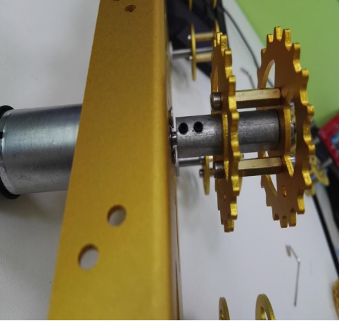
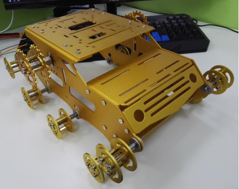

 
 Y100坦克车安装说明 

 from SZDOIT 

## 一、物料准备 

清单 

| 名称              | 数量 | 名称                | 数量 |
| ----------------- | ---- | ------------------- | ---- |
| （左/右）侧板     | 2    | M3*8 内六角螺丝     | 72   |
| 底盘              | 1    | M3*17mm 双通铜柱    | 36   |
| 下挡板            | 1    | 轴承                | 20   |
| 后挡板            | 1    | 连接器              | 10   |
| 前挡板            | 1    | 短 M4 *12内六角螺丝 | 12   |
| 上挡板            | 1    | M2 螺丝             | 10   |
| T300 驱动轮（个） | 2    | （4mm）联轴器       | 2    |
| 减震履带          | 2    | 顶丝                | 4    |
| 减震承重轮（个）  | 10   | M3 螺母             | 24   |
| 电机              | 2    | M38 平头螺丝        | 28   |
| 车头 LED 灯（套） | 2    | 垫片                | 20   |

（附：发货时外加一套 3 种型号大小的扳手工具）

## 二.安装过程

### 01 组装承重轮 

 

 

 

 

### 02 组装驱动轮

 

### 03 安装承重轮 

 

### 04 安装电机

 

### 05 安装驱动轮

 

 

### 06 安装底盘

 

### 07 安装上挡板 

 

### 08 安装下挡板 

 

### 09 安装前挡板 

 

 

### 10 安装后挡板 

 

 

### 11 安装履带

|      |                    |
| ---- | ------------------ |
|      |  |

 

 

### 12 安装车灯 

 

 

### 13 效果图Finished.

前视图（底朝上）

 

后视图

 

左视图

 

俯视图

底视图

 

 

 

## 更多资源，请关注公众号！

