
 YP100坦克车坦克小车安装说明

 From SZDOIT

Part of the installation:

track: https://gitnova.com/#/Robot/FrameChassis/track/track

DC motor: https://gitnova.com/#/Robot/Engine/9vMotor/9vmotor

Controller： Arduino UNO:https://gitnova.com/#/Robot/Controller/ps2/4motor16servo

ESPDuino:https://gitnova.com/#/Robot/Controller/controller/espduinoController

App：

https://gitnova.com/#/Robot/Controller/app/AppforSmartCar

## 1. 物料准备

材料清单

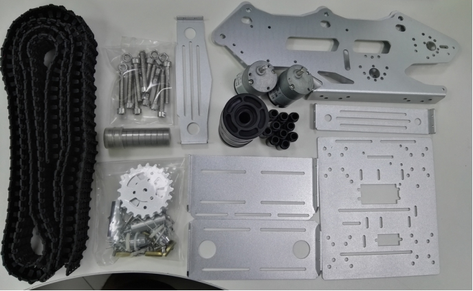 

 

## 2. 安装过程

### 2.1 安装承重轮

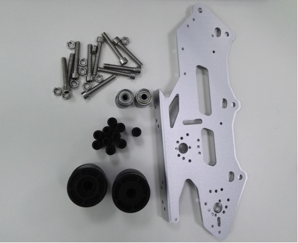 

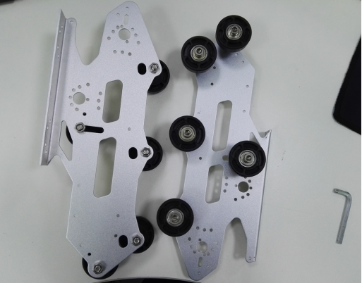 

### 2.2 安装驱动轮

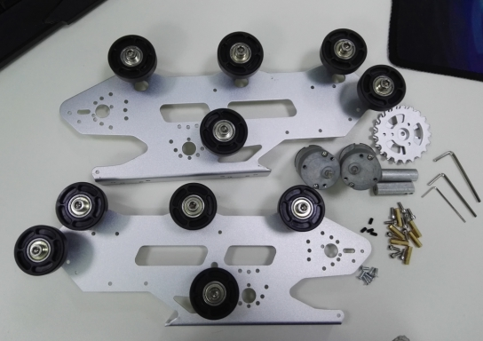 

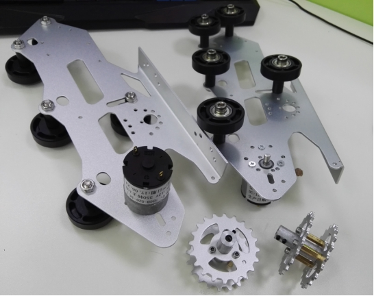 

### 2.3 安装底盘

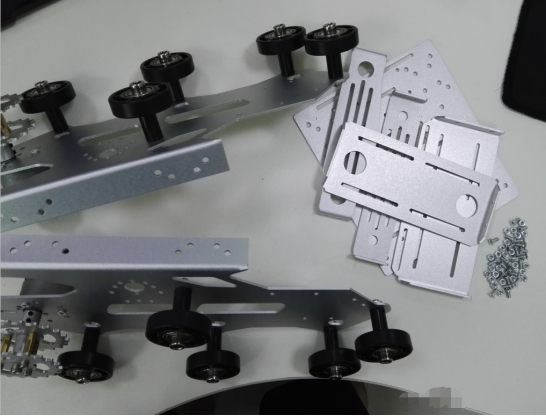 

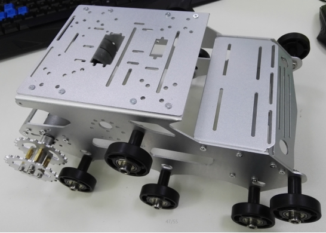 

### 2.4 安装履带

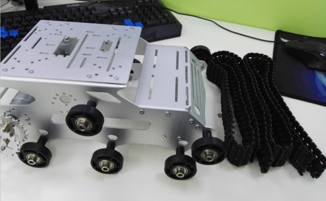 

### 2.5 安装车灯

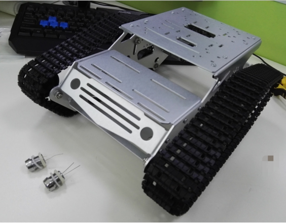 

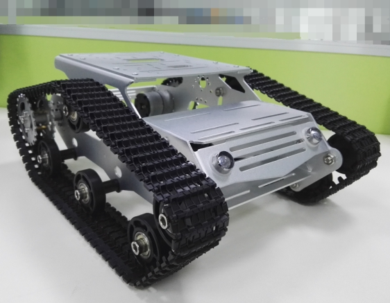 

### 2.6 小车效果图

前视图

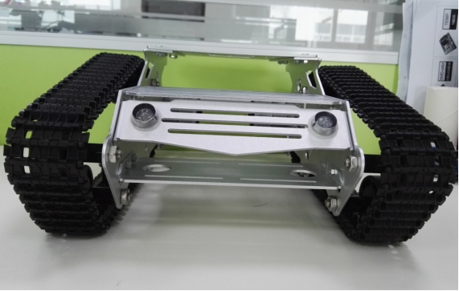 

左视图

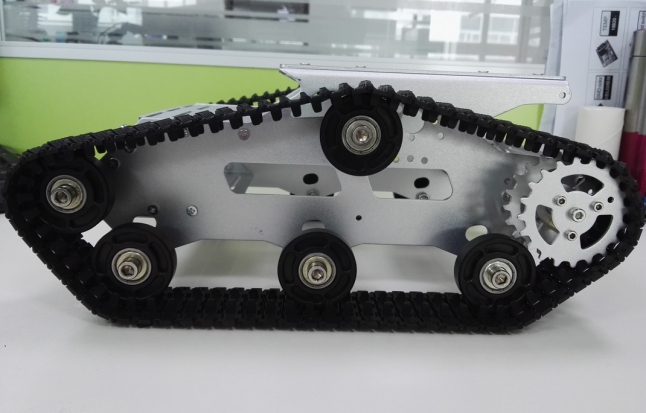 

右视图

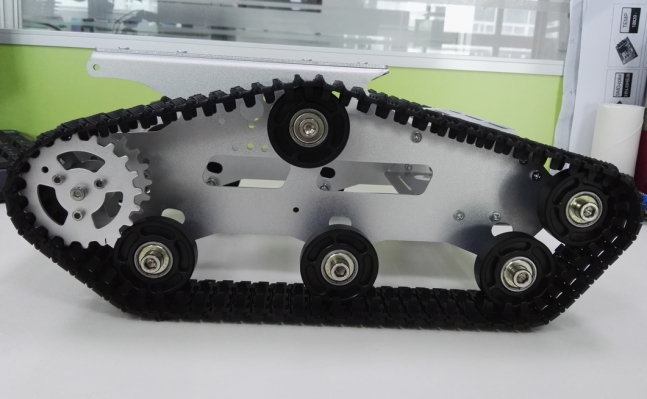 

后视图

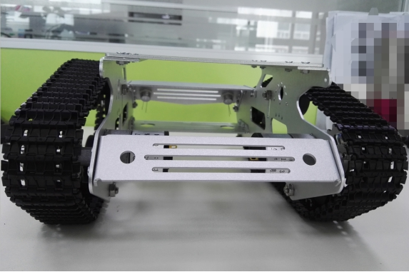 

俯视图

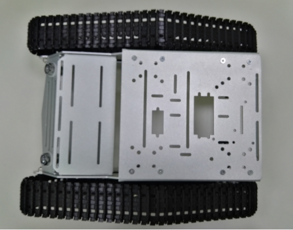 

底视图

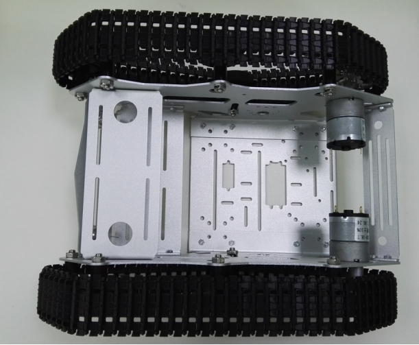 

## 三. 注意要点

1 此种电机每个需要3颗M3平头螺丝固定；

2 顶部的承重轮安装在侧板中央的一竖杆顶端；

 

## 更多资源，请关注公众号！

