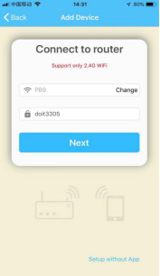

 
  DoHome国标智能插座 

 from SZDOIT 

 

## 功能键与指示灯说明

按键：

- 短按按键电源开关，红灯亮通电，红灯灭断电；

- 长按5秒，蓝灯快闪，产品进入配网模式；

指示灯：

- 蓝灯常亮表示连接路由正常；

- 蓝灯处于慢闪状态表示网络连接异常，请检查路由器或网络配置；

- 红灯亮通电，红灯灭断电；

## 技术参数

型号：DoHome-GB

产品尺寸：584855mm

最大电流：10A

输入电压：AC 90~250V

输出电压：AC 90~250V

最大负载：2200W 10A  工作温度：-25℃ - 40℃
无线类型：Wi-Fi 2.4GHz 无线标准：IEEE 802.11 b/g/n

支持系统：AndroidiOS

地址：深圳市南山区西丽民企科技园2栋西座4楼

## 开始使用

### 1.下载软件

扫描二维码下载DoHome APP，并注册登录

 

### 2.接入电源

将产品接入电源，长按开关键5秒钟，蓝色led开始快速闪烁

 

### 3.添加设备

确认手机已连接可用的WiFi网络，在DoHome APP中点击添加设备。

（备注：暂时不支持5G频段的WiFi网络）

 

此时确认设备蓝色指示灯正在快速闪烁

 

### 4.网络配置

在配置界面输入手机当前连接的WiFi密码。按照页面说明，返回手机的WLAN设置，连接“DoHome_XXXX”的热点，其密码为“12345678”。若有多台设备，请注意区分不同的设备！

 

### 5.配网完成

配网完成，蓝色灯由闪烁状态变为常亮，点击完成成功添加设备。

 

## 更多资源，请关注公众号！

