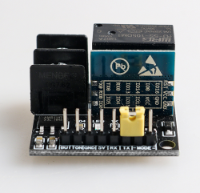

 HomeKit继电器开关 

 From SZDOIT 

## 1 产品外观

注：该产品支持苹果和安卓双系统控制

 

 

|      产品名称：      | HomeKit远程遥控继电器开关  |
| :------------------: | :------------------------: |
|      产品尺寸：      | 长：30mm 宽：30mm 高：15mm |
|      产品重量：      |           13.5g            |
|    控制电路电压：    |             5V             |
|    控制电路电流：    |           150mA            |
| 继电器输出直流电压： |            30V             |
| 继电器输出直流电流： |             5A             |
| 继电器输出交流电压： |            250V            |
| 继电器输出交流电流： |            10A             |

## 2 硬件接口说明

1. 引脚定义：

共有八个可外接的控制引脚(如下图)，从左到右分别为1.下载引脚(MODE)，2.下载引脚(MODE)，3.数据接收引脚(RX)，4.数据发送引脚(TX)，5.电源引脚(5V)，6.接地引脚(GND)，7.按钮引脚(BUTTON)，8.按钮引脚(BUTTON)。

 

2. 继电器接口介绍

继电器控制着两个外接接口接口1和接口2，当继电器通电导通时

接口1和接口2处于闭合状态，当继电器断电时，两个接口断开。

 

3. 接口使用：

3.1按钮控制：

当需要使用外接按钮控制继电器工作时只需要将5,6引脚外接5v电源和GND，在将7,8的BUTTON引脚短接即可实现按钮控制功能。

3.2如何进入下载模式：

当需要对开发板进行固件下载时，只需要使用短接帽将1,2 MODE引脚短接，就可以进入下载模式，之后使用下载工具将5V电源引脚，GND引脚，RX，TX引脚分别相连接即可。

 

## 3 客户如何更新自己的程序

详细见：https://github.com/SmartArduino/DoHome/tree/master/DoHome_HomeKit_DIY_Smart_Plug

## 4 如何使用

设备出厂默认为HomeKit 模式

For HomeKit Model（仅苹果手机）:

第一步：请打开你的苹果手机WiFi列表（如下图1），找到并连接到HomeKit_xxxx 的WiFi热点，大约等待3秒钟，手机将自动跳转到配网页面。

注意：如果手机没有自动跳转到配网页面，请打开手机浏览器输入：http://192.168.4.1。等待进入配网页面。

 

第二步：请在跳转页面中选择你的家庭WiFi名称，且在password中输入密码，点击join图标（如图2），并且查看智能插座指示灯在常亮状态。（图中WiFi账号仅供参考）。

注意：如果没有找到您的路由器或者智能插座在其他状态。请查看常见问题，并且重新给智能插座配网。

 

第三步：检查你的苹果手机否安装“家庭 APP”，如果没有安装“家庭 APP”，请在App Store下载“家庭 APP”（如图3）。如果已经安装，请进行第四步。

 

 

第四步：确保苹果手机连接到你的家庭WiFi网络（如图4）

注意：苹果手机和智能插座必须是在同一个家庭WiFi网络下。

 

第五步：打开苹果手机Home APP， 点击添加配件，点击“没有代码或无法扫描”，点击设备，点击仍然添加，输入设置代码：12345678，等待加密校验（30s-50s），添加设备成功。为了以后方便操作请重新命名。

第六步：如果仅使用HomeKit功能，到此已经结束。

对于DoHome模式:

如果没有iOS设备，需要将智能插座设备切换到DoHome 模式使用。

第1步：请给智能插座开发板供电到5V电路中，并且查看智能插座的指示灯在慢闪状态（每秒闪烁1次），短路帽插到XXXX位置5s，确认指示灯进入快闪状态（每秒闪烁10次）。

第2步：打开手机并扫描下面二维码，下载DoHome APP。

 

 

第3步：打开DoHome APP 注册DoHome APP账号，并登录DoHome APP。

 

 

 

 

第4步：点击右上角“+”添加设备，按照提示操作即可。

注意：如有疑问，请点击左上角菜单栏，查看帮助并点击使用说明。

 

 

 

第5步：如果你想使用智能音箱设备，如Alexa，谷歌助手，天猫精灵或小米箱等。请单击左上角的菜单，并查找对应的音箱教程。

常见问题：

Q1:HomeKit用户如何使用定时、远程、Alexa 、谷歌助手、天猫精灵、小爱同学等智能音箱设备？

1.扫描下面二维码。下载DoHome APP。

 

2.注册DoHome  APP账号。下拉刷新设备列表，并查看你的智能插座。

注意：手机和智能插座必须连接到同一个家庭WiFi网络下。

 

 

3. 打开左上角菜单栏，点击“设备管理”，找到你想要控制的设备并选择它，请点击“设备绑定”。

注意：(1).在使用音箱之前，请在Alexa 、谷歌助手、天猫精灵、小爱同学等智能音箱设备平台登录你的DoHome账号。

(2) . 使用智能音箱，请点击对应的音箱图标查看用户手册。

 

 

4:如何把插座恢复出厂设置

A:短路帽插到XXXXX（5s），查看指示灯慢闪；

## 更多资源，请关注公众号！

