 
  HomeKit两路继电器 

 from SZDOIT 

## 1 外观及参数

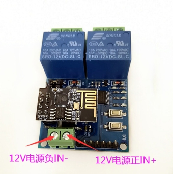 

|       参数       |            说明            |
| :--------------: | :------------------------: |
|     输入电压     |      IN+,IN-,12V电源       |
| 输出直流电压范围 |          28V-30V           |
|   输出直流电流   |            10A             |
| 输出交流电压范围 |         125V-250V          |
|   输出交流电流   |            10A             |
|       尺寸       | 长：60mm 宽：57mm 高：14mm |
|       重量       |           38.5g            |

 注意：该设备必须12V供电，否则无法正常工作！

## 2 接口简介

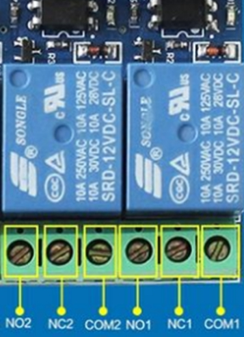 

 

| 接口 |                   说明                    |
| :--: | :---------------------------------------: |
| COM1 |                  公共端                   |
| NC1  | 常闭端,继电器吸合前与COM1短接,吸合后悬空  |
| NO1  | 常开端,继电器吸合前悬空，吸合后与COM1短接 |
| COM2 |                  公共端                   |
| NC2  | 常闭端,继电器吸合前与COM2短接,吸合后悬空  |
| NO2  | 常开端,继电器吸合前悬空，吸合后与COM2短接 |

如何恢复出厂设置：

开关三次（断电三次）既可以恢复到出厂模式

## 3 如何使用

设备出厂默认为HomeKit 模式

For HomeKit Model（仅苹果手机）:

第一步：请打开你的苹果手机WiFi列表（如下图1），找到并连接到HomeKit_xxxx 的WiFi热点，大约等待3秒钟，手机将自动跳转到配网页面。

注意：如果手机没有自动跳转到配网页面，请打开手机浏览器输入：http://192.168.4.1。等待进入配网页面。

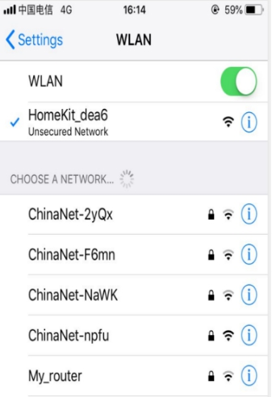 

第二步：请在跳转页面中选择你的家庭WiFi名称，且在password中输入密码，点击join图标（如图2），并且查看智能插座指示灯在常亮状态。（图中WiFi账号仅供参考）。

注意：如果没有找到您的路由器或者智能插座在其他状态。请查看常见问题，并且重新给智能插座配网。

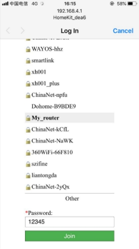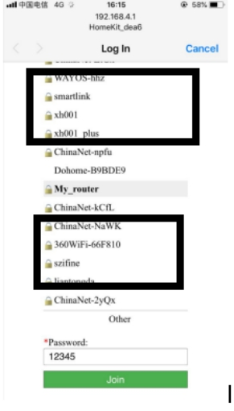 

第三步：检查你的苹果手机否安装“家庭 APP”，如果没有安装“家庭 APP”，请在App Store下载“家庭 APP”（如图3）。如果已经安装，请进行第四步。

 

 

第四步：确保苹果手机连接到你的家庭WiFi网络（如图4）

注意：苹果手机和智能插座必须是在同一个家庭WiFi网络下。

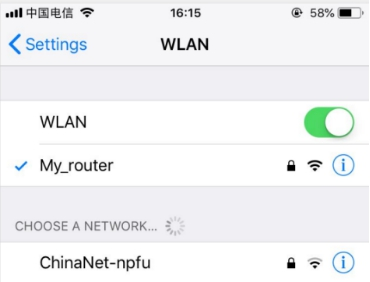 

第五步：打开苹果手机Home APP， 点击添加配件，点击“没有代码或无法扫描”，点击设备，点击仍然添加，输入设置代码：12345678，等待加密校验（30s-50s），添加设备成功。为了以后方便操作请重新命名。

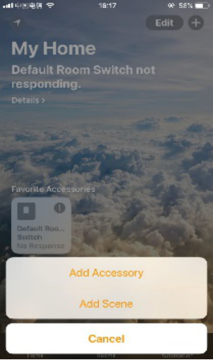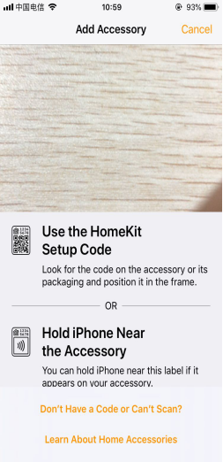

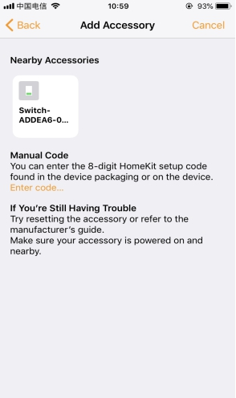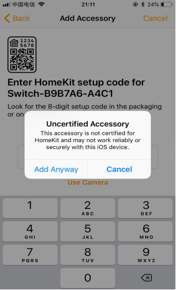

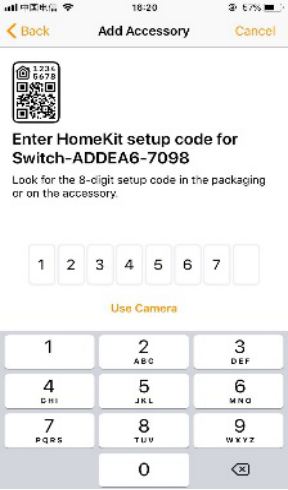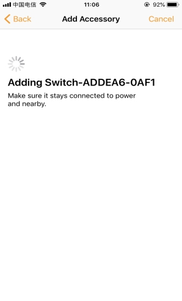

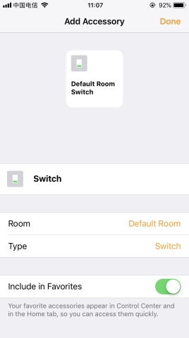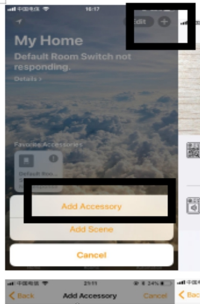

 

## 4 常见问题

1)如何把插座恢复出厂设置

A: 开关三次（断电三次）既可恢复到出厂模式

## 支持与服务

| 四博智联资源                                        |                                                              |
| --------------------------------------------------- | ------------------------------------------------------------ |
| 官网                                                | [www.doit.am](http://www.doit.am/)                           |
| 教材                                                | [ESPDuino智慧物联开发宝典](https://item.taobao.com/item.htm?spm=a1z10.3-c.w4002-7420449993.9.Bgp1Ll&id=520583000610) |
| 购买                                                | [官方淘宝店](https://szdoit.taobao.com/)(szdoit.am)          |
| 讨论                                                | [技术论坛](http://bbs.doit.am/forum.php)(bbs.doit.am)        |
| 应用案例集锦                                        |                                                              |
| [Doit玩家云](http://wechat.doit.am)(wechat.doit.am) | [免费TCP公网调试服务](http://tcp.doit.am)(tcp.doit.am)       |
| 官方技术支持QQ群1/2/3群已满                         |                                                              |
| 技术支持群4                                         | 278888904                                                    |
| 技术支持群5                                         | 278888905                                                    |
| 术支持群6                                           | 278888906                                                    |
| 技术支持群7                                         | 278888907                                                    |
| 技术支持群8                                         | 278888908                                                    |
| 技术支持群9                                         | 278888909                                                    |
| 技术支持群10                                        | 278888900                                                    |

# 六、免责申明和版权公告

本文中的信息，包括供参考的URL地址，如有变更，恕不另行通知。 

文档“按现状”提供，不负任何担保责任，包括对适销性、适用于特定用途或非侵权性的任何担保，和任何提案、规格或样品在他处提到的任何担保。本文档不负任何责任，包括使用本文档内信息产生的侵犯任何专利权行为的责任。本文档在此未以禁止反言或其他方式授予任何知识产权使用许可，不管是明示许可还是暗示许可。 

Wi-Fi联盟成员标志归Wi-Fi联盟所有。

文中提到的所有商标名称、商标和注册商标均属其各自所有者的财产，特此声明

# 七、注 意

由于产品升级或其他原因，本手册内容有可能变更。深圳四博智联科技有限公司保留在没有任何通知或者提示的情况下对本手册的内容进行修改的权利。本手册仅作为使用指导，深圳四博智联科技有限公司尽全力在本手册中提供准确的信息，但是并不确保手册内容完全没有错误，本手册中的所有陈述、信息和建议也不构成任何明示或暗示