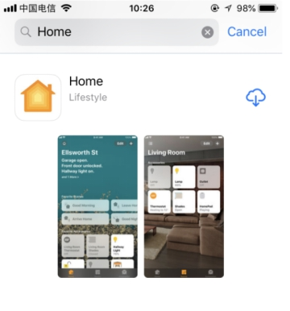

 
  HomeKit两路继电器 

 from SZDOIT 

## 1 外观及参数

 

|       参数       |            说明            |
| :--------------: | :------------------------: |
|     输入电压     |      IN+,IN-,12V电源       |
| 输出直流电压范围 |          28V-30V           |
|   输出直流电流   |            10A             |
| 输出交流电压范围 |         125V-250V          |
|   输出交流电流   |            10A             |
|       尺寸       | 长：60mm 宽：57mm 高：14mm |
|       重量       |           38.5g            |

 注意：该设备必须12V供电，否则无法正常工作！

## 2 接口简介

 

 

| 接口 |                   说明                    |
| :--: | :---------------------------------------: |
| COM1 |                  公共端                   |
| NC1  | 常闭端,继电器吸合前与COM1短接,吸合后悬空  |
| NO1  | 常开端,继电器吸合前悬空，吸合后与COM1短接 |
| COM2 |                  公共端                   |
| NC2  | 常闭端,继电器吸合前与COM2短接,吸合后悬空  |
| NO2  | 常开端,继电器吸合前悬空，吸合后与COM2短接 |

如何恢复出厂设置：

开关三次（断电三次）既可以恢复到出厂模式

## 3 如何使用

设备出厂默认为HomeKit 模式

For HomeKit Model（仅苹果手机）:

第一步：请打开你的苹果手机WiFi列表（如下图1），找到并连接到HomeKit_xxxx 的WiFi热点，大约等待3秒钟，手机将自动跳转到配网页面。

注意：如果手机没有自动跳转到配网页面，请打开手机浏览器输入：http://192.168.4.1。等待进入配网页面。

 

第二步：请在跳转页面中选择你的家庭WiFi名称，且在password中输入密码，点击join图标（如图2），并且查看智能插座指示灯在常亮状态。（图中WiFi账号仅供参考）。

注意：如果没有找到您的路由器或者智能插座在其他状态。请查看常见问题，并且重新给智能插座配网。

 

第三步：检查你的苹果手机否安装“家庭 APP”，如果没有安装“家庭 APP”，请在App Store下载“家庭 APP”（如图3）。如果已经安装，请进行第四步。

 

 

第四步：确保苹果手机连接到你的家庭WiFi网络（如图4）

注意：苹果手机和智能插座必须是在同一个家庭WiFi网络下。

 

第五步：打开苹果手机Home APP， 点击添加配件，点击“没有代码或无法扫描”，点击设备，点击仍然添加，输入设置代码：12345678，等待加密校验（30s-50s），添加设备成功。为了以后方便操作请重新命名。

 

## 4 常见问题

1)如何把插座恢复出厂设置

A: 开关三次（断电三次）既可恢复到出厂模式

## 更多资源，请关注公众号！

