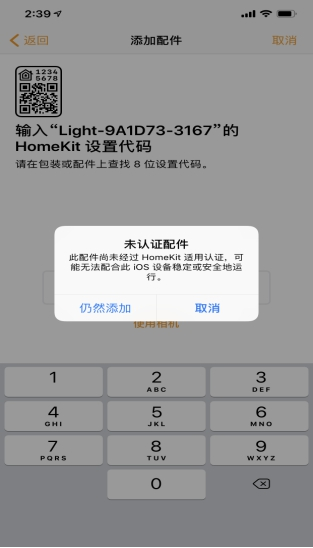

 

 
  HomeKit WiFi智能 灯带控制器 

 from SZDOIT 

### 

# 一、简介

本产品HomeKit的版本，没有iphone手机，配置相对繁琐（参见HomeKit For Android部分），请购买DoHome版本。DoHome版本已经对接了各大智能音箱，需要下载DoHome APP才能使用。

注意：本产品为外贸产品改造升级产品，产品说明和附带纸质说明不一致，正确的产品说明在如下淘宝产品说明中，本产品不带遥控器。

上架到：https://szdoit.taobao.com/category-1386351860.htm?spm=a1z10.1-c-s.w5002-1811579817.6.62ae55ceJOiNZP&search=y&catName=%D6%C7%C4%DC%B2%FA%C6%B7的智能产品下面

温馨提示：

检查智能灯带控制器是否因运输过程导致异响、破损、断裂等。如有损坏请及时与厂家联系。请给智能灯带控制器供电到85V-255V（50-60hz）的家庭电路中， 在未配网前，HomtKit版本智能灯带控制器上电前几秒颜色从红、绿、蓝、白，然后常亮。

注意：如果智能灯带控制器长电前几秒颜色没有从红、绿、蓝、白，然后常亮，请

1)给智能灯供电。

2)给智能灯断电。

3)如此重复操作3次，LED灯循环慢闪，颜色红、绿、蓝、白，然后常亮。

 

 

# 二、HomeKit For iphone

如果使用HomeKit功能，请使用iphone手机进行如下操作:

## 第一步

请打开苹果手机WiFi列表（如图一），找到Homekit_xxxx 的WIFI 热点并连接。大约等待3秒钟，手机将自动跳转到配网界面。

注意：如果手机没有自动跳转到配网界面，请打开手机浏览器输入：htt://192.168.4.1。等待进入配网界面。

 

## 第二步

请在跳网面页中选择您的家庭WiFi名称，且请在password中输入密码，点击join （如图二）。等待手机配网页跳转到WIFI列表页面（如图三），确定智能插头指示灯常亮。（图中WIF 账号仅供参考）

黑色款内的不要

 

## 第三步

检查您是否安装Home APP ，如果没有Home  APP请在App Store商城下载一个Home  APP（如图四）。

## 第四步

请把手机连接到你的家庭WiFi网络（如图五），注意：苹果手机和智能插座必须是在同一个家庭WiFi网络下。

 

## 第五步

打开苹果手机Home  APP 点击添加配件，请点击“没有代码或无法扫描”点击刷新出来的设备，仍然添加，等待加密校验（大约30S），添加设备成功。以后方便的操做请重新命名，并享受它

 

 

 

注意：如果没有刷新设备，请确认手机和智能插座是否在同一个局域网络。请确认指示灯是否在常亮状态，如果添加失败，请查看常见问题。

## 第六步

如果您要用alexa 、谷歌助手、天猫精灵、小爱同学、等智能音响设备或是需要定时等更多功能请见常见问题。

HomeKit For Android:

第一步：请给智能插座供电到85V-255V（50-60hz）的家庭电路中，，

1)给智能灯供电。

2)给智能灯断电。

3)如此重复操作三次，LED灯白光闪烁三次，然后常亮，LED灯发出DoHome_XXXXXX热点。

第二步：打开手机扫描下面二维码并且下载DoHome  APP。

 

第三步：打开Dohome app 注册DoHome  APP账号和密码。并且登录Dohome。

第四步：点击右上角“+”添加设备，按照提示操作即可。

注意：如有疑问，请点击右上角菜单栏”≡”，查看帮助，点击使用说明。

DoHome 版APP使用:

第一步：请给智能插座供电到85V-255V（50-60hz）的家庭电路中,给智能灯供电。在未配网前，智能灯带控制器上电前几秒颜色从红、绿 渐变，然后常亮。

注意：如果智能灯带控制器长电前几秒颜色没有红绿渐变，然后常亮，请

1)给智能灯供电。

2)给智能灯断电。

3)如此重复操作5次，LED灯循环慢闪，颜色红、绿渐变然后常亮。

第二步：打开手机扫描下面二维码并且下载DoHome  APP。

 

第三步：打开Dohome app 注册DoHome  APP账号和密码。并且登录Dohome。

第四步：点击右上角“+”添加设备，按照提示操作即可。

注意：如有疑问，请点击右上角菜单栏”≡”，查看帮助，点击使用说明。

# 常见问题

Q:homekit用户如何使用alexa 、谷歌助手、天猫精灵、小爱同学等智能音响设备？如何通过DoHome使用定时等更多 功能

扫描下面二维码。下载DoHome  APP。

1.注册DoHome  APP账号、密码。下拉刷新列表并查看您的智能设备。

注意：手机和智能灯带控制器必须连接到同一个家庭WiFi网络。

2.在左上角中打开菜单，点击“设备管理”，找到你的设备，然后选择它点击“设备绑定”。

注意：您要使用智能音响请点击对应的音响图标，查看用户手册。如需帮助请点击帮助选项。

此设备仅支持IOS 10以上/ android 8.0以上版本。

Q：在添加设备的时候，如果弹窗提示“是否允许APP获取您的定位”，如何处理？

A：这个问题非常重要，请一定点击“同意”或“允许”。

Q：为什么设备名称需要简短？

A：因为这对语音控制功能来说比较方便，例如DoHome。

Q:如何把智能灯带控制器恢复出厂设置

1)给智能灯供电。

2)给智能灯断电。

3)如此重复操作3次，LED灯循环慢闪，颜色没有从红、绿、蓝、白，然后常亮。

Q:配网过程中要注意哪些事项

1.配网过程中请确保设备，手机，路由器三者靠近；

2.配网过程中请确保输入的路由器的密码正确；

3.配网过程中请确保路由器工作在2.4G频段，并且使能广播功能，并且工作在 非11n only 模式；

4.配网过程中请确保路由器无线设置加密方式为WPA2-PSK类型，认证类型为AES，或者两者皆设置为自动。

5.配网过程中若路由器开启无线MAC地址过滤，请将设备移除路由器的MAC过滤列表；请确认路由器是否有防火墙功能。若有，请关闭防火墙功能后，再尝试让设备连接路由器；

6.如果是双频路由器，请将2.4G信号和5G信号分别设置不同的密码，或者关闭5G信号，请勿打开双频合一的功能；

 支持与服务

| 官方技术支持QQ群 |           |
| :--------------- | --------- |
| 技术支持群4      | 278888904 |
| 技术支持群5      | 278888905 |
| 技术支持群6      | 278888906 |
| 技术支持群7      | 278888907 |
| 技术支持群8      | 278888908 |
| 技术支持群9      | 278888909 |
| 技术支持群10     | 278888900 |

# 免责申明和版权公告

本文中的信息，包括供参考的URL地址，如有变更，恕不另行通知。 

文档“按现状”提供，不负任何担保责任，包括对适销性、适用于特定用途或非侵权性的任何担保，和任何提案、规格或样品在他处提到的任何担保。本文档不负任何责任，包括使用本文档内信息产生的侵犯任何专利权行为的责任。本文档在此未以禁止反言或其他方式授予任何知识产权使用许可，不管是明示许可还是暗示许可。 

Wi-Fi联盟成员标志归Wi-Fi联盟所有。

文中提到的所有商标名称、商标和注册商标均属其各自所有者的财产，特此声明 

# 注 意

由于产品升级或其他原因，本手册内容有可能变更。深圳四博智联科技有限公司保留在没有任何通知或者提示的情况下对本手册的内容进行修改的权利。本手册仅作为使用指导，深圳四博智联科技有限公司尽全力在本手册中提供准确的信息，但是并不确保手册内容完全没有错误，本手册中的所有陈述、信息和建议也不构成任何明示或暗示的担保。