 
  HomeKit DoHome温湿度采集器 

 from SZDOIT 

## 1. 产品外观

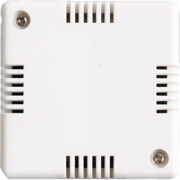 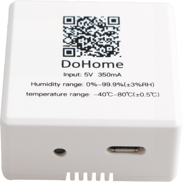 

## 2. 参数规格

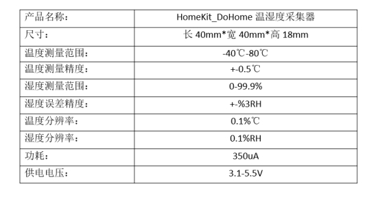

## 3. 如何使用

### Step1：配置设备联网

设备上电,开启一个Homekit-sensor_xxxx的热点,连接“Homekit-sensor_xxxx”的热点，其密码为:无，大约等待3秒钟，手机将自动跳转到配网界面，注：若有多台设备，请注意区分不同的热点名字。

如果手机没有自动跳转到配网界面，请打开手机浏览器输入：http://192.168.4.1，等待进入配网界面。请在跳网面页中选择您的家庭WiFi名称，且请在password中输入密码，点击join。

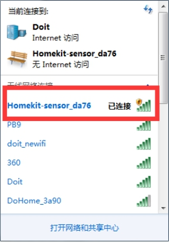 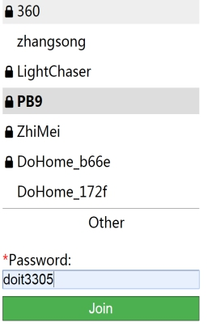

### Step2：加入到HomeKit家庭

1）请把手机连接到你的家庭WiFi网络

注意：苹果手机和设备必须是在同一个家庭WiFi网络下，即配置网络是选择的WiFi网络（例如设备配置的是连接PB9这个路由器，那么苹果手机也要连接到PB9这个路由）。

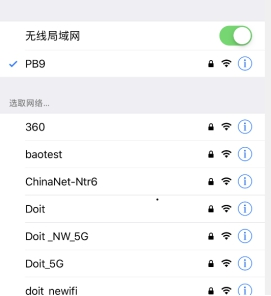 

 

2)打开苹果手机Home APP 点击添加配件，请将图6中的设置 代码（123-45-678）放到取景框 内。选择任然添加，等待加密校验 （50s)，添加成功。

 

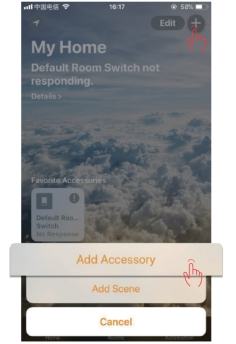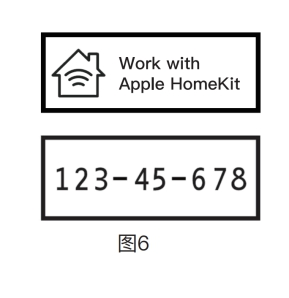 

 

 

 

 

注意：如果无法识别代码，请点击“没有 代码或无法扫描”，选择刷新出来 的设备，点击仍然添加，输入设置 代码:12345678，等待加密校验 （50s），添加设备成功。

如果没有刷新到设备，请确认手机和设备是否在同一个局域网络。请确认指示灯是否在常亮状态，如果添加失败，请查看常见问题。

请点击“没有代码或无法扫描”点击刷新出来的设备，仍然添加，等待加密校验（大约50S），添加设备成功。

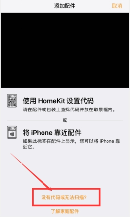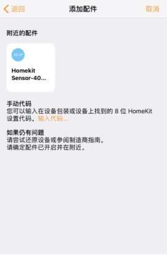

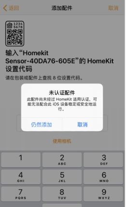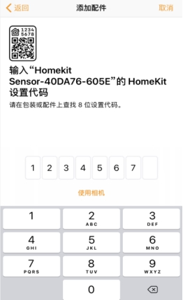

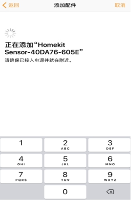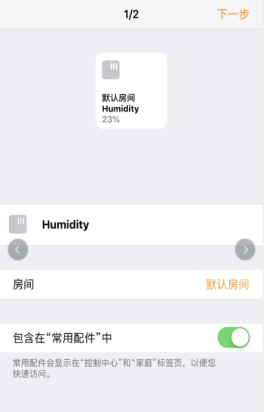

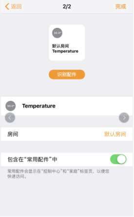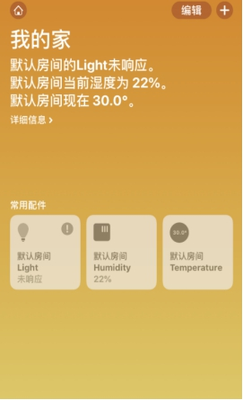 

如果没有刷新到设备，请确认手机和设备是否在同一个局域网络。请确认指示灯是否在常亮状态，如果添加失败，请查看常见问题。

常见问题：

Q1:若我已经配置过了，想要重新配置该怎么办？

A1:若以前已经配置过路由，想要重新配置新的路由器，连续开关三次以上，每次上电时间超过2S，小于10s，然后重复第一次配网的步骤即可。

Q2: 我想自己二次开发，更新设备里面的固件应该如何操作。

二次开发见：https://github.com/SmartArduino/DoHome/tree/master/DoHome_HomeKit_Temperature_Humidity_Sensor

## 更多资源，请关注公众号！

