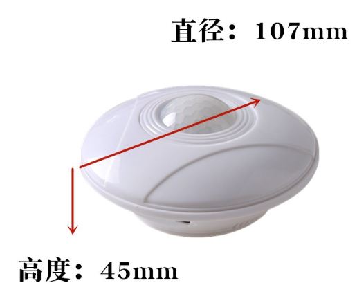
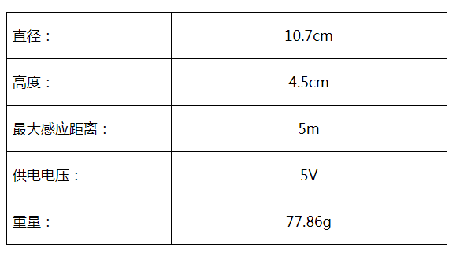
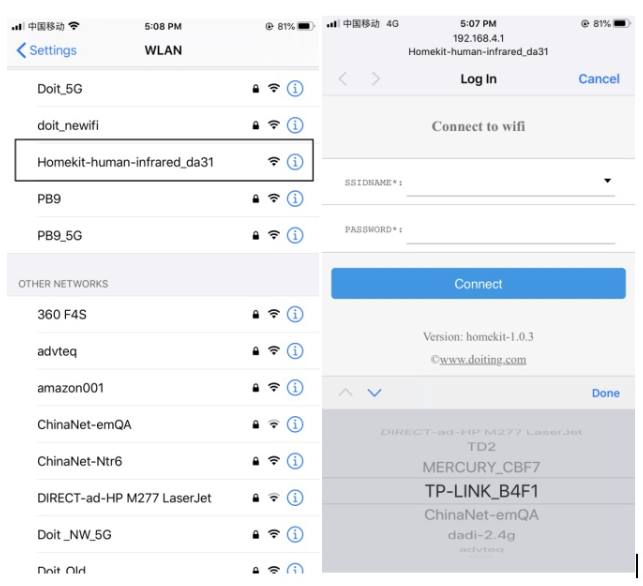
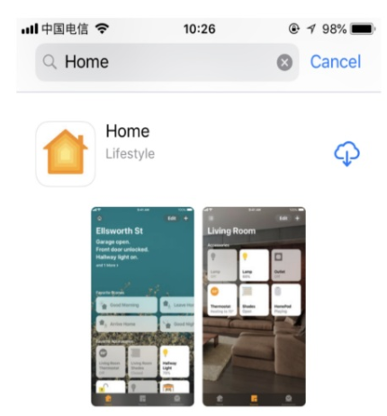
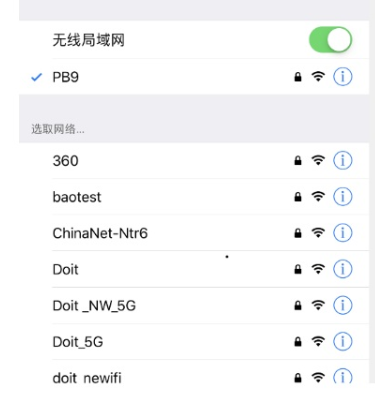
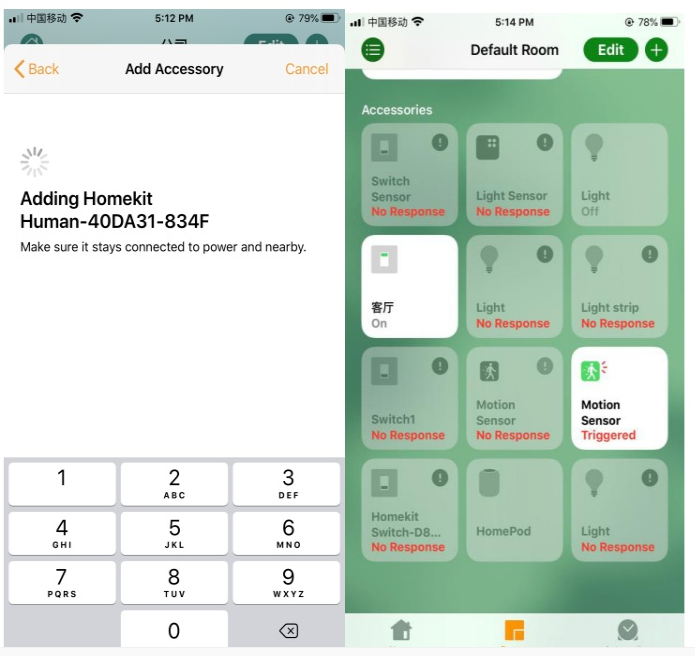
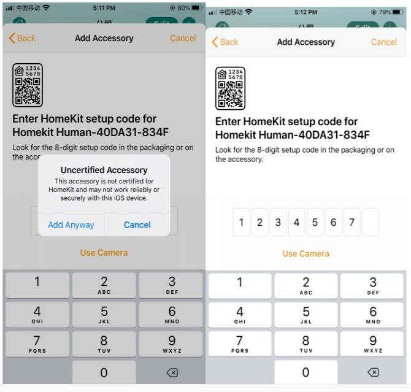
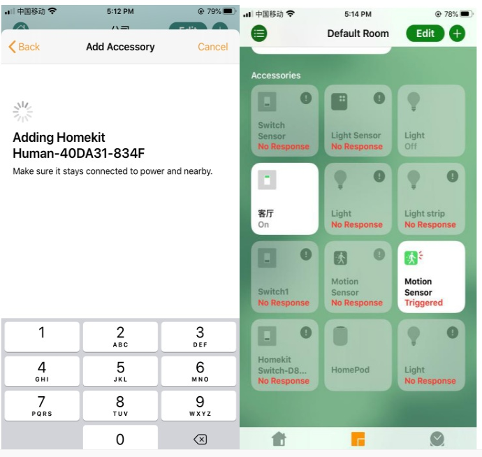

 DoHome智能人体感应器 

 From SZDOIT

## 1. 简介

​	DoHome智能人体感应器 支持siri语音，带下载串口支持二次开发

## 2. 相关参数

## 3. 如何使用

**第一步：配置设备联网**

设备上电,开发手机WLAN，找到一个Homekit-human_inrared_xxxx的热点并连接，大约等待3秒钟，手机将自动跳转到配网界面，注：若有多台设备，请注意区分不同的热点名字。

如果手机没有自动跳转到配网界面，请打开手机浏览器输入：htt://192.168.4.1，等待进入配网界面。请在跳网面页中选择您的家庭WiFi名称，且请在password中输入密码，点击connect。

**第二步：加入到HomeKit家庭**

(1) 检查您是否安装Home APP。

如果没有Home APP,请在App Store商城下载一个Home APP

(2) 请把手机连接到你的家庭WiFi网络

注意：苹果手机和设备必须是在同一个家庭WiFi网络下，即配置网络是选择的WiFi网络（例如设备配置的是连接PB9这个路由器，那么苹果手机也要连接到PB9这个路由）。

(3) 打开苹果手机Home APP 点击添加配件，请点击“没有代码或无法扫描”点击刷新出来的设备，仍然添加，等待加密校验（大约30S），添加设备成功。以后方便操作请重新命名。

## 4. 常见问题

由于设备为网络设备，如果出现设备部响应等问题，可以依照如下方法进行解决：

如果没有刷新到设备，请确认手机和设备是否在同一个局域网络。请确认指示灯是处于长亮还是熄灭状态，如果设备添加失败，请查看常见问题。

Q:配网过程中要注意哪些事项

1.配网过程中请确保设备，手机，路由器三者靠近；

2.配网过程中请确保输入的路由器的密码正确；

3.配网过程中请确保路由器工作在2.4G频段，并且使能广播功能，并且工作在 非11n only 模式；

4.配网过程中请确保路由器无线设置加密方式为WPA2-PSK类型，认证类型为AES，或者两者皆设置为自动。

5.配网过程中若路由器开启无线MAC地址过滤，请将设备移除路由器的MAC过滤列表；请确认路由器是否有防火墙功能。若有，请关闭防火墙功能后，再尝试让设备连接路由器；

6.如果是双频路由器，请将2.4G信号和5G信号分别设置不同的密码，或者关闭5G信号，请勿打开双频合一的功能；

 Q: 如何恢复出厂设置

A: 使设备在较短的时间内断电三次(设备插拔三次)，即可实现恢复到出厂设置。

Q: 指示灯含义

A: 本设备共有两个LED灯一个为电源灯(红色)只要设备上电就会点亮，一个作为设备状态指示灯(蓝色)，在配网状态为常亮，设备HomeKit添加成功后，有人触发则被点亮，没有则熄灭。

**特别注意：**

如果遇到问题，请恢复到出厂设置，重新配置（使设备在较短的时间内断电三次，即可实现恢复到出厂设置）

## 支持与服务

| 四博智联资源                                        |                                                              |
| --------------------------------------------------- | ------------------------------------------------------------ |
| 官网                                                | [www.doit.am](http://www.doit.am/)                           |
| 教材                                                | [ESPDuino智慧物联开发宝典](https://item.taobao.com/item.htm?spm=a1z10.3-c.w4002-7420449993.9.Bgp1Ll&id=520583000610) |
| 购买                                                | [官方淘宝店](https://szdoit.taobao.com/)(szdoit.am)          |
| 讨论                                                | [技术论坛](http://bbs.doit.am/forum.php)(bbs.doit.am)        |
| 应用案例集锦                                        |                                                              |
| [Doit玩家云](http://wechat.doit.am)(wechat.doit.am) | [免费TCP公网调试服务](http://tcp.doit.am)(tcp.doit.am)       |
| 官方技术支持QQ群1/2/3群已满                         |                                                              |
| 技术支持群4                                         | 278888904                                                    |
| 技术支持群5                                         | 278888905                                                    |
| 术支持群6                                           | 278888906                                                    |
| 技术支持群7                                         | 278888907                                                    |
| 技术支持群8                                         | 278888908                                                    |
| 技术支持群9                                         | 278888909                                                    |
| 技术支持群10                                        | 278888900                                                    |