
 HomeKit月球灯 

 From SZDOIT

## 1.产品外观开灯效果。

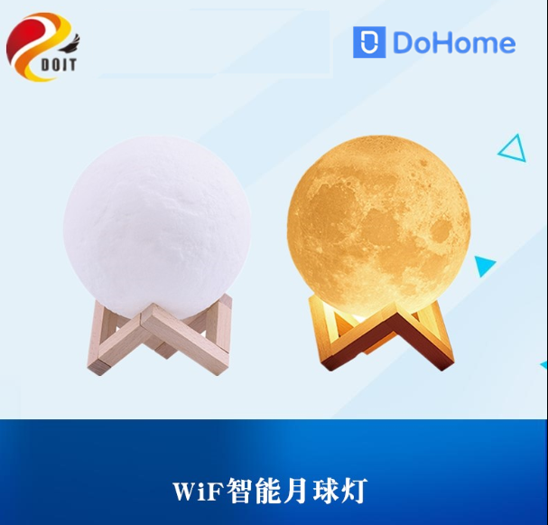

## 2.硬件说明

(1) 参数说明：

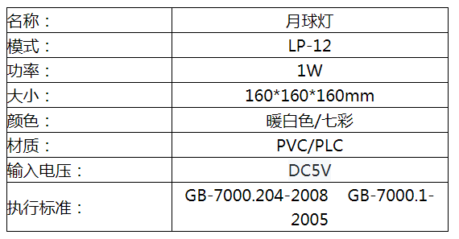

(2) IO口说明

|   功能    |  GPIO  |
| :-------: | :----: |
| 红色（r） | GPIO12 |
| 绿色（g） | GPIO14 |
| 蓝色（b） | GPIO5  |
| 白色（w） | GPIO4  |

## 3. 客户如何更新自己的程序

本产品自带串口下载芯片，支持用户下载自己的程序，详细见：https://github.com/SmartArduino/DoHome/tree/master/DoHome_HomeKit_Moon_Light

## 4. 如何使用

注意：对于HomeKit模式，只支持苹果手机

第一步：请打开苹果手机WiFi列表（如图1），找到Homekit_xxxx 的WIFI 热点并连接。大约等待3秒钟，手机将自动跳转到配网界面。

注意：如果手机没有自动跳转到配网界面，请打开手机浏览器输入：htt://192.168.4.1。等待进入配网界面。

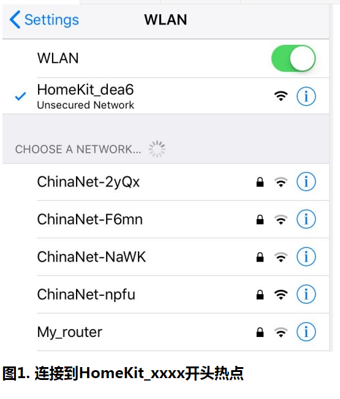

第二步：请在跳网面页中选择您的家庭WiFi名称，且请在password中输入密码，点击join （如图2）。等待手机配网页跳转到WIFI列表页面（如图3）。（图中WIF 账号仅供参考）

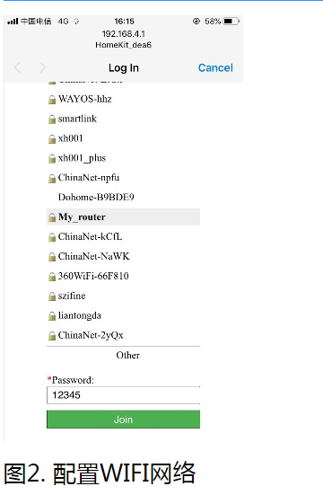

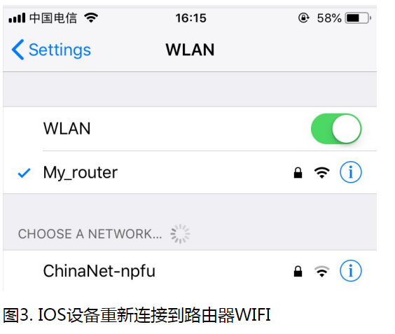

第三步：检查您是否安装Home APP,系统默认安装，除非人为卸载。

如果没有Home  APP请在App Store商城下载一个Home  APP（如图4）。

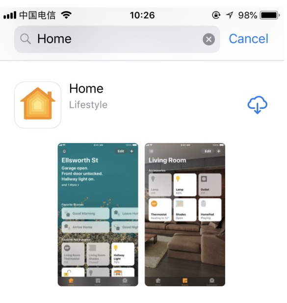

图4  安装Home

第四步：请再次核对手机连接到你的家庭WiFi网络（如图5）

注意：苹果手机和智能插座必须是在同一个家庭WiFi网络下。

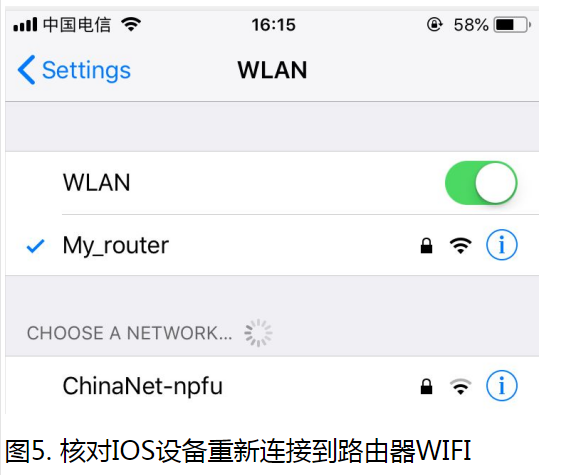

第五步：打开苹果手机Home APP 点击添加配件，请点击“没有代码或无法扫描”点击刷新出来的设备，仍然添加，等待加密校验（大约50S），添加设备成功。为以后方便的操做请重新命名

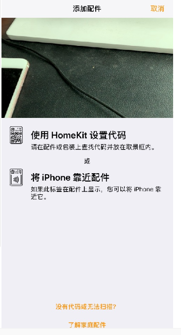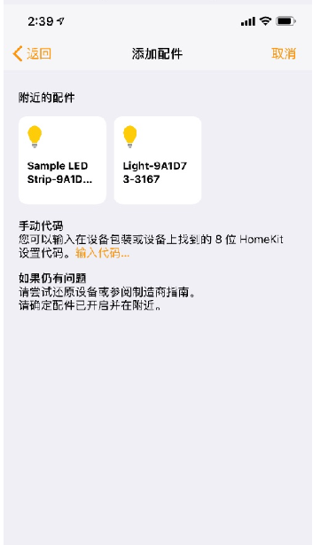

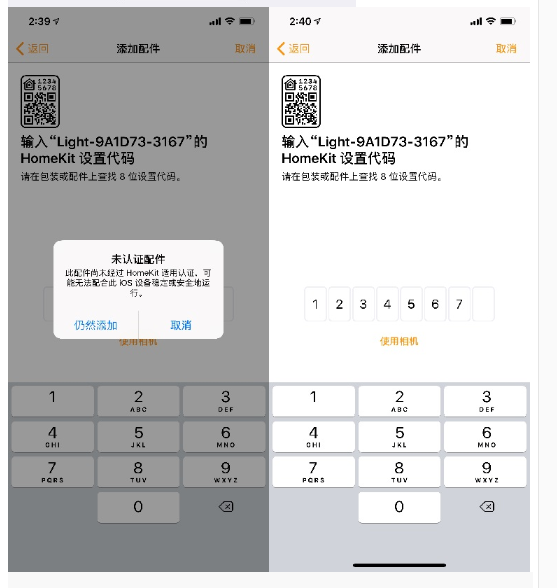

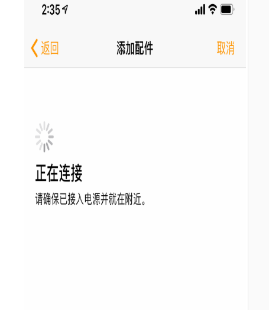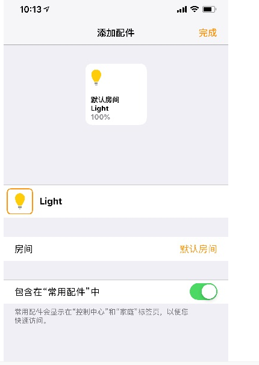

## 支持与服务

| 四博智联资源                                        |                                                              |
| --------------------------------------------------- | ------------------------------------------------------------ |
| 官网                                                | [www.doit.am](http://www.doit.am/)                           |
| 教材                                                | [ESPDuino智慧物联开发宝典](https://item.taobao.com/item.htm?spm=a1z10.3-c.w4002-7420449993.9.Bgp1Ll&id=520583000610) |
| 购买                                                | [官方淘宝店](https://szdoit.taobao.com/)(szdoit.am)          |
| 讨论                                                | [技术论坛](http://bbs.doit.am/forum.php)(bbs.doit.am)        |
| 应用案例集锦                                        |                                                              |
| [Doit玩家云](http://wechat.doit.am)(wechat.doit.am) | [免费TCP公网调试服务](http://tcp.doit.am)(tcp.doit.am)       |
| 官方技术支持QQ群1/2/3群已满                         |                                                              |
| 技术支持群4                                         | 278888904                                                    |
| 技术支持群5                                         | 278888905                                                    |
| 术支持群6                                           | 278888906                                                    |
| 技术支持群7                                         | 278888907                                                    |
| 技术支持群8                                         | 278888908                                                    |
| 技术支持群9                                         | 278888909                                                    |
| 技术支持群10                                        | 278888900                                                    |