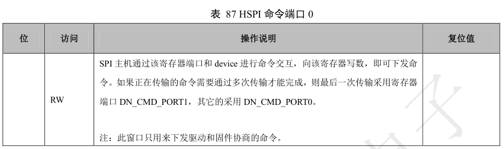
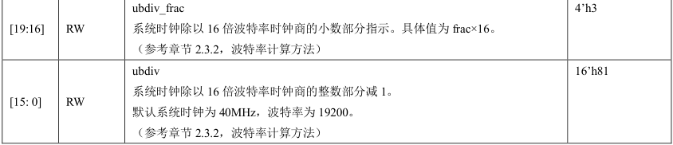

 W600_寄存器手册 

 From SZDOIT

## 1 引言

### 1.1 编写目的

W600 芯片是联盛德微电子推出的一款嵌入式 Wi-Fi SoC 芯片。该芯片集成度高，所需外围器件少，性
价比高。适用于 IoT（智能家庭）领域各种智能产品。高度集成的 Wi-Fi 功能是其主要功能；另外，该
芯片集成 Cortex-M3 内核，内置 QFlash，SDIO、SPI、UART、GPIO、I²C、PWM、I²S、7816 等接口, 支持多种硬件加解密算法。

本文档主要描述 W600 芯片内部结构，各功能模块信息以及详细寄存器使用信息；是开发者开发驱动程序、应用程序的主要参考资料。联盛德微电子提供的 SDK 中有各种功能的开源实现，开发者可以参考对应驱动程序、应用程序示例，以增加对芯片功能和寄存器描述的理解。本文档没有对 Wi-Fi 部分的寄存器描述。

### 1.2 参考资料

W600 芯片封装参数、电气特性、射频参数等信息，请参考《W600 芯片产品规格书》 ；
W600 芯片集成了 ROM 程序，ROM 程序提供了下载固件，MAC 地址读写、Wi-Fi 参数读写等功能，
详细信息请参考《WM_W600_ROM 功能简述》 ；

W600 芯片内置了 1Mbytes QFlash 存储器，作为代码以及参数的存储空间。本文档提供了 QFlash 基本操作信息。如有超出本文档范围的需求，需要参考 QFlash 手册；

W600 芯片采用 ARM Cortex-M3 核心，M3 相关的功能介绍、开发资料等可以参考 ARM 公司发布信息；

## 2. 特征

## 3. 概述

本芯片是一款支持多接口、多协议的无线局域网 802.11n（1T1R）的 SOC 芯片。该 SOC 芯片集成射频收发前端 RF Transceiver，CMOS PA 功率放大器，基带处理器/媒体访问控制，SDIO、SPI、UART、GPIO 等接口的低功耗 WLAN 芯片。

W600 芯片支持 GB15629.11-2006、IEEE802.11 b/g/ n 协议，并且支持 STBC、Green Field、Short-GI、反向传输、RIFS 帧间隔、AMPDU、AMSDU、T-immediate Compressed Block Ack、normal ACK、no ACK、CTS to self 等丰富的协议以及操作。

W600 芯片片内集成了射频收发前端、A/D 和 D/A 转换器。它支持 DSSS（直接序列扩频）以及 OFDM（正交频分复用）调制模式，具备数据解扰能力，支持多种不同的数据传输速率。在收发器的模拟前端配备的收发 AGC 功能使得芯片系统能够获得最佳的性能。W600 芯片还包含了内置增强信号监测器，可以很大程度上消除多径效应的影响。

W600 芯片在安全方面，不仅支持国家标准的 WAPI 加密，还支持国际标准 WEP、TKIP、CCMP 加密，这些硬件组件使得基于该芯片的数据传输系统在进行保密通信时仍然能够获得与非加密通信时相近的数据传输性能。

W600 芯片除了支持 IEEE802.11 以及 Wi-Fi 协议规定的节能操作外，还支持用户定制的节能方案。芯片支持工作、睡眠、待机、关机四种工作模式，从而使整个系统实现低功耗，并方便用户根据自身的使用场景定义不同的节能方案。

W600 芯片集成了高性能的 32 位嵌入式处理器，大量的内存资源，以及丰富的外设接口，便于使用者
很容易的将芯片应用于特定产品的二次开发工作。

W600 芯片支持 AP 功能，可以实现同时组建 5 个 SSID 网络，实现 5 个独立 AP 的功能。支持建立多组播网络功能。可以实现作为 STA 加入别的网络的同时，自己又作为 AP 建立 BSS 网络的功能。
W600 芯片支持 WPS 方式，从而让用户采用一键式操作即可以实现加密的完全网络，保证信息的安全
性。

W600 芯片多功能、高集成度保证了 WLAN 系统不需要过多的片外电路和外部存储器。

## 4 芯片结构

### 4.1 芯片结构

下图描述 W600 芯片的整体结构，核心部分包括 Cortex-M3 CPU，288KB SRAM 和 16KB ROM 存储空间。PMU 部分作为芯片的常供电模块提供了上电时序管理，起振时钟，实时时钟功能等。提供了丰富的外设功能和硬件加解密功能。Wi-Fi 部分集成了 MAC，BB 和 RF。

### 4.2 总线结构

W600 芯片由两级总线构成，如下图所示:

（1）AHB-1 总线
本级总线有四个主设备-即 Cortex-M3，DMA，GPSEC 以及 5 个从设备。

Cortex-M3 基于 ARMV7-M 架构设计，使用 Thumb-2 指令集，采用哈佛结构，拥有独立的指令总线和数据总线。总线时钟最快工作在 80MHz 频率，可以配置为 40MHz，或更低，时钟配置详见时钟分频部分。

2）AHB-2 总线
本条总线有 4 个主设备，3 个从设备，使用 crossbar 连接结构，能够实现不同主设备对不同从设备的同时访问，从而加大带宽。总线时钟最快工作在 40MHz 频率，可以根据需要配置为更低。

各主设备采用固定优先级，自上而下优先级递减。

### 4.3 时钟结构

### 4.4 地址空间

Cortex-M3 可寻址 4G 空间，分别为代码区，内存区，片上外设，片外存储区，片外外设和系统外设区。

#### 4.4.1 SRAM

W600 内置 288KB SRAM。其中 160KB 挂载一级 AHB 总线上，128KB 挂载在二级 AHB 总线上。CPU等一级总线设备可以访问所有内存区域，但是二级总线上的设备只能访问二级总线上 128KB 的内存。

#### 4.4.2 Flash

##### 4.4.2.1 QFlash

W600 内部集成 1MBytes QFlash。通过芯片内部集成 32KB cache 实现 XIP 方式在 QFlash 上执行程序。程序运行过程中，CPU 首先从 Cache 中读取指令，当不能获取指令时，以 8Bytes 一行的方式从 QFlash读取指令，存入 Cache 内。因此，当持续运行代码大小小于 32K 时，CPU 将无需从 QFlash 读取指令，此时 CPU 可以运行在更高的频率。上述方式为读取指令操作方式，整个 Image 的 RO 段都会以这种方式操作。此过程用户无需干预。

QFlash 也可以存储数据，当用户程序需要读写 QFlash 内数据时，需要通过内置的 QFlash 控制器进行操作，QFlash 提供了相应的地址、指令等寄存器来协助实现用户想要的操作。具体描述请参考 QFlash 控制器对应章节。

用户需要注意的是，程序进行读取或者写入数据时，无需进行状态判断、等待等操作，因为 QFlash 控
制器本身会进行判断。当 QFlash 控制器返回时，表明读取或者写入已经完成。

##### 4.4.2.2 SPI Flash

W600 芯片除了支持 6PIN 的 QFlash 接口之外（内置 PIN，未封装），还支持低速 SPI 接口访问。该 SPI接口的最高工作频率可达 20MHz，支持主从功能，详细描述参考 SPI 接口对应章节。
W600 芯片程序只能在 QFlash 对应的空间进行执行。但是当用户需要更多的存储空间时，可以通过在
SPI 接口上外扩 Flash。用户数据、参数、OTA Image 等都可以放置在外部 SPI Flash 空间。

#### 4.4.3 位带

W600 支持位带操作(Bit-Band Operations)。

##### 4.4.3.1 位带操作

位带操作即使用普通的加载（load）/存储（store）指令来对单一 BIT 进行读写，相当于为位带区域的每一 BIT 都起了一个别名，通过对别名的访问来代替对指定 BIT 的访问。指定 BIT 与别名之间的映射过程由内核直接完成，无需人工干预。

##### 4.4.3.2 Cortex-M3 的位带操作区域

- SRAM 的最低 1M 范围

- 片内外设区的最低 1M 范围

##### 4.4.3.3 位带区地址和位带别名的关系

对于 SRAM 区的某个比特，记它所在字节的地址为 A，位序号为 n（0<=n<=7），则映射的别名区地址为：

AliasAddr ＝ 0x220000 +((A‐0x20000000)*8+n)*4 = 0x22000000 + (A‐0x20000000)*32 + nx4对于片上外设位带区的某个比特，记它所在字节的地址为 A,位序号为 n(0<=n<=7)，则映射的别名区地
址为：
AliasAddr ＝ 0x42000000+((A‐0x40000000)*8+n)*4 = 0x42000000 + (A‐0x40000000)*32 + nx4上式中，“*4”表示一个字为 4 个字节，“*8”表示一个字节中有 8 个比特。
下图为内存位带区地址与位带别名区地址的映射关系

##### 4.4.3.4 W600 的位带可操作区域

- 0X2000_0000 - 0X2004_8000

- 0X4000_0000 - 0X4001_3C00

### 4.5 启动配置

W600 芯片上电后，CPU 会启动执行 ROM 中的固件，加载 Flash 中指定地址的用户 Image。

ROM 固件在开始运行时会读取 BootMode(PA0)引脚，根据引脚的信号判断进入启动状态：

通常，BootMode 引脚应该用于生产或者调试阶段。在生产阶段，用户通过将 BootMode 引脚持续拉低30ms 以上，进入功能模式，可以快速进行烧录 Flash 工作。

在产品返工或者维修的场景中，在芯片未进入“最高安全等级”（关于安全等级的描述请参考
《WM_W600_ROM 功能简述》）时，可以通过该引脚进入功能模式，擦除旧的 Image，写入新的 Image。

在调试阶段，无论固件出现任何故障，都可以通过将 BootMode 引脚持续拉低 30ms 以上，进入串口下载功能，烧录新的固件。

## 5. 时钟与复位模块

### 5.1 功能概述

时钟与复位模块完成了软件对芯片时钟和复位系统的控制。时钟控制包括时钟变频，时钟关断以及自适应门控；复位控制包括系统以及子模块的软复位控制。

### 5.2 主要特性

- 支持各模块时钟关断

- 支持部分模块时钟自适应关断

- 支持各模块软件复位

- 支持 CPU 频率设置

- 支持 ADC/DAC 回环测试

- 支持 I2S 时钟设置

### 5.3 功能描述

#### 5.3.1 时钟门控

通过配置时钟门控使能寄存器 CLK_GATE_EN 可以控制指定功能的时钟关断，从而达到关断某一模块
功能的目的。

为了提供固件对系统功耗控制的灵活性，时钟与复位模块提供了系统内各模块的时钟门控功能。当关闭相应模块的时钟时，该模块的数字逻辑与时钟树将停止工作，能够降低系统的动态功耗。

具体各模块的开关对应寄存器 SW_CLKG_EN 的详细描述。

#### 5.3.2 时钟自适应关断

芯片依据内部的某些状态的迁移，自适应关断某些功能模块的时钟。

用户请不要更改配置，否则可能会在配置 PMU 功能时导致系统异常。

#### 5.3.3 功能复位

芯片提供了各子系统的软复位功能，通过设置 SW_RST_CTRL 相应 BIT 为 0 可以达到子系统复位。
但是，复位状态不会自动清除，要恢复正常工作需将 SW_RST_CTRL 相应 BIT 位置 1。
软复位功能并不会复位 CPU 及 WatchDog。

该寄存器中，对 APB/BUS1/BUS2(对应 APB 总线，系统总线及数据总线)的复位操作不推荐，会导致系统访问设备异常。

#### 5.3.4 时钟分频

W600 系统采用 40MHz 晶体作为系统时钟源，系统内置 DPLL，固定输出 160MHz 时钟作为全系统的
时钟源（如下图）。

系统总线的时钟与 CPU 时钟一致，数据总线的时钟固定为 WLAN 根时钟的 1/4。

WLAN 根时钟同时也是整个 WLAN 系统的时钟源头。

此模块中提供了设定 CPU 时钟与 WLAN 根时钟的功能，供固件调节系统性能及功耗使用。

设置 SYS_CLK_DIV 寄存器的 BIT[3:0]可以调整 CPU 时钟分频系数。CPU 时钟分频的源时钟为 DPLL
的输出，固定为 160MHz。CPU 时钟分频系数默认值为 2，即 CPU 默认工作频率为 160MHz 的 2 分频，即 80MHz。当需要调整 CPU 所需时钟时，可以重新配置本参数。

设置 SYS_CLK_DIV寄存器的 BIT[7:4]可以调整WLAN 时钟分频系数。默认分频因子为 1，即不对 DPLL
的 160MHz 输出分频，得到 160MHz 时钟，作为根节点时钟送给 WLAN（WLAN 再继续分频得到更为详细的低频时钟供 WLAN 系统使用）。

注意：如果希望 WLAN 系统正常工作，WLAN 根时钟需要保持在 160MHz，否则 WLAN 系统将失效。
当不需要 WLAN 系统工作的时候，可以将 WLAN 根时钟降低，降低系统动态功耗。

W600 中 CPU/WLAN 时钟分频系数不能随意配置，否则，可能会导致配置无法生效，下表是可使用的分频配置及对应的系统时钟：

在改变系统时钟配置的时候，需要注意：系统总线与数据总线的比例需要维持在 M：1，其中 M 为整数，最小为 1。在改变系统时钟配置时，也需要同时更新寄存器 SYS_CLK_DIV 的 BIT [11:8], 设置正确的比例系数。否则，访问数据总线将得到异常数据。

SYS_CLK_DIV 的[27:12]提供了设置 SAR_ADC 工作频率的分频因子，以 40M 为时钟源进行分频。分
频系数即为所配分频值。

SYS_CLK_DIV 的 BIT[28]为配置 RSA 模块核心运算的时钟频率选择，可以选择 40MHz 或者 80MHz。
当需要重新配置 cpu_clk_divider，wlan_clk_divider，bus2_syncdn_factor，sdadc_fdiv 时，需要置位SYS_CLK_DIV 的 BIT[31]，硬件自动更新上述四个参数到分频器，然后清零 BIT[31]。

I2S_CLK_CTRL 提供了 I2S 模块的时钟配置功能。

#### 5.3.5 调试功能控制

用户可以通过设置 DEBUG_CTRL 的值 BIT5 来达到使能和禁用 JTAG 功能的目的。

### 5.4 寄存器描述

#### 5.4.1 寄存器列表

#### 5.4.2 软件时钟门控使能寄存器

#### 5.4.3 软件时钟掩码寄存器

#### 5.4.4 软件复位控制寄存器

#### 5.4.5 时钟分频配置寄存器

### 5.4.6 调试控制寄存器

#### 5.4.7 I2S 时钟控制寄存器

## 6 DMA 模块

### 6.1 功能概述

DMA 用于在外设与存储器之间以及存储器与存储器之间提供高速数据传输。可以在无需任何 CPU 操作的情况下通过 DMA 快速移动数据。这样节省的 CPU 资源，不影响 CPU 进行其他指令的操作。

DMA 挂载在 AHB 总线上，最多支持 8 通道，16 个硬件外设请求源，支持链表结构与寄存器控制。

### 6.2 主要特性

- Amba2.0 标准总线接口，8 路 DMA 通道

- 支持基于存储器链表结构的 DMA 操作

- 支持 16 个硬件外设请求源

- 支持 1，4-burst 操作模式

- 支持 byte、half-word，word 为单位传输操作

- 支持源、目的地址不变或顺序递增或可配置在预定义地址范围内循环操作

- 支持内存到内存，内存到外设，外设到内存的数据传输方式

### 6.3 功能描述

#### 6.3.1 DMA 通道

W600 共支持 8 路 DMA 通道，DMA 通道互相不干涉，可以同时运行。请求不同的数据流可以选择不同的 DMA 通道。

每个 DMA 通道分配在不同的寄存器地址偏移段，可以直接选择相应通道的地址段进行配置使用可。

不同通道的寄存器配置方式完全一致。

#### 6.3.2 DMA 数据流

8 路 DMA 通道能够实现源和目的之间单向数据传输链路。

DMA 的源和目的地址可以设置为每次 DMA 操作完成之后不变、递增或循环三种模式：

- DMA_CTRL[2:1]控制源地址每次 DMA 操作后变化方式；
- DMA_CTRL[4:3]控制目的地址每次 DMA 操作后变化方式。

DMA 可以设置 byte、half-word、word 的搬运单位，最终搬运数据的数量是搬运单位的整数倍，通过DMA_CTRL[6:5]来设置。

DMA 可以通过 burst 设置每次搬运多少个单位的数据，通过 DMA_CTRL[7]来选择一次搬运 1 或 4 个单位的数据，如果 DMA_CTRL[6:5]设置为 word，burst 设置为 4，则每次搬运 4 个 word 的数据

DMA 可以设置每次启动 DMA 传输的 Byte 个数，最大 65535 Byte，通过 DMA_CTRL[23:8]来设置。

#### 6.3.3 DMA 循环模式

DMA 循环地址模式是指设置 DMA 的源和目的地址之后，数据搬运达到设定的循环边界之后，会跳转
到循环起始地址，如此循环执行，直到到达设定的传输字节。

循环地址模式的源和目的地址需要用 SRC_WRAP_ADDR 和 DEST_WRAP_ADDR 寄存器来设定，并通
过 WRAP_SIZE 来设定循环的长度值。

#### 6.3.4 DMA 传输模式

DMA 支持 3 种传输模式：

- 内存到内存
  源地址和目的地址均配置成需要传输的内存地址，DMA_MODE[0]设置为 0，软件方式。

- 内存到外设
  源地址设置为内存地址，目的地址设置成外设地址，DMA_MODE[0]设置为 1，硬件方式，
  DMA_MODE[5:2]选择所使用的外设。

- 外设到内存
  源地址设置为外设地址，目的地址设置成内存地址，DMA_MODE[0]设置为 1，硬件方式，
  DMA_MODE[5:2]选择所使用的外设。

#### 6.3.5 DMA 外设选择

当使用外设到内存或者内存到外设这种传输方式的时候，除了相应的外设需要设置为 DMA TX 或 RX
外，DMA_MODE[5:2]也需要选择对应的外设。

注意：因为 UART 口共有 3 个，在 UART 使用 DMA 的时候，还需要通过 UART_CH[1:0]来选择对应的
UART。

#### 6.3.6 DMA 链表模式

DMA 支持链表工作模式。 通过链表模式，我们在 DMA 搬运当前链表内存数据的时候，可以提前向下
一个链表中填充数据，DMA 搬完当前链表之后，判断到下一个链表有效，可以直接搬运下一个链表的
数据。通过链表的方式可以有效的提高 DMA 和 CPU 配合的效率。

链表操作方式：通过 DMA_MODE[1]寄存器设置 DMA 为链表工作方式，再将 DESC_ADDR 寄存器设
置为链表结构的起始地址，然后再通过 CHNL_CTRL 寄存器使能 DMA。当 DMA 处理完成当前内存的
搬移后，软件通过设置有效标志，通知 DMA 链表中依然存在有效的数据，DMA 依据链表的有效标志
处理下一个待搬移数据。

#### 6.3.7 DMA 中断

DMA 传输完成或者 burst 均可以产生中断，INT_MASK 寄存器可以屏蔽 DMA 通道对应的中断。

当 DMA 相应中断产生后，可以通过 INT_SRC 寄存器查询当前中断的状态，指示当前是什么产生的中
断，相应的状态位需要软件写 1 清 0。

### 6.4 寄存器描述

#### 6.4.1 寄存器列表

6.4.2 中断屏蔽寄存器

#### 6.4.3 中断状态寄存器

#### 6.4.4 UART 选择寄存器

#### 6.4.5 DMA 源地址寄存器

#### 6.4.6 DMA 目的地址寄存器

#### 6.4.7 DMA 循环源起始地址寄存器

#### 6.4.8 DMA 循环目的起始地址寄存器

#### 6.4.9 DMA 循环长度寄存器

#### 6.4.10 DMA 通道控制寄存器

#### 6.4.11 DMA 模式选择寄存器

#### 6.4.12 DMA 数据流控制寄存器

#### 6.4.13 DMA 传输字节数寄存器

#### 6.4.14 DMA 链表入口地址寄存器

表 29 DMA 链表入口地址寄存器

#### 6.4.15 DMA 当前目的地址寄存器

## 7 通用硬件加密模块

### 7.1 功能概述

加密模块自动完成指定长度的源地址空间数据的加密，完成后自动将加密数据回写到指定的目的地址空间；支持 SHA1/MD5/RC4/DES/3DES/AES/CRC/PRNG。

### 7.2 主要特征

- 支持 SHA1/MD5/RC4/DES/3DES/AES/CRC/PRNG 加密算法

- DES/3DES 支持 ECB 和 CBC 两种模式

- AES 支持 ECB、CBC 和 CTR 三种模式

- CRC 支持 CRC8、CRC16_MODBUS、CRC16_CCITT 和 CRC32 四种模式

- CRC 支持输入/输出反向

- SHA1/MD5/CRC 支持连续多包加密

- 伪随机数支持连续产生 16 位和 32 位随机数，支持 seed 种子

### 7.3 功能描述

#### 7.3.1 SHA1 加密

可对连续多包数据进行硬件 SHA1 计算，计算结果存在寄存器中，上一包的加密结果可以作为下一包的初始值。

#### 7.3.2 MD5 加密

可对连续多包数据进行硬件 MD5 计算，计算结果存在寄存器中，上一包的加密结果可以作为下一包的
初始值。

#### 7.3.3 RC4 加密

支持 RC4 加密和解密。

#### 7.3.4 DES 加密

支持 DES 加密和解密，支持 ECB 和 CBC 两种模式。

#### 7.3.5 3DES 加密

支持 3DES 加密和解密，支持 ECB 和 CBC 两种模式。

#### 7.3.6 AES 加密

支持 AES 加密和解密，支持 ECB、CBC 和 CTR 三种模式。

#### 7.3.7 CRC 加密

可对连续多包数据进行硬件 CRC 计算，计算结果存在寄存器中，上一包的加密结果可以作为下一包的
初始值，支持 CRC8、CRC16_MODBUS、CRC16_CCITT 和 CRC32 四种模式，支持输入/输出反向。
CRC32 计算公式如下：

1、CRC-32: 0x04C11DB7
X32+X26+X23+X22+X16+X12+X11+X10+X8+X7+X5+X4+X2+X+1
常用于 ZIP, RAR, IEEE 802 LAN/FDDI, IEEE 1394, PPP-FCS 等协议。

2、CRC-16: 支持两种多项式
2.1: 0X1021
X16 + X12 + X5 + 1
常用于 ISO HDLC, ITU X.25, V.34/V.41/V.42, PPP-FCS CCITT 等协议。

2.2: 0X8005
X16 + X15 + X2 + 1
常用于 USB, ANSI X3.28, SIA DC-07 等协议。

3、CRC-8：0X207
x8+x2+x1+1

#### 7.3.8 PRNG 伪随机数

可连续产生 16 位或 32 位伪随机数，支持随机种子，随机结果存在寄存器中。

### 7.4 寄存器描述

#### 7.4.1 寄存器列表

#### 7.4.2 配置寄存器

#### 7.4.3 控制寄存器

#### 7.4.4 状态寄存器

## 8 RSA 加密模块

### 8.1 功能概述

RSA 运算硬件协处理器，提供 Montgomery(FIOS 算法)模乘运算功能。配合 RSA 软件库实现 RSA 算法。
支持 128 位到 2048 位模乘。

### 8.2 主要特征

- 支持 128 位到 2048 位模乘（模乘长度是 32 位的整数倍）

- 支持 D*D；X*Y；D*Y；X*X 等 4 个模乘模式

### 8.3 功能描述

#### 8.3.1 模乘功能

RSA 运算硬件协处理器，提供 Montgomery（FIOS 算法）模乘运算功能。配合 RSA 软件库一同实现 RSA算法。支持 128 位到 2048 位模乘。

### 8.4 寄存器描述

#### 8.4.1 寄存器列表

#### 8.4.2 数据 X 寄存器

XBUF 对应数据 X（2048bit）的缓冲区，对应 haddr 值为 0000h~00fch。对应规则如下表：

#### 8.4.3 数据 Y 寄存器

YBUF 对应数据 Y（2048bit）的缓冲区，对应 haddr 值为 0100h~01fch。对应规则如下表：

#### 8.4.4 数据 M 寄存器

MBUF 对应数据 M（2048bit）的缓冲区，对应 haddr 值为 0200h~02fch。对应规则如下表：

#### 8.4.5 数据 D 寄存器

DBUF 对应数据 D（2048bit）的缓冲区，对应 haddr 值为 0300h~03fch。对应规则如下表：

#### 8.4.6 RSA 控制寄存器

RSACON，RSA 控制寄存器，实际物理空间为 32bit 寄存器。

#### 8.4.7 参数 MC 寄存器

|   位   | 访问 |                        操作说明                        | 复位值 |
| :----: | :--: | :----------------------------------------------------: | :----: |
| [31:0] |  WO  | RSAMC 对应参数 MC（32bit）。复位值全 0。读出值为全 0。 | 32’h0  |

#### 8.4.8 参数 N 寄存器

RSAN 对应参数 N（7bit）。N 值为模乘长度除以 32 的值。即如果调用 1024bit 的模乘运算，需设置 N＝32。对该寄存器写入时，取低 7 位为有效数据，读出时，高 25 位为 0。复位值全 0。

## 9 GPIO 模块

### 9.1 功能概述

GPIO 控制器实现了软件对 GPIO 属性的配置，使用户能够方便的操作 GPIO。

每个 GPIO 都可以通过软件单独配置，设置其作为输入端口、输出端口，设置其悬浮、上拉、下拉状态，设置其上升沿、下降沿、双沿、高电平、低电平中断触发方式。

### 9.2 主要特性

- 支持 GPIO 软件配置

- 支持 GPIO 中断配置

- 最多提供 17 个 GPIO 可用

### 9.3 功能描述

W600 中提供的 GPIO 分为两组，一组为 GPIOA，一组为 GPIOB，GPIOA 和 GPIOB 寄存器起始地址不同，但是功能一致。

当用户希望将某个特定IO作为软件控制的GPIO 使用的话，将GPIO复用选择寄存器中对应位置为0 即
可。

GPIO 方向控制寄存器用来控制 GPIO 的方向，1 表示对应的 GPIO 作为输出引脚，0 表示对应的GPIO作为输入引脚。

GPIO 上下拉控制寄存器用来控制相应 IO 的上下拉功能。此寄存器低有效，设置为 0 表示打开相应 IO
的上下拉功能，设置为 1 表示关闭上下拉功能。每个 IO 只有一种上下拉状态，IO 具有的属性请参见 IO复用表。

GPIO 数据寄存器在设置为输入状态时表示输入 IO 的电平，在设置为输出状态时可以写入 1 或者 0 指
定 IO 的输出电平。此寄存器受到 GPIO 数据使能寄存器的控制，只有在 GPIO 数据使能寄存器设置为 1的时候，GPIO 数据寄存器才能读写。

GPIO 模块提供输入信号检测功能。通过配置 GPIO 中断相关的寄存器可以实现高低电平检测以及上下
沿跳变检测。当对应 IO 的输入信号符合预先设置的条件，比如说高电平触发或者上升沿触发等，即会
触发 GPIO 中断，上报给 MCU 处理。MCU 需要清除相应的中断状态，以免中断误触发。

### 9.4 寄存器描述

#### 9.4.1 寄存器列表

#### 9.4.2 GPIO 数据寄存器

#### 9.4.3 GPIO 数据使能寄存器

#### 9.4.4 GPIO 方向控制寄存器

#### 9.4.5 GPIO 上下拉控制寄存器

#### 9.4.6 GPIO 复用选择寄存器

#### 9.4.7 GPIO 复用选择寄存器 1

#### 9.4.8 GPIO 复用选择寄存器 0

#### 9.4.9 GPIO 中断触发方式配置寄存器

#### 9.4.10 GPIO 中断边沿触发模式配置寄存器

#### 9.4.11 GPIO 中断上下边沿触发配置寄存器

#### 9.4.12 GPIO 中断使能配置寄存器

#### 9.4.13 GPIO 裸中断状态寄存器

#### 9.4.14 GPIO 屏蔽后中断状态寄存器

#### 9.4.15 GPIO 中断清除控制寄存器

## 10 高速 SPI 设备控制器

### 10.1 功能概述

兼容通用 SPI 物理层协议，通过约定与主机交互的数据格式，主机可以对设备进行高速访问，最高支持工作频率为 50MHZ。

### 10.2 主要特性

- 兼容通用 SPI 协议

- 可选择的电平中断信号

- 最高支持 50Mbps 速率

- 简单的帧格式，全硬件解析与 DMA

### 10.3 功能描述

#### 10.3.1 SPI 协议简介

SPI 以主从方式工作，通常有一个主设备和一个或多个从设备，需要至少 4 根线，事实上 3 根也可以（单向传输时）。分别是 SDI（数据输入）、SDO（数据输出）、SCLK（时钟）、CS（片选）。
（1）SDI – Serial Data In，串行数据输入
（2）SDO – Serial Data Out，串行数据输出
（3）SCLK – Serial Clock，时钟信号，由主设备产生
（4）CS – Chip Select，从设备使能信号，由主设备控制。

其中，CS 是从芯片是否被主芯片选中的控制信号，也就是说只有片选信号为预先规定的使能信号时（高电位或低电位），主芯片对此从芯片的操作才有效。这就使在同一条总线上连接多个 SPI 设备成为可能。

除了上述 4 根信号线之后，HSPI 还额外增加了一根 INT 线，当从设备有数据需要上传时，产生一个下
降沿的中断，实现数据的主动上报。

SPI 通讯是通过数据交换完成的，数据是一位一位的传输的，由 SCLK 提供时钟脉冲，SDI，SDO 则基
于此脉冲完成数据传输。数据输出通过 SDO 线，数据在时钟上升沿或下降沿时改变，在紧接着的下降
沿或上升沿被读取。完成一位数据传输，输入也使用同样原理。因此，至少需要 8 次时钟信号的改变（上沿和下沿为一次），才能完成 8 位数据的传输。

SCLK 信号线由主设备控制，从设备不能控制信号线。在一个基于 SPI 的设备中，至少有一个主控设备。

#### 10.3.2 SPI 工作过程

芯片内部的 HSPI 是和 wrapper 控制器一起工作的，wrapper 控制器内部集成 DMA，通过 DMA 实现 HSPI内部FIFO和芯片内部缓存之间的数据交换。该操作是硬件实现的，软件不需要关心数据发送接收过程，只需要配置发送接收数据链表，以及操作 wrapper 控制器相应的寄存器。

关于 wrapper 控制器的详细介绍，请参考相关章节。

### 10.4 寄存器描述

#### 10.4.1 HSPI 芯片内部操作的寄存器列表

##### 10.4.1.1 HSPI FIFO 清空寄存器

##### 10.4.1.2 HSPI 配置寄存器

##### 10.4.1.3 HSPI 模式配置寄存器

##### 10.4.1.4 HSPI 中断配置寄存器

##### 10.4.1.5 HSPI 中断状态寄存器

##### 10.4.1.6 HSPI 数据上传长度寄存器

#### 10.4.2 主机端访问 HSPI 控制器寄存器列表

主机端通过固定的 SPI 命令格式访问 SPI 接口寄存器。命令长度固定为一个字节，数据长度固定为两个字节。

##### 10.4.2.1 HSPI 获取数据长度寄存器

##### 10.4.2.2 HSPI 下发数据标志寄存器

##### 10.4.2.3 HSPI 中断配置寄存器

##### 10.4.2.4 HSPI 中断状态寄存器

##### 10.4.2.5 HSPI 数据端口 0

##### 10.4.2.6 HSPI 数据端口 1

##### 10.4.2.7 HSPI 命令端口 0

##### 10.4.2.8 HSPI 命令端口 1

#### 10.4.3 高速 SPI 设备控制器接口时序

主要描述 SPI 读写时序，以及主 SPI 如何与 HSPI 进行数据交互。

##### 10.4.3.1 数据格式

数据格式分为命令域和数据域两部分，如下图。其中命令域固定长度为 8bit，数据域长度根据访问对象不同，长度不同，具体参见下文。
命令域的最高 bit 为读写标志位，其余 7bit 为地址.

- 0 表示从后边 7bit 地址处读数据

- 1 表示向后边 7bit 地址写数据

本模块数据域只支持两种长度，上位机 SPI 访问接口配置寄存器（表 2），数据域长度为 16bit；通过端口（数据端口 0，数据端口 1，命令端口 0 和命令端口 1）传输数据，数据域长度为 32bit 的整数倍；
下图为读写接口配置寄存器的时序图。从设备默认配置是小端模式。

下图为读写数据的时序图，数据域长度为 32bit 的整数倍，图示只传输一个字的长度。

注：命令和数据之间可以没有等待时间，即传输命令字段后，可以紧接着数据传输，不需要多余空闲时钟或者空闲时间。有时间延迟也可以，但不能出现空闲时钟。

##### 10.4.3.2 时序

本模块支持半双工，可以支持的时序根据时钟相位和采样点的不同，分为 4 种。以下时序只是给出时钟的相位和采样关系。需要注意的是，芯片默认支持（CPOL=0,CPHA=0）。

注：命令和数据之间可以没有等待时间，即传输命令字段后，可以紧接着数据传输，不需要多余空闲时钟或者空闲时间。有时间延迟也可以，但不能出现空闲时钟。

##### 10.4.3.3 中断

中断信号由从设备发送给主设备，通过 SPI_INT 管脚触发，低电平有效。
spi_int 主要通知 spi 主机有数据或者命令需要上传，spi 主机处理中断时关心的接口寄存器为：

- SPI_INT_HOST_MASK

- SPI_INT_HOST_STTS

- RX_DAT_LEN

注：每一上传的帧对应一个中断。只有当前需要上传的帧传输完成后，如果还有帧需要上传，此时，才会产生新的中断。下图是处理中断的一种方式。

##### 10.4.3.4 主 SPI 收发数据工作流程

注意：下发的数据的长度必须是以字为单位，如果非整字，填 0 补齐。

注意：下发的命令的长度必须是以字为单位，如果非整字，填 0 补齐。

上行数据和上行命令的流程一样。

此处需要注意的是，上行的数据的长度必须是以字为单位，如果有效长度非整字，尾部多余数据可以扔掉。

需要说明的是，主从之间有数据和命令两个通道可以交互数据，用户可以根据需要任意选择一个通道使用或者两个都使用。命令通道一次交互最大数据长度为 256 字节，数据通道一次交互最大数据长度为1500 字节。数据长度限制由从设备控制，如果长度超限，会破坏从设备的数据结构。

## 11 SDIO 设备控制器

### 11.1 功能概述

W600 集成了 SDIO 设备端接口，作为从设备，完成与主机数据的交互。内部集成了 1024byte 的异步FIFO，完成主机与芯片的数据交互。

### 11.2 主要特性

- 兼容 SDIO 卡规范 2.0

- 支持主机速率 0~50MHz

- 支持最大 1024 字节的 Block

- 支持 1 比特 SD 和 4 比特 SD 模式

### 11.3 功能描述

#### 11.3.1 SDIO 总线

SDIO 总线和 USB 总线类似，SDIO 总线也有两端，其中一端是主机端，另一端是设备端， 采用 HOST-DEVICE 这样的设计 是为了简化 DEVICE 的设计，所有的通信都是由 HOST 端发出命令开始的。在DEVICE 端只要能解析 HOST 的命令，就可以同 HOST 进行通信了， SDIO 的 HOST 可以连接多个DEVICE 。

在 SDIO 总线定义中,DAT1 信号线复用为中断线。在 SDIO 的 1BIT 模式 下 DAT0 用来传输数据，DAT1用作中断线。在 SDIO 的 4BIT 模式 下 DAT0-DAT3 用来传输数据，其中 DAT1 复用作中断线。

11.3.2 SDIO 命令
SDIO 总线上都是 HOST 端发起请求，然后 DEVICE 端回应请求，其中请求和回应中会包含数据信息：

- Command:用于开始传输的命令，是由 HOST 端发往 DEVICE 端的，其中命令是通过 CMD 信号线传送的；

- Response:回应是 DEVICE 返回的,作为 Command 的回应。也是通过 CMD 线传送的；

- Data:数据是双向的传送的。可以设置为 1 线模式，也可以设置为 4 线模式。数据是通过DAT0-DAT3 信号线传输的。

SDIO的每次操作都是由HOST在CMD线上发起一个CMD，对于有的CMD，DEVICE需要返回Response，有的则不需要。
对于读命令，首先 HOST 会向 DEVICE 发送命令，紧接着 DEVICE 会返回一个握手信号，此时，当 HOST收到回应的握手信号后，会将数据放在 4 位的数据线上，在传送数据的同时会跟随着 CRC 校验码。当整个读传送完毕后，HOST 会再次发送一个命令，通知 DEVICE 操作完毕，DEVICE 同时会返回一个响应。

对于写命令，首先 HOST 会向 DEVICE 发送命令，紧接着 DEVICE 会返回一个握手信号，此时，当 HOST收到回应的握手信号后，会将数据放在 4 位的数据线上，在传送数据的同时会跟随着 CRC 校验码。当整个写传送完毕后，HOST 会再次发送一个命令，通知 DEVICE 操作完毕，DEVICE 同时会返回一个响应。

#### 11.3.3 SDIO 内部存储

SDIO 设备内部具有固定的存储映射，包括一般资讯区域（CIA）和特殊功能区域（function unique area）。
CIA 中的寄存器包括了 I/O 端口功能，中断产生以及端口工作信息，可以通过读写功能 0 对 CIA 所定义的寄存器进行相关操作。CIA 包含了 CCCR，FBR 和 CIS 共三方面信息。其中 CCCR 定义了 SDIO 卡
的公共控制寄存器，主机端通过操作 CCCR 可以对 SDIO 卡进行检查和对端口进行操作，CCCR 的地址
为 0X00-0XFF。FBR 定义了所支持的端口功能 1 到端口功能 7 的操作，包括了各端口的要求和功能，
电源控制等，FBR 的地址为 0Xn00-0Xnff（其中 n 为功能端口号）。CIS 定义了卡的一些信息结构，地址为 0X1000-0X17FFF，CIS 有公共 CIS 和各功能端口各自的 CIS，其中公共 CIS 的初始地址在 CCCR的 CIS Pointer 域中，各端口功能的 CIS 在各功能端口 FBR 的 CIS Pointer 域中。
CIA 的存储映射如下图。

CIA 中各寄存器的描述参考下文。要深入了解 CIA，请参阅 SDIO 协议规范。

### 11.4 寄存器描述

#### 11.4.1 寄存器列表

#### 11.4.2 SDIO Fn0 寄存器

Fn0寄存器为SDIO协议规定的寄存器，其地址范围为：0x00000~0x1FFFF，共128K。起始地址为0x00000。
Fn0 寄存器由 SDIO 主机通过 CMD52 命令进行访问，偏移地址即为访问地址，功能号为 0。

##### 11.4.2.1 SDIO CCCR 寄存器和 FBR1 寄存器列表

#### 11.4.3 SDIO Fn1 寄存器

Fn1 寄存器为 SDIO 协议分配给 function1 的地址空间，其地址范围为：0x00000~0x1FFFF，共 128K。由于芯片内部 AHB 总线地址位宽为 32 位，SDIO 无法使用 17 位地址直接对芯片内部进行访问，因此在设计中，需要完成一次地址映射。具体映射关系如下表：（FN1 访问空间）

驱动应该避免访问超出以上范围的空间，这样做可能会带来意想不到的结果。

其中第一项地址空间寄存器是在 SDIO 内部，并且只能由 SDIO HOST 访问；其他地址空间的访问将根据描述映射到芯片内部其他空间中。

本节只介绍 SDIO 0x0000 ~ 0x00FF 地址空间中的寄存器，这些寄存器由 SDIO 主机通过 CMD52 命令直接访问，偏移地址即为访问地址，功能号为 1。

##### 11.4.3.1 SDIO AHB 接口从设备寄存器

下面的寄存器，在 SDIO 从设备初始化的时候使用。
传输数据时，需要和 wrapper 控制器配合使用，Wrapper 控制器的部分参考 HSPI 部分说明文档。

## 12 HSPI/SDIO Wrapper 控制器

### 12.1 功能概述

配合接口控制器（SDIO 和 HSPI）完成主机和芯片内部缓存之间数据的 DMA 操作。包括上下行数据缓存的软硬件交互控制，发送与接收缓存的填充与释放，上行数据中断的产生等等。

SDIO 和 HSPI 都通过 wrapper 控制器和上位机交互数据，两者的控制命令以及流程是相同的。为了描述方便，部分寄存器加上了前缀 SDIO。相应寄存器操作同样适用于 HSPI

需要注意的是，对于前缀是 SDIO_TX 相关寄存器，控制的是设备接收数据，对于 SDIO_RX 相关寄存器，控制的是设备发送数据。

对于寄存器中出现的 cmd 字段，只是从描述上和数据帧区分，并不表示命令通道只能传输命令，也可
以用来传输数据。在这里命令和数据的区别是，命令通道只有一块缓存区，并且缓存长度一般会少于
256 字节，而数据通道有多块缓存区，每块缓存区的长度都超过 1K，多块缓存构成一个链表结构，具
体长度由软件配置。由于数据帧的这种链表缓存结构，传输速率会快于命令通道。

12.2 主要特性

- 支持字对齐的数据搬移

- 支持 DMA 功能

- 支持链表结构管理

- 支持中断产生

- 最大可接收 4096 字节数据

### 12.3 功能描述

#### 12.3.1 上行数据接收功能

上行方向是指主设备（SDIO 或者 HSPI）向从设备（W600）发送数据的方向。

当主设备向从设备发送数据时，SDIO 或者 HSPI 模块接收到数据后，会通过 WRAPPER 把数据链接到接收 BD，并产生中断通知应用软件处理数据。

接收 BD 描述符：

当 W600 的 SDIO 模块或者 HSPI 模块检测到接收使能有效后，读取 RXBD，并判断 Vld 的标志。

#### 12.3.2 下行数据搬移功能

当 W600 有数据要向主设备发送数据的时候，软件先把发送描述准备好，然后，通知 WRAPPER 把数据搬移，WRAPPER 通过 SDIO 或者 HSPI 的中断信号通知主设备来读取要发送的设备，当数据发送完成后，WRAPPER 产生发送完成中断通知程序。

发送 BD 描述符：

### 12.4 寄存器描述

#### 12.4.1 寄存器列表

#### 12.4.2 WRAPPER 中断状态寄存器

### 12.4.3 WRAPPER 中断配置寄存器

#### 12.4.4 WRAPPER 上行命令就绪寄存器

#### 12.4.5 WRAPPER 下行命令 buf 就绪寄存器

#### 12.4.6 SDIO TX 链接使能寄存器

#### 12.4.7 SDIO TX 链接地址寄存器

#### 12.4.8 SDIO TX 使能寄存器

#### 12.4.9 SDIO TX 状态寄存器

#### 12.4.10SDIO RX 链接使能寄存器

#### 12.4.11 SDIO RX 链接地址寄存器

#### 12.4.12SDIO RX 使能寄存器

#### 12.4.13 SDIO RX 状态寄存器

#### 12.4.14 WRAPPER CMD BUF 基地址寄存器

#### 12.4.15 WRAPPER CMD BUF SIZE 寄存器

## 13 SPI 控制器

### 13.1 功能概述

SPI 是串行外设接口（Serial Peripheral Interface）的缩写。SPI 是一种高速、全双工、同步的通信总线。SPI 的通信原理很简单，它以主从方式工作，这种模式通常有一个主设备和一个或多个从设备，需要至
少 4 根线，事实上 3 根也可以（单向传输时）,包括 SDI（数据输入）、SDO（数据输出）、SCLK（时钟）、CS（片选）。

### 13.2 主要特性

- 既可作为 SPI 主设备，也可作为 SPI 从设备

- 发送和接收通路各有 8 个字深度的 FIFO

- master 支持 motorola spi 的 4 种格式（CPOL，CPHA），TI 时序，macrowire 时序

- slave 支持 motorola spi 的 4 种格式（CPOL，CPHA）

- 支持全双工和半双工

- 主设备支持 bit 传输，最大支持 65535bit 传输

- 从设备支持各种长度 byte 的传输模式

- 从设备输入的 spi_clk 最大时钟频率为系统 APB 时钟的 1/6

### 13.3 功能描述

#### 13.3.1 主从可配

SPI 控制器既支持设备作为 SPI 通信主设备，也支持设备作为 SPI 通信从设备。通过设置 SPI_CFG 寄存器的 Bit2 可以来回切换设备主从角色。

#### 13.3.2 多种模式支持

作为主设备时，通过设置 SPI_CFG 寄存器的 Bit1(CPHA) 和 Bit0(CPOL)，可以使其分别以 MOTOROLA SPI 的四种格式传输数据。CPOL 是用来决定 SCK 时钟信号空闲时的电平，CPOL=0，空闲电平为低电平，CPOL=1 时，空闲电平为高电平。CPHA 是用来决定采样时刻的，CPHA=0，在每个周期的第一个时钟沿采样，CPHA=1，在每个周期的第二个时钟沿采样。还可以通过设TRANS_MODE 寄存器来设置主设备以 TI 时序或者 microwire 时序来传输数据，两种时序下的传输数据长度均可调。

作为从设备时，则只支持 MOTOROLA SPI 的四种格式，格式选择也是通过设置与作为主设备时相同的寄存器来实现。

#### 13.3.3 高效的数据传输

FIFO 存储器是一个先入先出的双口缓冲器，即第一个进入其内的数据第一个被移出，其中一个存储器
的输入口，另一个口是存储器的输出口。SPI 控制器集成了两个(收发各一个)深度均为 8 个字的 FIFO 存贮器，以增加数据传输率、处理大量数据流、匹配具有不同传输率的系统，从而提高了系统性能。可以通过设置 MODE_CFG 寄存器的 Bit[8:6]和 Bit[4:2]可以设置 RXFIFO 和 TXFIFO 的 trigger level，以满足不同传输速率下的性能要求。FIFO 的 trigger level 被触发后，就可以触发中断或者 DMA，将数据从内存移到 TXFIFO 或者将将数据从 RXFIFO 搬移至内存。

### 13.4 寄存器描述

#### 13.4.1 寄存器列表

#### 13.4.2 通道配置寄存器

#### 13.4.3 SPI 配置寄存器

#### 13.4.4 时钟配置寄存器

#### 13.4.5 模式配置寄存器

#### 13.4.6 中断控制寄存器

#### 13.4.7 中断状态寄存器

#### 13.4.8 SPI 状态寄存器

#### 13.4.9 SPI 超时寄存器

#### 13.4.10 数据发送寄存器

#### 13.4.11传输模式寄存器

#### 13.4.12 数据长度寄存器

#### 13.4.13 数据接收寄存器

## 14 I2C 控制器

### 14.1 功能概述

I2C 总线是一种简单、双向二线制同步串行总线。它只需要两根线即可在连接于总线上的器件之间传送
信息。

主器件用于启动总线传送数据，并产生时钟以开放传送的器件，此时任何被寻址的器件均被认为是从器件．在总线上主和从、发和收的关系不是恒定的，而取决于此时数据传送方向。如果主机要发送数据给从器件，则主机首先寻址从器件，然后主动发送数据至从器件，最后由主机终止数据传送；如果主机要接收从器件的数据，首先由主器件寻址从器件．然后主机接收从器件发送的数据，最后由主机终止接收过程。在这种情况下．主机负责产生定时时钟和终止数据传送。

### 14.2 主要特性

- APB 总线协议标准接口

- 只可作为主设备控制器使用

- I2C 工作速率可配，100KHz~400KHz

- 多路 GPIO 可复用成 I2C 的通信接口

- 可快速输出和检测时序信号

### 14.3 功能描述

#### 14.3.1 传输速率选择

通过设置寄存器 PRERlo 和寄存器 PRERhi 就可以将 I2C 总线上的数据传输速率配置在 100KHz 到
400KHz 之间的任意总线频率整数分频值。

#### 14.3.2 中断及启动停止可控

通过设置寄存器 CTR 的 Bit6 允许或者禁止 I2C 控制器产生中断，并且还可以通过设置 Bit7 来随时启动或者停止 I2C 控制器的工作。

#### 14.3.3 快速输出及检测信号

通过设置寄存器 CR_SR 的相应位可以使控制器快速输出或者检测总线 START 信号，总线 STOP 信号，总线 ACK 信号，总线 NACK 信号。在主模式下，I2C 接口启动数据传输并生成时钟信号。 一个串行数据传输始终以启动信号开始，以停止信号结束。一旦在总线上生成启动信号，就选择了主设备模式。

### 14.4 寄存器描述

#### 14.4.1 寄存器列表

#### 14.4.2 时钟分频寄存器_1

#### 14.4.3 时钟分频寄存器_2

#### 14.4.4 控制寄存器

#### 14.4.5 数据寄存器

#### 14.4.6 收发控制寄存器

#### 14.4.7 TXR 读出寄存器

#### 14.4.8 CR 读出寄存器

## 15 I2S 控制器

### 15.1 功能概述

I2S（Inter-IC Sound）是针对数字音频设备（如 CD 播放器、数码音效处理器、数字电视音响系统）之间的音频数据传输而制定的一种总线标准。它采用了独立的导线传输时钟与数据信号的设计，通过将数据和时钟信号分离，避免了因时差诱发的失真，为用户节省了购买抵抗音频抖动的专业设备的费用。标准的 I2S 总线电缆是由 3 根串行导线组成的：1 根是时分多路复用（简称 TDM）数据线；1 根是字选择线；1 根是时钟线。

### 15.2 主要特性

- 实现 I2S 接口，支持 I2S 和 PCM 协议

- 支持 amba APB 总线接口，32bit single 读写操作

- 支持主从模式

- 支持 8，16，24，32 位宽，最高采样频率为 128KHz

- 支持单声道和立体声模式

- 兼容 I2S 和 MSB justified 数据格式，兼容 PCM A/B 格式

- 支持 DMA 请求读写操作，只支持按字操作

### 15.3 功能描述

#### 15.3.1 多种模式支持

通过设置 I2S Control 寄存器的 Bit[25:24]可以设置数据格式为 I2S 格式，MSB justified 格式，PCM A 格式，或者 PCM B 格式；通过设置 I2S Control 寄存器的 Bit[22]可以选择单声道或者立体声模式。通过设置 I2S Control 寄存器的 Bit[5:4]可以设置数据传输字的位宽，可以设置为 8bit，16bit，24bit，32bit。

#### 15.3.2 零交叉检测

通过设置 I2S Control 寄存器的 Bit[17:16]可以设置是否启用左右声道的零交叉检测功能；通过设置I2S_IMASK 寄存器的 Bit[9:8]可以设置左右声道零交叉检测功能是否产生中断。若启用了检测功能，并且使了中断，则当检测到零交叉现象时，程序会执行中断子程序，同时 I2S_INT_FLAG 寄存器Bit[9:8]的相应位会被置 1。

#### 15.3.3 高效的数据传输

FIFO 存储器是一个先入先出的双口缓冲器，即第一个进入其内的数据第一个被移出，其中一个存储器的输入口，另一个口是存储器的输出口。I2S 控制器集成了两个(收发各一个)深度均为 8 个字的 FIFO 存贮器，以增加数据传输率、处理大量数据流、匹配具有不同传输率的系统，从而提高了系统性能。可以通过设置 I2S Control 寄存器的 Bit[14:12]和 Bit[11:9]可以设置 RXFIFO 和 TXFIFO 的 trigger level，以满足不同传输速率下的性能要求。FIFO 的 trigger level 被触发后，就可以触发中断或者 DMA，将数据从内存移到 TXFIFO 或者将将数据从 RXFIFO 搬移至内存。

### 15.4 寄存器描述

#### 15.4.1 寄存器列表

#### 15.4.2 控制寄存器

#### 15.4.3 中断屏蔽寄存器

#### 15.4.4 中断标志寄存器

#### 15.4.5 状态寄存器

#### 15.4.6 数据发送寄存器

## 16 UART 模块

### 16.1 功能概述

UART 是一种通用串行数据总线，用于异步通信。该总线支持双向通信，可以实现全双工传输和接收。

W600 共 2 组普通 UART 口(uart0 和 uart1)，通过精细的时钟分频组合可以实现各种波特率的设置，最大可支持 2Mbps 的通信速率。W600 UART 能和硬件 DMA 配合使用，实现数据的高效异步传输。

### 16.2 主要特性

- 符合 APB 总线接口协议，全双工异步通信方式

- 支持中断或轮询工作方式

- 支持 DMA Byte 传输模式，发送接收各 32-byte FIFO

- 波特率可编程，最大支持 2Mbps

- 5-8bit 数据长度，以及 parity 极性可配置

- 1 或 2 个 stop 位可配置

- 支持 RTS/CTS 流控

- 支持 Break 帧发送与接收

- 支持 Overrun，parity error，frame error，rx break frame 中断指示

### 6.3 功能描述

#### 16.3.1 UART 波特率

异步通信因为两边没有同一时钟源作参考，需要通信双方按照协商好的波特率来发送和接收数据。W600可 以 通 过 波 特 率 设 置 寄 存 器 BAUD_RATE_CTRL 寄 存 器 来 实 现 精 细 的 波 特 率 控 制。BAUD_RATE_CTRL[15:0]命名为 ubdiv，BAUD_RATE_CTRL[19:16]命名为 ubdiv_frac，需要设置的波
特率 baudrate，计算公式如下：
ubdiv = apbclk / (16 * baudrate) – 1 //取整数
ubdiv_frac = (apbclk % (baudrate * 16)) / baudrate //取整数
以 APB 时钟 40MHz，波特率 19200bps 为例：
ubdiv = 40000000 / (16 * 19200) – 1 = 129
ubdiv_frac = (40000000 % (19200* 16)) / 19200 = 3
根据以上公式计算 APB 时钟 40MHz，波特率 19200bps 的情况下，波特率寄存器应该设置为：
BAUD_RATE _CTRL = (3<<16) | 129 = 0x0003_0081。

#### 16.3.2 UART 数据格式

- 数据长度
  W600 的 UART 支持支持 5bit、6bit、7bit、8bit 的数据长度可配置。关于数据长度的定义如下：

正常的 UART 通信是由 1bit 起始位，1bit 停止位再加中间的数据位，而中间的数据位是可以配置的，W600 支持 5bit、6bit、7bit、8bit 4 种长度的数据位可配置，可根据实际应用来选择数据位长度。

- 停止位
  W600 的 UART 支持 1bit 停止位和 2bit 停止位可配置，可根据实际需要配置，如下：

- 奇偶检验位
  奇偶校验位的作用是为了校验数据的正确性，W600 可以设置奇校验、偶校验和无校验。
  奇校验的计算方法：如果当前数据位 1 的个数是奇数个，奇校验位为 0，如果当前数据为 1 的个数是偶数个，奇校验位为 1。总之保证奇数个 1。
  偶校验的计算方法：如果当前数据位 1 的个数是奇数个，偶校验位为 1，如果当前数据为 1 的个数是偶数个，偶校验位为 0。总之保证偶数个 1。

#### 16.3.3 UART 硬件流控

W600 UART 支持 RTS/CTS 方式的硬件流控。流控的主要目的是为了防止 UART fifo里的数据因为软件来不及处理而造成丢失，RTS 和 CTS 是对应使用的，如下图：

W600 的硬件流控是通过 AUTO_FLOW_CTRL 寄存器来控制的。当硬件流控 AUTO_FLOW_CTRL[0]
为 1 时，W600 会根据 AUTO_FLOW_CTRL[4:2]设定的 rxfifo 中的数据个数来进行流控设置，大于设定个数，RTS 拉高，其他设备则不再给 W600 发送数据，小于设定个数 RTS 拉低，其他设备继续给 W600发送数据。当 AUTO_FLOW_CTRL[0]为 0 时，软件通过 AUTO_FLOW_CTRL[1]来设定 RTS 的高低。

W600 发送数据时，可以通过中断判断当前 CTS 是否发生变化，并通过 FIFO_STATUS[12]查询 CTS 状态，来决定是否继续给其他设备发送数据。

#### 16.3.4 UART DMA 传输

W600 的 UART 支持 DMA 传输模式，DMA 传输时需要配置 UART 寄存器列表里面的 DMA_CTRL 寄存器来打开 UART 的 DMA 使能。同时需要配置 UART_FIFO_CTRL 配置 txfifo、rxfifo 中剩余多少个字节触发 DMA 搬运。

DMA 的源或目的地址设置为 TX_DATA_WINDOW 或 RX_DATA_WIDNOW，其他 DMA 寄存器的设置参考 DMA 寄存器章节。

注意：UART DMA 传输只能设置为 Byte 模式，不支持 half_word 和 word 传输模式。

#### 16.3.5 UART 中断

UART 支持中断操作模式，包括 fifo 空，fifo 达到设定触发值，CTS 变化，出错等都会产生 UART 中断，可以通过 INT_MASK 寄存器来设置需要的中断。
当 UART 中断产生后，可以通过 INT_SRC 来查询当前的中断状态，触发中断的原因。软件写 1 清 0。

### 16.4 寄存器描述

#### 16.4.1 寄存器列表

#### 16.4.2 数据流控制寄存器

#### 16.4.3 自动硬件流控寄存器

#### 16.4.4 DMA 设置寄存器

#### 16.4.5 FIFO 控制寄存器

#### 16.4.6 波特率控制寄存器

#### 16.4.7 中断屏蔽寄存器

#### 16.4.8 中断状态寄存器

#### 16.4.9 FIFO 状态寄存器

#### 16.4.10TX 起始地址寄存器

#### 16.4.11RX 起始地址寄存器

## 17 UART&7816 模块

### 17.1 功能概述

UART&7816 模块兼容 UART 功能，同时兼容 7816 接口功能。

W600 支持 1 组 UART&7816 复用接口(uart2)，作为 UART 使用时，可以通过精细的时钟分频组合可以实现各种波特率的设置，最大可支持 2Mbps 的通信速率。

W600 UART&7816 接口能和硬件 DMA 配合使用，实现数据的高效传输。

### 17.2 主要特性

- 符合 APB 总线接口协议，支持 UART 异步全双工和 7816 异步半双工通信方式；

  - 支持中断或轮询工作方式；

  - 支持 DMA Byte 传输模式，发送接收各 32-byte FIFO；

  - 串口功能：

  - 波特率可编程，最大支持 2Mbps

  - 5-8bit 数据长度，以及 parity 极性可配置

  - 1 或 2 个停止位可配置

  - 支持 RTS/CTS 流控

  - 支持 Break 帧发送与接收

  - 支持 Overrun，parity error，frame error，rx break frame 中断指示

- 7816 接口功能：
  
  - 兼容 ISO-7816-3 T=0.T=1 模式
  
  - 兼容 EVM2000 协议
  
  - 可配置 guard time（11 ETU-267 ETU）

  - 正向/反向约定，可软件配置
  
  - 支持发送/接收奇偶校验及重传功能
  
  - 支持 0.5 和 1.5 个 stop 位可配置
  

### 17.3 UART 功能描述

参考 16 章 UART 功能模块描述

### 17.4 7816 功能描述

#### 17.4.1 7816 简介

ISO7816 是国际标准的智能卡协议，协议规定了智能卡物理特性、尺寸和接口、电信号和传输协议、命令、安全等多方面信息。

W600 主要实现了 ISO 7816 -3 电信号和传输协议这部分，支持 T0 和 T1 卡。通过 W600 的 7816 接口，用户可以无法关心时钟和数据的信号通信逻辑，可以直接与智能卡进行数据和命令的交互。关于智能卡的数据和命令交互方式，用户需要自己参考 ISO7816-4 协议去实现。

#### 17.4.2 7816 接口

W600 主要集成了智能卡的时钟和数据两个接口，来实现数据和命令的通信电信号逻辑。实际智能卡应用中，还有 RST、VCC、GND 这三个信号，RST 可以通过普通 GPIO 来控制，主要是智能卡上电复位时使用。VCC可以直接连接 3.3V电源，或者通过GPIO 配合其他电路来控制智能卡 VCC的通断。

#### 17.4.3 7816 配置

作为 7816 接口使用时需要进行相关配置：

- 设置接口工作模式，UART_LIN_CTRL[24]设置为 1，选择当前接口为 7816 模式；

- 设置 7816 MSB 或 LSB 传输模式，UART_LIN_CTRL[3]设置为 1，通过 UART_LIN_CTRL[3]
  来选择 7816 接口是 MSB 模式(bit7 先传输)，还是 LSB 模式(bit0 先传输)；

- 设置停止位，UART_LIN_CTRL[2]可选择智能卡 0.5 或者 1.5 个停止位；

- 选择卡片类型，UART_LIN_CTRL[8]可以选择 T0 卡或者 T1 卡；

- 配置智能卡通信超时时间，通过 WAIT_TIME 来设置超时时间，接收数据时超时未收到数据
  则产生超时中断。

#### 17.4.4 7816 时钟配置

智能卡时钟是指通过 CLK 引脚提供给智能卡的时钟，通过 BAUD_RATE_CTRL[21:16]来设置，计算方法如下：

fsc_clk：需要给智能卡提供的 CLK；
fclk_apb：系统 APB 总线时钟；
clk_div：需要设置给 BAUD_RATE_CTRL[21:16]的时钟分频因子
因为 clk_div 只能取整数，为了减少误差，我们最好采取四舍五入的计算方法，C 语言计算取整会丢掉小数部分，C 语言采取四舍五入的转换方法如下：
clk_div = (fclk_apb + fsc_clk)/(2 * fsc_clk) - 1;

#### 17.4.5 7816 速率设置

智能卡中有一个时间单位 ETU，智能卡按此时间单位来传输数据和命令。ETU 的设置是通过BAUD_RATE_CTRL[15: 0]来设置的，计算方法如下：

f：即我们智能卡的 CLK；
F 和 D 均是有智能卡给出的参数。
其实我们需要设置的 BAUD_RATE_CTRL[15: 0]的 ubdiv 就是 F/D，上面的公式只是为了计算 ETU 供大家参考。我们实际设置的时候，只需要设置 ubdiv = F/D 即可。F 和 D 可由下表进行查询。

#### 17.4.6 7816 上电复位

上图为智能卡上电复位的时序图。CLK 和 IO 初始状态为低，需要我们配置成 GPIO 模式并拉低。VCC拉高后 CLK 和 IO 配置成 7816 模式后由 7816 控制即可。最后我们需要把 RST 引脚手动拉高，完成复位过程。配置步骤如下：

- I/O、CLK、RST 配置为普通 GPIO 模式并保持低电平；

- 设置 7816 为 T=0 模式；

- 通过 GPIO 控制 VCC 上电；

- 配置 I/O、CLK 为 7816 模式，由 7816 驱动时钟和数据；

- 配置 7816 时钟频率并允许时钟输出；

- 置位 RST 管脚，等待接收 ATR 数据，若 40000 个时钟内没有收到 ATR 数据，则执行失活流程，
  卡片失活。

#### 17.4.7 7816 热复位

如上图所示，热复位的过程很简单，正常工作模式，将 RST 引脚拉低 400 个周期即可。配置步骤如下：

- 保持 VCC 上电状态；

- 拉低 RST 引脚至少 400 个时钟周期；

- 拉高 RST 引脚，等待接收 ATR 数据，若 40000 个时钟内没有收到 ATR 数据，则执行失活流程，
  卡片失活。

#### 17.4.8 7816 失活过程

如上图所示，RST 拉低之后需要将 CLK 和 IO 配置成普通 IO 模式并拉低，最后关闭 VCC 电源,操作步
骤如下：

- 保持 VCC 上电状态；

- 拉低 RST 引脚；

- 配置 CLK 和 IO 为 GPIO 模式，并拉低；

- 通过 GPIO 控制 VCC 掉电；

#### 17.4.9 7816 数据传输

7816 的数据传输的时序已经有 W600 硬件完成，无需用户操作，用户如果想要了解此部分具体内容，
请参考 ISO7816-3 协议中的规定。

#### 17.4.10UART&7816 DMA 传输

W600 的 UART&7816 支持 DMA 传输模式，DMA 传输时需要配置 UART&7816 寄存器列表里面的DMA_CTRL 寄存器来打开 UART 的 DMA 使能。同时需要配置 UART_FIFO_CTRL 配置 txfifo、rxfifo中剩余多少个字节触发 DMA 搬运。
DMA 的源或目的地址设置为 TX_DATA_WINDOW 或 RX_DATA_WIDNOW，其他 DMA 寄存器的设置参考 DMA 寄存器章节。

注意：UART&7816 DMA 传输只能设置为 Byte 模式，不支持 half_word 和 word 传输模式。

#### 17.4.11UART&7816 中断

UART&7816 支持中断操作模式，包括 fifo 空，fifo 达到设定触发值，CTS 变化，出错等都会产UART&7816 中断，可以通过 INT_MASK 寄存器来设置需要的中断。

当 UART&7816 中断产生后，可以通过 INT_SRC 来查询当前的中断状态，触发中断的原因。软件写 1清 0。

### 17.5 寄存器描述

#### 17.5.1 寄存器列表

#### 17.5.2 数据流控制寄存器

#### 17.5.3 自动硬件流控寄存器

#### 17.5.4 DMA 设置寄存器

#### 17.5.5 FIFO 控制寄存器

#### 17.5.6 波特率控制寄存器

#### 17.5.7 中断屏蔽寄存器

#### 17.5.8 中断状态寄存器

#### 17.5.9 FIFO 状态寄存器

#### 17.5.10 TX 起始地址寄存器

#### 17.5.11 RX 起始地址寄存器

#### 17.5.12 7816 保护时间寄存器

#### 17.5.13 7816 超时时间寄存器

## 18 Timer 模块

### 18.1 功能概述

定时器包含一个 32-bit 自动加载的计数器，该计数器由系统时钟经过分频后驱动。W600 有 6 路完全独立定时器。实现了精确的定时时间以及中断功能，可用于延时或者周期性事件处理。

### 18.2 主要特性

- 6 路完全独立的定时器

- 32-bit 自动加载计数器

- 定时单位可配置为 ms、us

- 可实现单次定时或者重复定时功能

- 定时中断功能

### 18.3 功能描述

定时器模块由 6 路完全独立的定时器组成，互不影响，6 路可以同时工作。

系统时钟经过分频系数分频后得到 us 标准时钟，用于计数器的输入时钟。定时单位可配置为 us、ms两种级别。

定时值是一个 32-bit 可配置的寄存器，可满足不同定时时长的需求。每一个定时器对应一个中断，当定时时间满足后，如果使能了中断功能，则会产生一个中断请求，可以用于处理周期性事件。

#### 18.3.1 定时功能

定时功能是指依据用户设定时间，当时间到产生硬件中断，通知用户实现特定的功能。定时触发支持单次和周期两种，一种可用于处理单次事件，一种可用于处理周期性事件。
用户依据系统时钟的分频系数获得 APB 总线时钟频率，设定定时器的基准微秒计数配置寄存器（TMR_CONFIG），设置定时值，配置定时单位，工作模式，使能中断，然后，启动定时功能。当定时时间到，程序进入定时器中断处理函数，清除中断。

#### 18.3.2 延时功能

延时功能是指用户可以依据定时器的倒计时功能，让程序处于等待状态，直至计时完成，程序才继续运行。

### 18.4 寄存器描述

#### 18.4.1 寄存器列表

#### 18.4.2 标准 us 配置寄存器

#### 18.4.3 定时器控制寄存器

#### 18.4.4 定时器 1 定时值配置寄存器

#### 18.4.5 定时器 2 定时值配置寄存器

#### 18.4.6 定时器 3 定时值配置寄存器

#### 18.4.7 定时器 4 定时值配置寄存器

#### 18.4.8 定时器 5 定时值配置寄存器

表 168 定时器 5 定时值配置寄存器

#### 18.4.9 定时器 6 定时值配置寄存器

## 19 电源管理模块

### 19.1 功能概述

PMU 实现芯片硬件工作状态的切换，以及状态切换过程中的电源管理，同时提供定时器、实时时钟以及 32K 时钟。

### 19.2 主要特性

- 提供芯片电源控制

- 提供定时器功能

- 提供实时时钟控制

- 提供 32K RC 振荡器校准功能

### 19.3 功能描述

#### 19.3.1 全芯片电源控制

PMU 模块控制芯片的电源开关，包括 40M 起振电路，BandGap，数字 PLL，电压检测电路，数字电路LDO。
在芯片上电时，PMU 模块根据预设上电顺序引导各模块依次打开电源；
当软件配置寄存器进入休眠模式时，根据安全的下电顺序引导各功能模块依次关闭电源；
在休眠模式下提供三种唤醒模式：Timer 定时唤醒，RTC 定时唤醒或者通过将特殊 WAKEUP 管脚拉高唤醒。

#### 19.3.2 唤醒模式

PMU 支持 3 种唤醒模式，Timer 唤醒，RTC 唤醒和外部 IO 唤醒。

##### Timer 唤醒

在软件设置休眠模式之前，配置 PMU 中 Timer0 模块，设置好休眠时间。当系统进入休眠模式后，当
Timer0 计时到达休眠时间后将会唤醒系统，并产生相应 Timer 中断。系统恢复运行后需要对中断状态寄存器中相应状态位写‘1’清除中断状态，否则,下次进入休眠模式后将立即被中断唤醒；

##### RTC 唤醒

在软件设置休眠模式之前，配置 PMU 中 RTC 模块，设置好休眠时间。当系统进入休眠模式后，当 RTC记时到达休眠时间后将会唤醒系统，并给出相应 RTC 中断。系统恢复运行后请对中断寄存器 0x14 中相应状态位写‘1’清除中断状态，否则,下次进入休眠模式后将立即被中断唤醒；

##### 外部 IO 唤醒

在软件休眠后，PMU 会检测特定 Wakeup 脚，外部控制器可通过将此 IO 拉高来唤醒系统，并给出相应IO 唤醒中断。PMU 在离开休眠模式后不再检测该 IO 状态。系统恢复运行后请对中断寄存器 0x14 中相应状态位写‘1’清除中断状态，否则,下次进入休眠模式后将立即被中断唤醒；

#### 19.3.3 Timer0 定时器

通过 AHB 寄存器配置定时器使能信号和定时时间。首先设置定时值，然后设置定时器使能 BIT 启动定
时器，当达到定时时间后，产生中断，软件通过写清状态寄存器的 BIT0 来清除中断标志。

#### 19.3.4 实时时钟功能

参考实时时钟模块

#### 19.3.5 32K 时钟源切换与校准

W600 芯片集成 32K RC 振荡器作为 PMU 模块时钟来源。
因工作环境与温度变化，32K RC 振荡器的输出频率可能会产生变化，造成计时偏差。因此，在 PMU模块中引入 32K RC 振荡器校准功能，以及 32K 时钟的切换功能，以便矫正计时偏差。

##### 1) 32K 时钟源的切换

32K 时钟的切换可以通过设置 PS_CR 寄存器的 bit3 为 1，从 32K RC 振荡器切换到由 40M 时钟分频得到的 32K 时钟。但是，当芯片进入休眠模式时，因为 40M 时钟将被关闭，bit3 会自动清 0。待唤醒以后若固件仍要使用精准计时功能，需重新设置 bit3 为 1。

##### 2) 32K RC 振荡电路的校准

首先设置 PS_CR 寄存器的 bit2 为 0，然后再把 PS_CR 寄存器的 bit2 设置为 1。
校准完成后，32K RC 振荡器会相对准确。但是如果希望比较精准的计时，还是建议使用 40M 时钟分频得到的 32K 时钟。

### 19.4 寄存器描述

#### 19.4.1 寄存器列表

#### 19.4.2 PMU 控制寄存器

#### 19.4.3 PMU 定时器 0

#### 19.4.4 PMU 中断源寄存器

## 20 实时时钟模块

### 20.1 功能概述

RTC 是由 PMU 模块提供的 BCD 计数器/定时器，两个 32 位寄存器包含秒、分、时、日、月、年，以
二进制编码的十进制格式表示（BCD），能自动对 28、29（闰年）、30、31 天的月份进行修正。

在相应软件配置下，RTC 既可以提供时钟日历功能，又可以当作定时器使用，在定时器达到设置的时间后会产生一个 RTC 中断，可用来唤醒处于睡眠状态的系统。

RTC 模块有两个时钟源可以配置：40M 时钟分频和内部 32K 时钟。正常工作时可由软件配置具体使用
哪个时钟源；睡眠状态时只能使用 32K 时钟。如果正常工作状态 RTC 时钟源由 40M 时钟分频所得，么进入睡眠状态后会自动切换到 32K 时钟，系统被唤醒以后仍然保持使用 32K 时钟。所以只要电源电压保持在工作范围内，无论模块是正常工作状态还是睡眠状态，RTC 模块都不会停止工作。

### 20.2 主要特性

- 提供计时功能

- 提供定时功能

- 提供定时中断

- 中断唤醒系统

### 20.3 功能描述

#### 20.3.1 计时功能

在 RTC 配置寄存器 1 中可配置日、时、分、秒初始值，在 RTC 配置寄存器 2 中可配置年、月初始值，在 RTC 配置寄存器 2 可使能计时功能。

在 RTC 计时功能使能之后，读取 RTC 配置寄存器 1 可得到当前的日、时、分、秒数值，读取 RTC 配
置寄存器 2 可得到当前的年、月数值。

#### 20.3.2 定时功能

在 RTC 配置寄存器 1 中可配置日、时、分、秒定时值，在 RTC 配置寄存器 2 中可配置年、月定时值，在 RTC 配置寄存器 1 可使能定时功能。

当 RTC 定时器到达定时时间后会产生一个 RTC 中断，此时设置 PMU 中断源寄存器 RTC 中断位为 1 可清除中断状态。

当系统进入睡眠模式之后，RTC 定时器产生的中断会唤醒系统。

### 20.4 寄存器描述

#### 20.4.1 寄存器列表

RTC 模块一共有 2 个 32 位专属寄存器，RTC 中断状态需要查询 PMU 中断源寄存器。

#### 20.4.2 RTC 配置寄存器 1

#### 20.4.3 RTC 配置寄存器 2

## 21 看门狗模块

### 21.1 功能概述

实现“看门狗”功能。设计用于系统崩溃时全局复位。

“看门狗”会产生一个周期性中断，系统软件在中断产生后要清除其中断标志，若超过其设定时间未清除，则会产生一个硬复位信号对系统进行复位。

### 21.2 主要特性

- 提供定时功能

- 提供复位功能

- 提供定时中断

### 21.3 功能描述

#### 21.3.1 定时功能

设置定时值到寄存器 WD_LD 后，设置 WDG_CTRL 的 BIT0 为 1 启动定时器，WDG 模块定时时间到会产生定时中断，通知程序处理。如果寄存器 WD_CLR 的 BIT0 不清除，则会周期产生定时中断。

WD_LD 的值以 APB 时钟单位为基准，APB 的时钟从 160M 时钟分频出来。

#### 21.3.2 复位功能

设置芯片定时值 WD_LD 后，启动定时和复位功能（设置 WDG_CTRL 的 BIT1/BIT0），WDG 模块启动倒计时，定时时间到，WDG 会产生定时中断，同时如果 WD_CLR 的 BIT0 不清除，则芯片会在定时时间的下一个周期产生复位信号。

### 21.4 寄存器描述

#### 21.4.1 寄存器列表

#### 21.4.2 WDG 定时值加载寄存器

#### 21.4.3 WDG 当前值寄存器

#### 21.4.4 WDG 控制寄存器

#### 21.4.5 WDG 中断清除寄存器

#### 21.4.6 WDG 中断源寄存器

#### 21.4.7 WDG 中断状态寄存器

## 22 PWM 控制器

### 22.1 功能概述

PWM 是一种对模拟信号电平进行数字编码的方法。通过高分辨率计数器的使用，方波的占空比被调制用来对一个具体模拟信号的电平进行编码。PWM 信号仍然是数字的，因为在给定的任何时刻，满幅值
的直流供电要么完全有（ON），要么完全无（OFF）。电压或电流源是以一种通（ON）或断（OFF）的重复脉冲序列被加到模拟负载上去的。通的时候即是直流供电被加到负载上的时候，断的时候即是供电被断开的时候。只要带宽足够，任何模拟值都可以使用 PWM 进行编码。

### 22.2 主要特性

- 支持 2 通道输入信号捕获功能（PWM0 和 PWM4 两个通道）

- 输入信号捕获功能支持中断交互模式和 DMA 传输模式；DMA 模式支持按字操作

- 支持 5 通道 PWM 信号生成功能

- 5 通道 PWM 信号生成支持单次生成模式和自动装载模式

- 支持 5 通道制动功能

- PWM 输出频率范围：3Hz~160kHz

- 占空比最大精度：1/256，插入死区的计数器宽度：8bit

- 支持通道 0 通道 1 同步功能，支持通道 2 通道 3 同步功能

- 支持通道 0 通道 1 的互补与非互补模式，支持通道 2 通道 3 的互补与非互补模式

- 支持 5 通道同步功能

### 22.3 功能描述

#### 22.3.1 输入信号捕获

PWM 控制器支持两个通道的信号捕获功能，通过设置 PWM_CTL 寄存器的 Bit24 可以激活通道 0 的捕获功能，通过设置 PWM_CAP2CTL 寄存器的 Bit1 可以激活通道 4 的捕获功能。对捕获的信号的电平还可以设置是否翻转功能。通道捕获到相应的信号后，捕获数在更新到相应的捕获寄存器PWM_CAPDAT(通道 0 捕获数)和 PWM_CAP2DAT(通道 4 捕获数)。

#### 22.3.2 DMA 传输捕获数

通道 0 或者通道 4 开启捕获功能后，捕获寄存器的计数可以通过 DMA 通道快速传输至内存，加速用户处理进程。

#### 22.3.3 支持单次和自动装载模式

PWM 控制器的五路输出通道均支持单次输出模式和自动装载模式。单次装载模式下，通道输出指定周期个波形后，就不再输出 PWM 波了；自动装载模式下，通道输出指定周期个波形后，会自动重新装载周期数，从而继续产生 PWM 波。

#### 22.3.4 多种输出模式

PWM 控制器支持独立输出模式，即每个通道独立输出，互不干预；支持双通道同步模式，即一个通道
的输出完全与另一个通道输出一致；支持五通道同步模式，通道 1 至通道 4 的输出完全与通道 0 的输出一致；支持双通道互补输出，即一个通道输出的波形与另一个通道输出的波形完全相反；支持互补模式下常会用到的死区设置，死区长度最多可设置 256 个时钟周期；支持制动模式，当制动端口检测到指定电平后，输出通道会输出已经设置好的制动电平。

多种输出模式灵活可配，满足了使用者对 PWM 相关的各种应用场景。

### 22.4 寄存器描述

#### 22.4.1 PWM 寄存器列表

#### 22.4.2 时钟分频寄存器_01

#### 22.4.3 时钟分频寄存器_23

#### 22.4.4 控制寄存器

#### 22.4.5 周期寄存器

#### 22.4.6 周期数寄存器

#### 22.4.7 比较寄存器

#### 22.4.8 死区控制寄存器

#### 22.4.9 中断控制寄存器

#### 22.4.10 中断状态寄存器

#### 22.4.11 通道 0 捕获寄存器

#### 22.4.12 制动控制寄存器

#### 22.4.13 时钟分频寄存器_4

#### 22.4.14 通道 4 控制寄存器_1

#### 22.4.15 通道 4 捕获寄存器

#### 22.4.16 通道 4 控制寄存器_2

## 23 QFLASH 控制器

### 23.1 功能概述

W600 内置 QFLASH 的控制器，提供总线方式的 QFLASH 读写擦操作，提供系统总线和数据总线的访问仲裁，实现 CACHE 方式的 QFLASH 读操作。

### 23.2 主要特性

- 支持 QFLASH 命令读

- 支持 QFLASH 命令写

- 支持 QFLASH 命令擦除

- 支持 QFLASH 的 CACHE 方式读

### 23.3 功能描述

### 23.4 寄存器描述

#### 23.4.1 寄存器列表

#### 23.4.2 命令信息寄存器

#### 23.4.3 命令启动寄存器

### 23.5 QFLASH 的常用指令

## 24 附录 1. 芯片引脚定义

### 24.1 芯片引脚分布

### 24.2 芯片引脚复用关系

