
 W800_SDK_AT指令用户手册 

 From SZDOIT

## 1 引言

### 1.1 概述

本手册介绍联盛德嵌入式 w800 芯片的 AT+指令通讯协议。AT+指令协议采用一套基于
ASCII 码的命令行格式指令集，通过 UART 接口与 w800 芯片进行通讯。

### 1.2 控制指令集

#### 1.2.1 命令代码

本部分内容为用户命令，用于实现产品的参数配置及联网传输等功能，命令列表如下：

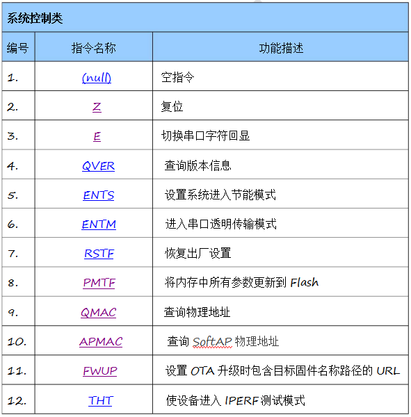

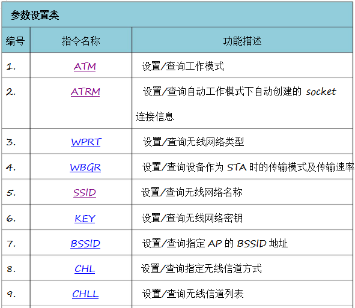

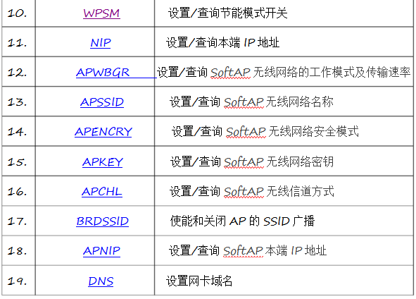

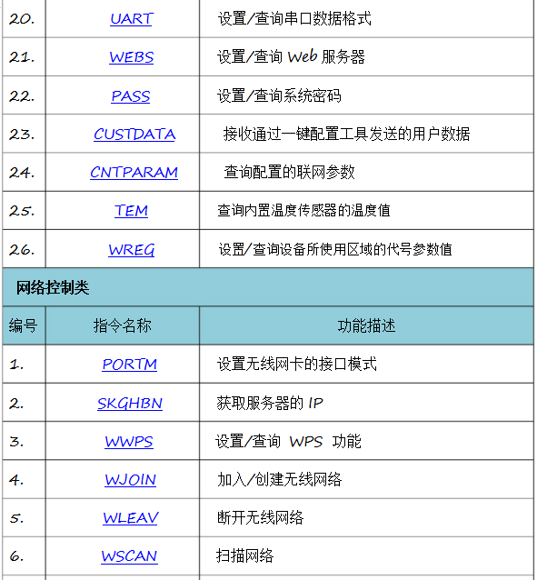

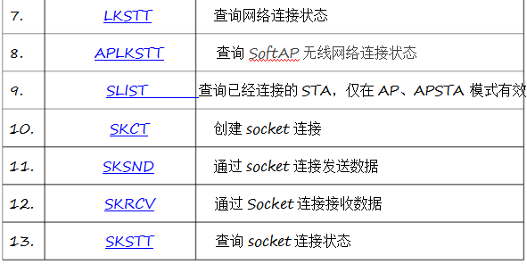

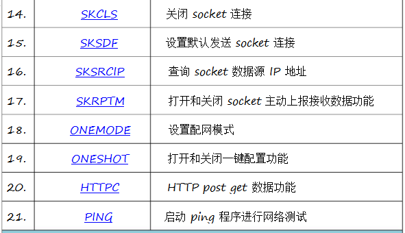

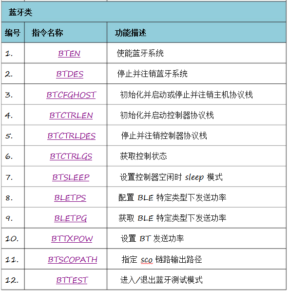

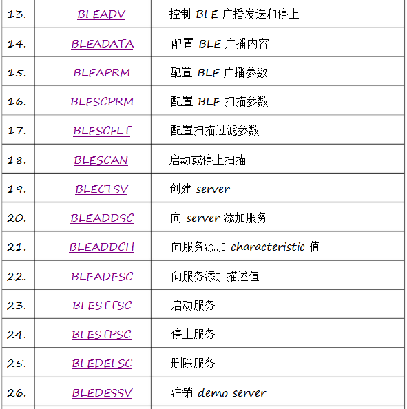

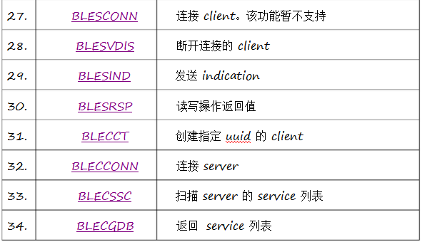

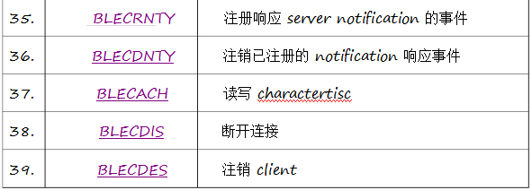

#### 1.2.2 错误代码

本系统支持的错误代码定义如下，用于 AT+指令协议中的响应消息：

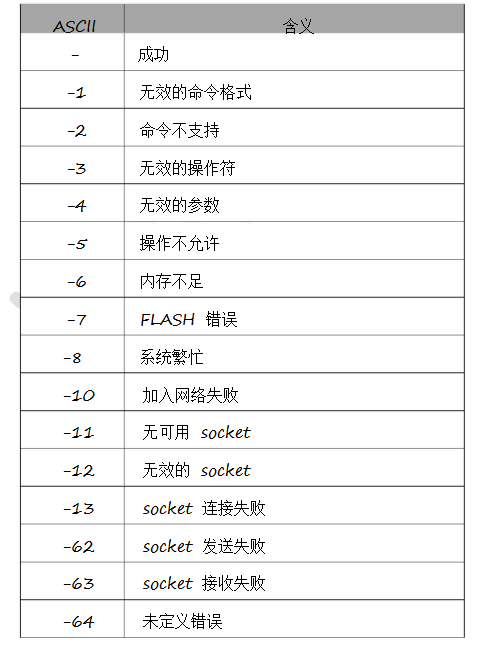

更多信息请查看：[W800_SDK_AT指令用户手册](https://pan.baidu.com/s/14_f_tmlm-f3ERFPUPjVP3A ) 提取码：doit 

## 支持与服务

| 四博智联资源                                        |                                                              |
| --------------------------------------------------- | ------------------------------------------------------------ |
| 官网                                                | [www.doit.am](http://www.doit.am/)                           |
| 教材                                                | [ESPDuino智慧物联开发宝典](https://item.taobao.com/item.htm?spm=a1z10.3-c.w4002-7420449993.9.Bgp1Ll&id=520583000610) |
| 购买                                                | [官方淘宝店](https://szdoit.taobao.com/)(szdoit.am)          |
| 讨论                                                | [技术论坛](http://bbs.doit.am/forum.php)(bbs.doit.am)        |
| 应用案例集锦                                        |                                                              |
| [Doit玩家云](http://wechat.doit.am)(wechat.doit.am) | [免费TCP公网调试服务](http://tcp.doit.am)(tcp.doit.am)       |
| 官方技术支持QQ群1/2/3群已满                         |                                                              |
| 技术支持群4                                         | 278888904                                                    |
| 技术支持群5                                         | 278888905                                                    |
| 术支持群6                                           | 278888906                                                    |
| 技术支持群7                                         | 278888907                                                    |
| 技术支持群8                                         | 278888908                                                    |
| 技术支持群9                                         | 278888909                                                    |
| 技术支持群10                                        | 278888900                                                    |