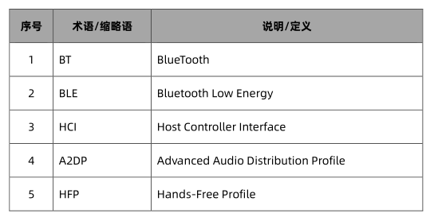
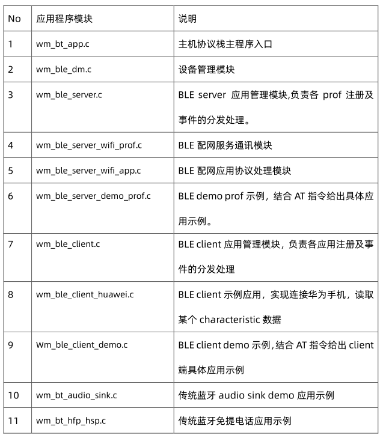

 W800_蓝牙系统架构及API描述 

 From SZDOIT

## 1 引言

### 1.1 编写目的

本文档用于介绍 W800 蓝牙软件系统，硬件系统及其开发蓝牙应用参考，指导用户学习及理解 w800的蓝牙开发。

### 1.2 预期读者

蓝牙应用开发人员，蓝牙协议栈维护人员及测试相关人员

### 1.3 术语定义

### 1.4 参考资料

《W800 芯片手册》
《蓝牙 Core spec4.0 及 4.2》
《蓝牙控制器 spec》

## 2 W800 蓝牙系统

### 2.1 芯片蓝牙设计框图

### 2.2 W800 蓝牙系统框图

W800 蓝牙系统可以分为应用程序部分、主机协议栈、控制器协议栈及蓝牙基带、射频构成。蓝牙的射频部分和 WiFi 系统共用。

认证的 HCI 串口操作指令参见传统蓝牙非信令测试及 BLE 非信令测试文档。具体测试方法如下图所示：

其中 W800 提供可配置的 UART 口，用于 HCI 指令的响应。综测仪通过 UART 口直接控制控制器。此时主机协议栈处于 freeze 状态。

### 2.3 Bluedroid 介绍

#### 2.3.1 bluedroid

Bluedroid 包含了传统蓝牙和低功耗蓝牙协议栈，同控制器交互采用标准的 HCI 协议。

我们移植了 bluedroid7.0，将内部的 task 替换为我们自己实现的微内核机制运行。

#### 2.3.2 蓝牙 bluedroid 架构图

我们移植后，保留了 STACK,BTA 和简化的 BTIF 三层。用户开发应用程序直接基于 BTIF 层开展。

### 2.4 各应用层协议描述

Bluedroid 主要分为 3 个部分：BTIF, BTA, Stack。
作为蓝牙核心服务，Bluetooth Stack 模块则由 Bluetooth Application Layer（BTA）和Bluetooth Embedded System（缩写为 BTE）两大部分组成。

BTE：bluedroid 的内部处理，又可以细分为 BTA，BTU，BTM，HCI 等

#### 2.4.1 BTIF (Bluetooth Profile Interface)

BTIF：Bluetooth Application task(BTA)和 JNI 层之间从当媒介（网上也说胶水层）。

对上层 JNI 提供所有 profile 功能行的接口。该层还存在 Bluetooth Interface Instance,所有 Profile 操作接口注册在其中（GAP, AV, DM, PAN, HF,HH, HL, Storage, Sockets）。Client应用通过 Instance 来操作 Profile

#### 2.4.2 BTA （Bluetooth Appication）

BTA：蓝牙应用层。指 bluedroid 中对各个 profile 实现和处理。上层下来的请求经过 BTA层，通过消息发送的方式将请求传到 BTA 层中处理。

所有 BTA 消息送到 BTU_TASK 中，由 bta_sys_event 来处理；如果是 Gatt 相关的消息，由 bta_gatt_hdl_event 处理。

Stack：实现蓝牙底层操作。

#### 2.4.3 BTU （Bluetooth Upper Layer）

BTU：承接 BTA 和 HCI

#### 2.4.4 BTM（Bluetooth Manager ）

BTM：Bluedroid 中的管理层。蓝牙配对和链路管理

#### 2.4.5 HCI

HCI：读取和写入数据到蓝牙 HW。主机与 BT 控制器之间的接口。

#### 2.4.6 GKI 模块

内核统一接口。该层是一个适配层，适配了 OS 相关的进程、内存相关的管理，还可以用于线程间传递消息 。主要通过变量 gki_cb 实现对进程的统一管理。GKI 模块在 Bluedroid 中主要用于线程间通信。

#### 2.4.7 bluedroid 协议栈消息传递和处理

蓝牙协议栈里通信通过消息队列完成。

### 2.5 BLE 介绍

BLE 根据需要提供短数据包，然后关闭链路，BLE 低功耗的原因之一。相对于常规蓝牙的传统配对方式，BLE 设备尽在需要收发信息时才进行链接。

BLE 通信方式极其严密。设备显示收发数据的服务，后者包含称之为特征的内容，用于定义可共享的数据。特征可包含描述符，帮助 定义数据。
大多数 BLE API 都支持搜索本地设备和发现有关设备的服务、特征和描述符。

#### 2.5.1 ATT

ATT 是专门针对 BLE 设备而设计的优化型协议。ATT 通过发送字节尽可能少的数据。所有属性均带有通用唯一标识符（UUID），后者为标准的 128 位字符串 ID，以唯一的方式识别信息。ATT 传输的属性被格式化为特征和服务。
• 特征（Characteristic）：包含一个单独数据以及 0 个或多个描述符以描述特征值。
• 描述符（Descriptor）：描述符制定了属性，可以描述特征值。可读的描述如可注明单位或测量，或定义可以接受的数值范围
• 服务（Service）：服务指特征的集合。例如一个 service 叫做“Heart Rate Monitor”，它可能包含多个 Characteristics，其中可能包含一个叫做“heart rate measurement"的 Characteristic。

#### 2.5.2 GATT

GATT 配置文件是关于通过蓝牙低功耗链路收发短数据（称为属性）的通用规范。当前BLE 应用配置文件均以 GATT 为基础。SIG 对 BLE 设备的配置文件数量进行了预定义。这些配置文件是关于描述设备使用方法的规范。

#### 2.5.3 GAP

定义了设备如何发现，建立连接，实现绑定。

#### 2.5.4 SM（Security Manager）

负责 BLE 通信中安全。

#### 2.5.5 中心设备和外围设备

Central 与 peripheral；
GATT server 与 GATT client；
GAP 用于外设设备与中心设备，每个设备可以充当多种角色，同一时间只能充当一种角色。

### 2.6 传统蓝牙音频

A2DP 定义了传统蓝牙音频传输规范，描述了立体声音频如何从媒体输出(source)传输至输入(sink)。

A2DP 定义了音频设备的两个角色：输出和输入。

• 输出(SRC)-设备在将数字化音频流传输至微微网的输出时则作为输出设备。

• 输入(SNK)-设备在输入来自同一微微网中 SRC 的数字化音频流时则作为输入设备。

A2DP 定义了在 ACL 信道实现高品质音频内容的单声道或立体声分发协议和程序。

基带、LMP、L2CAP 和 SDP 是蓝牙核心规格中定义的蓝牙协议。AVDTP 包括一个用于沟通串流参数的信令实体以及一个处理串流的传输实体.

AVRC/AVRC CTRL 定义了音视频控制传输协议，描述了输出和输出端音视频播放控制规范。

### 2.7 传统蓝牙免提电话

HFP 定义了传统蓝牙免提电话功能，描述了免提设备如何使用网关设备拨打和接听电话。

HFP 定义了音频网关(AG)和免提组件(HF)两个角色：

• 音频网关(AG) – 该设备为音频（特别是手机）的输入／输出网关。

• 免提组件(HF) – 该设备作为音频网关的远程音频输入／输出机制，并可提供若干遥控功能。

### 2.8 源码框架描述

#### 2.8.1 蓝牙系统软件代码位置

Btapp 目录即蓝牙示例代码，用户可以参考或基于此代码进行二次开发。
应用程序文件列表：

涉及到头文件如下

更多信息请查看官方文档：[《W800_蓝牙系统架构及API描述》](https://pan.baidu.com/s/1JKg8TZb3cF6E-anYEjDmmQ ) 提取码：doit 

