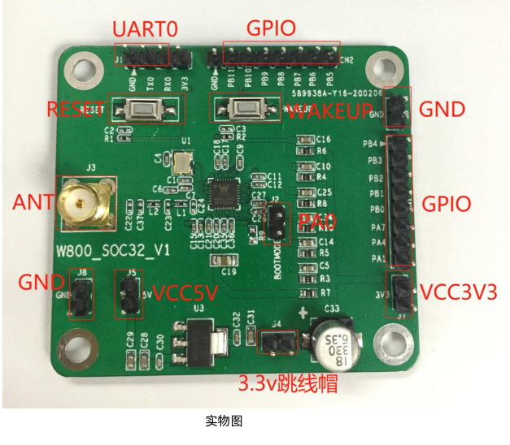
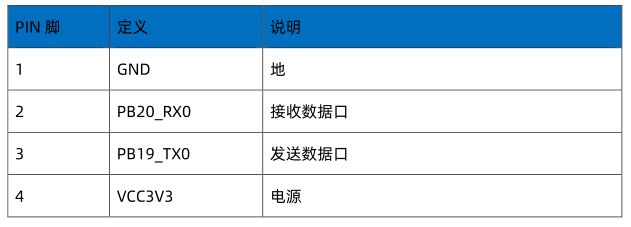
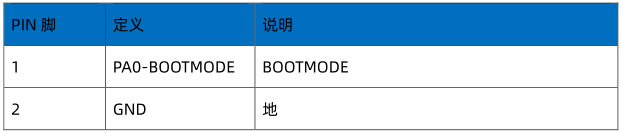
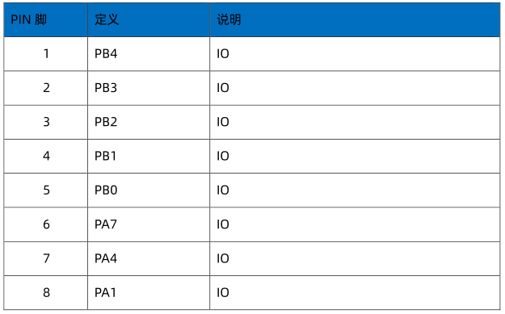
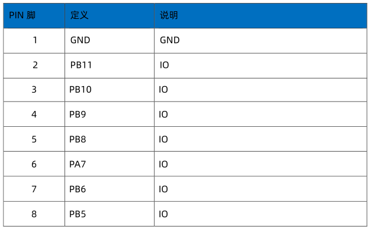
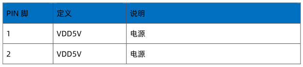
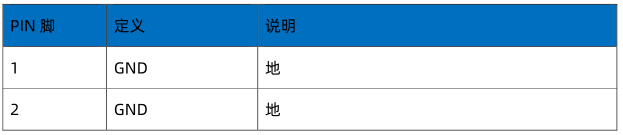
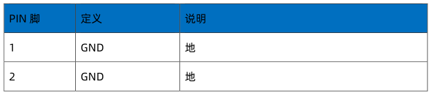
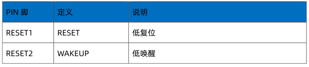

 W800开发板接口使用指南 

 From SZDOIT

## 1 概述

本指南介绍了 W800 简易开发板快速使用，硬件相关接口。

## 2 简易开发板介绍

### 2.1 简介

W800 简易开发板是我公司针对 W800 SOC32 芯片设计的一款简易开发板，供客户前期验证相关功能使用。射频采用 SMA 接口。芯片所有 IO 均已引出，开发者可以根据需求，连接外围设备，验证性能、功能。

### 2.2 开发板实物图

### 2.3 简易开发板使用说明

#### 2.3.1 供电方式

该简易开发板有两种供电方式。
5V 供电：分别连接 J5-VCC5V，J8-GND。
3.3V 供电：分别连接 J7-3.3V，J8-GND。
注意：使用 3.3V 供电时请断开 J4 跳线帽，使用 5V 供电时，需要短路 J4 跳线帽。

#### 2.3.2 射频测试

联网测试请使用 2.4G 频段天线与 J3 连接。通过仪器测试性能使用射频线缆通过 J3 与仪器连接。

### 2.4 简易开发板接口定义

#### 2.4.1 UART0 接口

J1 接插件

#### 2.4.2 BOOTMODE 接口

J2 接插件

#### 2.4.3 IO 接口

CN1 接插件

CN2 接插件

#### 2.4.4 天线口

J3 接插件

#### 2.4.5 电源接口

J5 接插件

### 2.4.6 地接口

J6 接插件

J8 接插件

#### 2.4.7 按键接口

# 支持与服务

| 四博智联资源                                        |                                                              |
| --------------------------------------------------- | ------------------------------------------------------------ |
| 官网                                                | [www.doit.am](http://www.doit.am/)                           |
| 教材                                                | [ESPDuino智慧物联开发宝典](https://item.taobao.com/item.htm?spm=a1z10.3-c.w4002-7420449993.9.Bgp1Ll&id=520583000610) |
| 购买                                                | [官方淘宝店](https://szdoit.taobao.com/)(szdoit.am)          |
| 讨论                                                | [技术论坛](http://bbs.doit.am/forum.php)(bbs.doit.am)        |
| 应用案例集锦                                        |                                                              |
| [Doit玩家云](http://wechat.doit.am)(wechat.doit.am) | [免费TCP公网调试服务](http://tcp.doit.am)(tcp.doit.am)       |
| 官方技术支持QQ群1/2/3群已满                         |                                                              |
| 技术支持群4                                         | 278888904                                                    |
| 技术支持群5                                         | 278888905                                                    |
| 术支持群6                                           | 278888906                                                    |
| 技术支持群7                                         | 278888907                                                    |
| 技术支持群8                                         | 278888908                                                    |
| 技术支持群9                                         | 278888909                                                    |
| 技术支持群10                                        | 278888900                                                    |