<center><font size=10> W800认证测试工具说明 </center></font>
<center> From SZDOIT</center>

## 1 引言

### 1.1 编写目的

无线认证测试 PC 端工具的使用方法及设置说明，指导客户如何通过工具操作待测无线模块，使待测模块处于认证测试所需状态。

### 1.2 预期读者

Wi-Fi/蓝牙部分物理层的研发工程师，测试工程师及其他认证支持工程师。

## 2 Wi-Fi 认证连接示意图

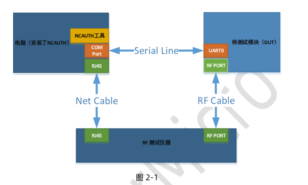

上图指示如何连接物理设备及工具安装情况：

1）待测试模块通过 UART0 与 PC 端的串口相连接

2）待测试模块通过射频线与测试仪器（Litepoint，频谱分析仪，信号源）相连

3）测试仪器与 PC 如何相连

4）认证测试工具及仪器分析软件（接收或者发送待测信号）会安装于同一 PC

## 3 蓝牙认证连接示意图

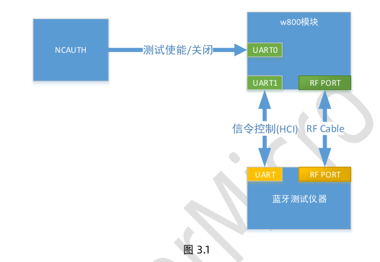

上图指示如何连接物理设备及工具安装情况：

1）待测试模块通过 UART0 与 PC 端的串口相连接，用于控制蓝牙进入测试模式

2）待测模块通过 UART1 与蓝牙测试仪器相连接，用于蓝牙测试的信令控制

3）待测试模块通过射频线与测试仪器相连

4）认证测试工具及仪器分析软件（接收或者发送待测信号）会安装于同一 PC

## 4 工具使用说明

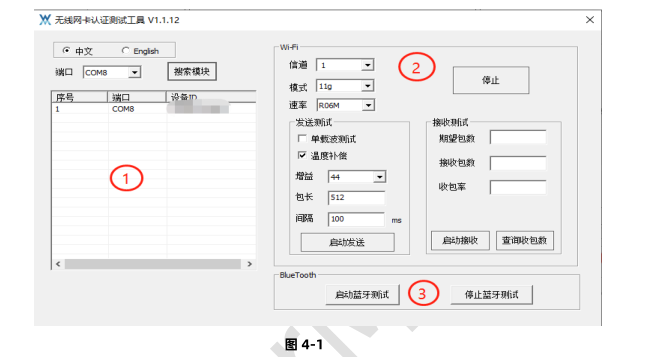

上图是工具主界面，它通过图形指导来展示：
1） 如何通过串口指令操作，使得待测模块的 Wi-Fi 功能处于发送，接收或频偏（单载波）等
相关状态，加以测试仪器（litepoint，频谱分析仪等）的配合来完成指定测试。
2） 如果通过串口指令操作，使得待测模块蓝牙处于测试模式。

### 4.1 界面说明

如图 2-1，界面按照左右分成两大部分：

1. DUT 搜索显示部分
a) 模块搜素：
端口下拉列出当前的串口，根据连接情况选择要使用的串口，默认波特率：115200，数据位：8bit，停止位：1bit，奇偶校验：无
b) 模块显示
搜索到的模块 MAC 和对应的串口显示在白色窗口

2. DUT 的 WI-Fi 指标测试部分
    a) 公共部分
    发送和接收时的信道，模式以及速率的配置项，停止测试的功能
    b) 发送和频偏测试部分
    发送的增益，包长，发包间隔等配置项
    频偏测试选项
    温度补偿选项
    启动发送功能按钮
    c) 接收部分
    可配置的期望包数（对端实际发包数）
    实际收包和误包率显示项
    启动接收功能按钮
    接收包数查询功能按钮

3. DUT 的蓝牙操作部分
    主要是用于控制模块的蓝牙打开及进入测试模式（UART0 口的操作），而信令相关的操作不在此界面操作，且信令是通过 UART1 口完成。

### 4.2 Wi-Fi 部分

#### 4.2.1 Wi-Fi 测试配置参数说明

  信道：1-14

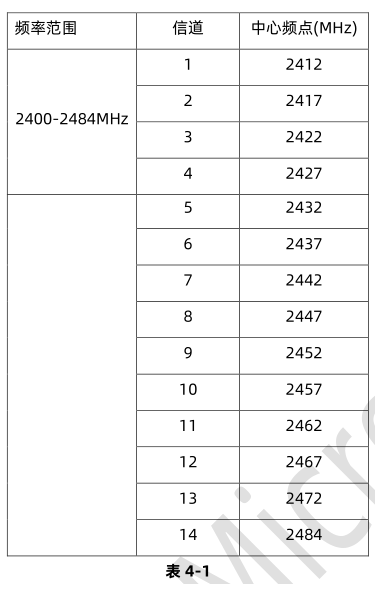

**模式：**

802.11b

802.11g

802.11n

**速率：**

802.11b 对应速率：

L1M，L2M，L5M5，L11M

802.11g 对应速率：

R06M，R09M，R12M，R18M，R24M，R36M，R48M，R54M

802.11n 对应速率：

HT20：MCS0_20M, MCS1_20M, MCS2_20M, MCS3_20M, MCS4_20M,MCS5_20M,MCS6_20M,MCS7_20M

HT40：MCS0_40M,MCS1_40M, MCS2_40M,MCS3_40M, MCS4_40M,MCS5_40M,MCS6_40M,MCS7_40M, MCS32
**单载波测试：**

测试频偏时使用

温度补偿：

默认打开功能。

随着环境温度升高或者降低，芯片的工作温度会变化，在不调整芯片参数的情况下，芯片发射性能会发生变化。为了使芯片能够在不同的温度都能达到较好的发射性能，因此需要根据温度的变化对芯片发射参数进行调整。

当温度补偿功能打开时，芯片依据内部设定的参数进行调整，界面设定的增益参数无效。

如果需要生效工具界面的增益，需关闭温度补偿功能。

**增益：**

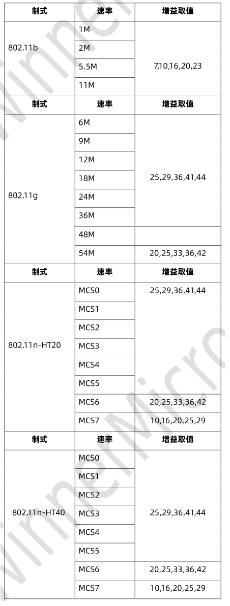

**包长：**
0-1500byte，说明，实际空中发送的包长度为：设置包长+MAC 头和 CRC 长度。
**发包间隔：**
默认 100ms，取值说明：>=2ms 时，使用设置值；<2 时，使用内部默认的发送间隔。
**期望包数：**
接收测试时，发送方要发送的包数，即模块要收到的最多包数。
**接收包数：**
接收测试时，通过查询收包数功能或者停止测试时查询到的实际接收包数。
**收包率：**
接收测试时，依据期望包数和接收包数计算百分比，即收包正确率，当收包大于总包数时，收保率无意义。

#### 4.2.2 Wi-Fi 测试操作说明

##### 4.2.2.1 Wi-Fi 发送测试

**说明：**
仪器处于接收状态，让待测模块发出指定的信号，仪器接收并分析模块的信号，进而分析出模块的发送功率，EVM，MASK 等信息。

如果要进行温度补偿功能，按照默认温度补偿功能勾选即可。

如果要测试不同增益下的射频发射性能，不要勾选温度补偿选项。

**操作：**
根据测试需要设置信道，模式，速率，增益，包长，发包间隔，然后，点击发送按钮，启动模块发送数据。如需要停止， 点击停止按钮。

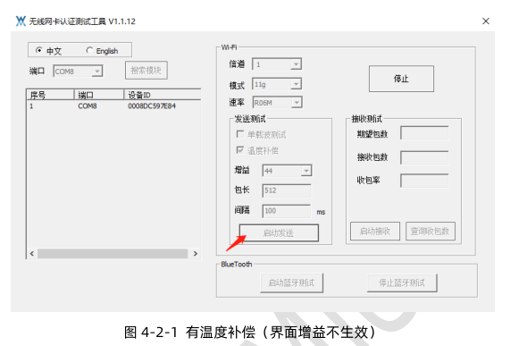

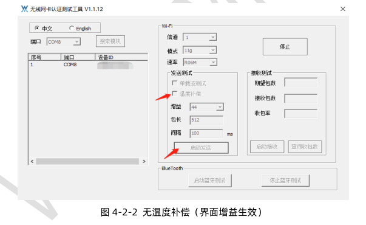

##### 4.2.2.2 Wi-Fi 接收测试

**说明：**

让待测模块打开接收通道，处于接收状态，仪器根据测试要求发出指定速率的信号，一般接收测试只是看误报率。

**操作：**

选择信道，模式，速率，点击启动接收按钮，使模块处于接收状态。如需要停止， 点击停止按钮。测试过程中，可以通过点击查询收包数按钮，查询收到的包数；停止测试时，也会更新实际收包数，如果期望包数设置，且满足条件会计算误包率。

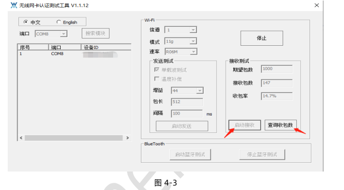

##### 4.2.2.3 Wi-Fi 频偏（单载波）测试

**说明：**
让待测模块打开发送通道，仪器处于接收状态，仪器分析模块的本振信号，以此来判断频率误差。
**操作：**
勾选[单载波测试]选项，设置信道，点击发送按钮，使得模块输出本振信号。如需要停止，点击停止按钮。

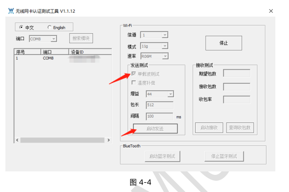

### 4.3 蓝牙部分

#### 4.3.1 测试控制说明

**说明：**
此界面操作仅仅是让待测模块处于蓝牙测试模式，具体的信令控制部分通过 UART1 来实现的。
**操作：**
要启动测试，点击“启动蓝牙测试”按钮，待测模块蓝牙功能打开，并进入蓝牙测试模式。要停止测试，点击“停止蓝牙测试”按钮即可。
如图所示。

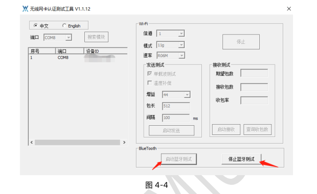

#### 4.3.2 BLE 的指令控制部分说明

**注意：**
此部分，仅是介绍蓝牙的 HCI 控制指令。一般蓝牙测试仪直接支持 HCI 指令，无需手动通过串口发送 HCI 指令。
如需手动操作，发送的指令串口应以十六进制方式发送。

##### 4.3.2.1 BLE 发送测试的 HCI 指令

```
1）发送：01 03 0C 00             //复位蓝牙控制

  响应：04 0E 04 01 03 0C 00

2）发送：01 1E 20 03 00 25 00   //发送数据，其中 packet payload 可以选择不同类型用于测试不同 rf 性能指标。具体定义参见如下说明。

 响应：04 0E 04 01 1E 20 00

3）发送停止测试：01 1F 20 00   //用于停止发送测试。如果测试不同的 channel 及packet payload，继续步骤 2）即可。

  响应：04 0E 06 01 1F 20 00 00 00

```

##### 4.3.2.2 BLE 接收灵敏度测试的 HCI 指令

```
1）发送：01 03 0C 00                //复位蓝牙控制器
  响应：04 0E 04 01 03 0C 00
  
2）发送：01 1D 20 01 00             //配置接收信道，进入接收数据模式。此时可以用 CWM500，根据配置的信道发送 LE 数据包。发送完成后，发送停止测试指令
  响应：04 0E 04 01 1D 20 00
  
3）发送停止测试：01 1F 20 00         //发送停止测试
  响应：04 0E 06 01 1F 20 00 xx xx //其中 xx xx 为收到的数据包个数。
```

##### 4.3.2.3 Packet payload 及发送信道及数据长度定义

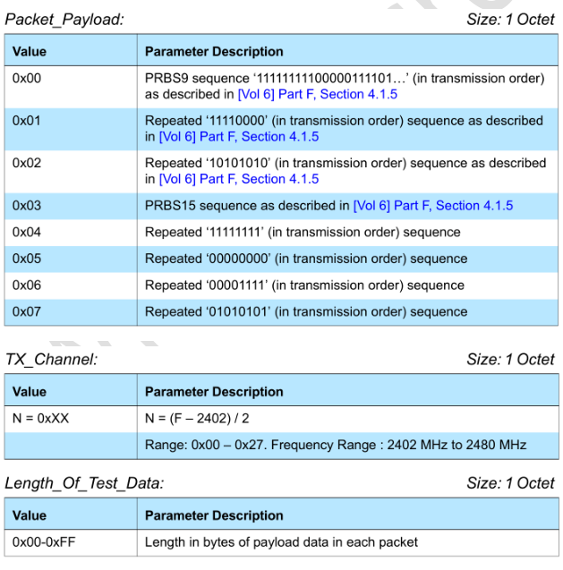

##### 4.3.2.4 BLE 测试的几个 HCI 指令的具体描述

```
蓝牙复位指令：
Send COM: 01 03 0C 00 (Reset)
01………………………………………………………Command
03 0C……………………………………………Command_Opcode (reset Command)
00……………………….. ……………Parameter length
Receive COM: 04 0E 04 01 03 0C 00 (7 bytes)
04………………………………………………………HCI_Packet_Type
0E………………………………………………….Event_Code
04…………………………………………… Parameter_Length
01………………………………………..
Num_HCI_Command_Packets 03
0C……………………………..Command_Opcode
00……………………….. Status
发射指令：
Send COM: 01 1E 20 03 00 25 00
01………………………………………………………Command
1E 20……………………………………………Command_Opcode
(HCI_LE_Transmitter_Test)
03……………………………………… Parameter_Length
00…………………………………TX_Channel (2402)
25……………………………Length_Of_Test_Data
00………………………..Packet_Payload (Pseudo-Random bit
sequence 9)
Receive COM: 04 0E 04 01 1E 20 00 (7 bytes)
04…………………………………………………….…HCI_Pa
cket_Type
0E………………………………………………….Event_
Code
04…………………………………………… Parameter_Length
01………………………………………..
Num_HCI_Command_Packets 1E
20……………………………...Command_Opcode
00…………………….….. Status
停止测试
Send COM: 01 1F 20 00 (End Test)
01………………………………………………………Command
1F 20……………………………………….…..Command_Opcode（HCI_LE_Test_End）
00……………………………………... Parameter length
Receive COM: 04 0E 06 01 1F 20 00 00 00 (9 bytes)
04………………………………………………….……HCI_Packet_Type
0E………………………………………………….Event_Code
06…………………………………………… Parameter_Length
01……………………………………….. Num_HCI_Command_Packets
1F 20………………………………Command_Opcode
00 …………………….Status
00 00……………..Number of packets
接收测试模式
Send COM: 01 1D 20 01 00
01………………………………………………………Command
1D 20……………………………………………Command_Opcode
(HCI_LE_Reciver_Test)
01……………………………………… Parameter_Length
00…………………………………RX_Channel (2402)
Receive COM: 04 0E 04 01 1D 20 00 (7 bytes)
04…………………………………………………….…HCI_Packet_Type
0E………………………………………………….Event_Code
04…………………………………………… Parameter_Length
01………………………………………..
Num_HCI_Command_Packets 1D
20……………………………...Command_Opcode
00…………………….….. Status
停止测试
Send COM: 01 1F 20 00 (End Test)
01………………………………………………………Command
1F 20……………………………………….…..Command_Opcode（HCI_LE_Test_End）
00……………………………………... Parameter length
Receive COM: 04 0E 06 01 1F 20 00 00 00 (9 bytes)
04………………………………………………….……HCI_Packet_Type
0E………………………………………………….Event_Code
06……………………………………………Parameter_Length
01………………………………………..
Num_HCI_Command_Packets
1F 20………………………………Command_Opcode
00 …………………….Status
```

#### 4.3.3 传统蓝牙的指令控制部分说明

注意：
此部分，仅是介绍传统蓝牙的 HCI 控制指令。一般蓝牙测试仪直接支持 HCI 指令，无需手动通过串口发送 HCI 指令。
如需手动操作，发送的指令串口应以十六进制方式发送。

##### 4.3.3.1 传统蓝牙测试的 HCI 指令

```
1）发送：01 03 0C 00 //复位蓝牙控制器
  响应：04 0E 04 01 03 0C 00
  
2）发送：01 05 0C 03 02 00 02 //设置 Event filter
  响应：04 0E 04 05 05 0C 00
  
3）发送：01 1A 0C 01 03 //用于配置控制器处于 scan 模式
  响应：04 0E 04 05 1A 0C 00
  
4）发送：01 03 18 00 //进入 DUT 模式
  响应：04 0E 04 05 03 18 00 //此时可以使用蓝牙测试测试
```

##### 4.3.3.2 传统蓝牙测试的几个 HCI 指令的具体描述

```
蓝牙复位指令：
Send COM: 01 03 0C 00 (Reset)
01………………………………………………………Command
03 0C……………………………………………Command_Opcode (reset Command)
00……………………….. parameter length
Receive COM: 04 0E 04 01 03 0C 00 (7 bytes)
04………………………………………………………HCI_Packet_Type
0E………………………………………………….Event_Code
04…………………………………………… Parameter_Length
01………………………………………..
Num_HCI_Command_Packets 03
0C……………………………..Command_Opcode
00……………………….. Status
设置 Event Filter:
Send COM: 01 05 0C 03 02 00 02
01………………………………………………………Command
03 0C……………………………………………Command_Opcode (reset Command)
03……………………………………….Parameter Length
02……………………………………Connection setup
00………………………………..Allow connections from all devices
02…………………………Do auto accept the connection with role
switch disabled
Receive COM: 04 0E 04 05 05 0C 00 (7 bytes)
04………………………………………………………HCI_Packet_Type
0E………………………………………………….Event_Code
04…………………………………………… Parameter_Length
05………………………………………..
Num_HCI_Command_Packets 05
0C……………………………..Command_Opcode
00……………………….. Status
设置使能 scan 模式
Send COM: 01 1A 0C 01 03
01………………………………………………………Command
1A 0C……………………………………………Write scan enable
01……………………………………… parameter length
03……………………………………Inquire and page scan enabled
Receive COM: 04 0E 04 05 1A 0C 00 (7 bytes)
04………………………………………………………HCI_Packet_Type
0E………………………………………………….Event_Code
04…………………………………………… Parameter_Length
05………………………………………..
Num_HCI_Command_Packets 1A
0C……………………………..Command_Opcode
00……………………….. Status
使能 DUT 模式指令：
Send COM: 01 03 18 00
01………………………………………………………Command
03 18……………………………………………Enable device under test mode
00………………………..………….. Parameter length
Receive COM: 04 0E 04 05 03 18 00
04………………………………………………………HCI_Packet_Type
0E………………………………………………….Event_Code
04…………………………………………… Parameter_Length
05………………………………………..
Num_HCI_Command_Packets 03
18……………………………..Command_Opcode
00……………………….. Status
```


## 支持与服务

| 四博智联资源                                        |                                                              |
| --------------------------------------------------- | ------------------------------------------------------------ |
| 官网                                                | [www.doit.am](http://www.doit.am/)                           |
| 教材                                                | [ESPDuino智慧物联开发宝典](https://item.taobao.com/item.htm?spm=a1z10.3-c.w4002-7420449993.9.Bgp1Ll&id=520583000610) |
| 购买                                                | [官方淘宝店](https://szdoit.taobao.com/)(szdoit.am)          |
| 讨论                                                | [技术论坛](http://bbs.doit.am/forum.php)(bbs.doit.am)        |
| 应用案例集锦                                        |                                                              |
| [Doit玩家云](http://wechat.doit.am)(wechat.doit.am) | [免费TCP公网调试服务](http://tcp.doit.am)(tcp.doit.am)       |
| 官方技术支持QQ群1/2/3群已满                         |                                                              |
| 技术支持群4                                         | 278888904                                                    |
| 技术支持群5                                         | 278888905                                                    |
| 术支持群6                                           | 278888906                                                    |
| 技术支持群7                                         | 278888907                                                    |
| 技术支持群8                                         | 278888908                                                    |
| 技术支持群9                                         | 278888909                                                    |
| 技术支持群10                                        | 278888900                                                    |