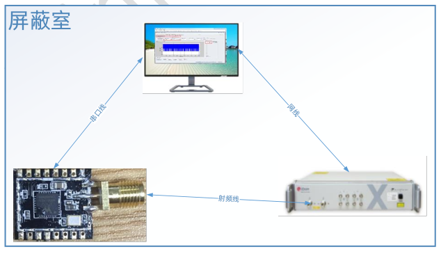
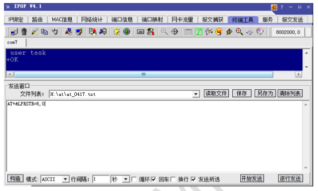
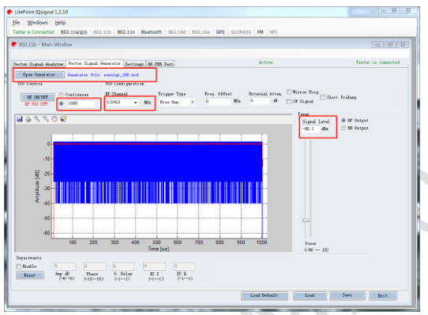
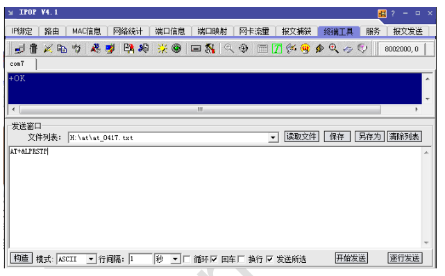
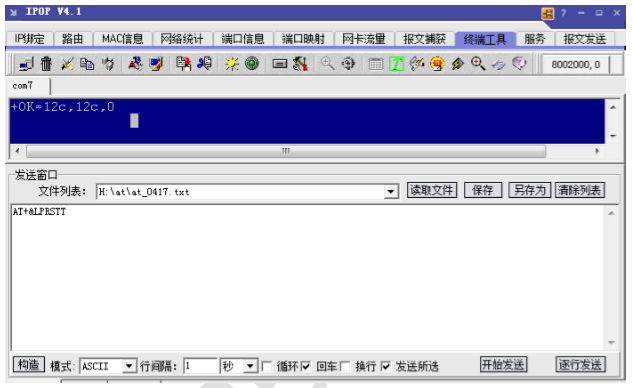
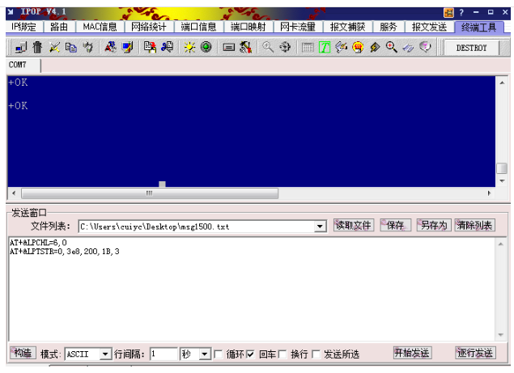
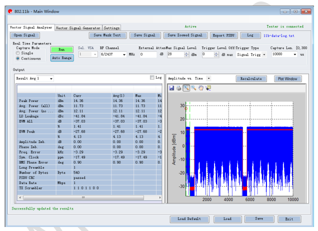
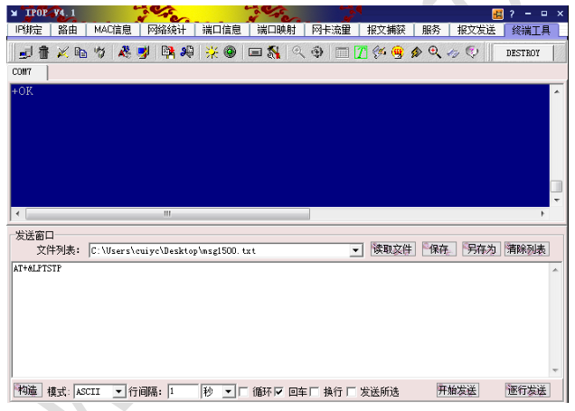

<center><font size=10> W800研发验证指导 </center></font>
<center> From SZDOIT</center>

## 1. 引言

### 1.1 编写目的

指导客户在研发阶段测试、调试基于 W800 产品的 Wi-Fi 性能，主要提供发送测试和接收灵敏度调试指导。

### 1.2 预期读者

射频工程师、Wi-Fi 软件工程师。

## 2 环境搭建

### 2.1 需要准备的设备

⚫ Litepoint；（不限于 Litepoint，只要是能控制发送 wifi 数据包、调节发送包的发送功率的设备皆可，本文以 Litepoint 为例）。

⚫ IQ Signal 软件

⚫ 电脑

⚫ 屏蔽室或者屏蔽箱

⚫ 串口软件（secureCRT/IPOP 等）

### 2.2 连接设备

⚫ W800 天线端断开，焊接 SMA 等射频接头，通过射频屏蔽线缆连接 Litepoint 等设备。在屏蔽室进行测试，或者将 W800 放置于屏蔽箱内。

⚫ 电脑网线连接 Litepoint，确保能控制 Litepoint。

⚫ 电脑串口线连接 W800 串口 0。



## 3 使用 W800 测试固件测试接收

**接收测试流程：**

1）使信号发射仪器处于发送，并设置信道，衰减 

2）让待测模块处于接收状态，设置好信道

3）导入指定测试的信号数据到仪器操作界面，让仪器发出指定数量的数据

4）查询模块侧的接收情况，进而得到实际的丢包率。

### 3.1 准备 W800 测试模式

#### 3.1.1 控制 W800 升级测试固件

给 W800 烧录测试固件 xxx.FLS（V0.0.06 版本及以后功能支持）

#### 3.1.2 控制 W800 启动接收测试

通过串口0发送串口指令：AT+&LPRSTR

**功能：**
连接Litepoint测试指令，启动RX测试。

**格式（ASCII）：**

```
AT+&LPRSTR=<channel>[,bandwidth]<CR>
+OK<CR><LF><CR><LF>
```

**参数：**
channel：无线信道，取值 1-14
bandwidth：信道频宽，取值 0 和 1 分别表示 20M 和 40M，默认是 20M。
如下图示例，测试 6 信道，20M 频宽



### 3.2 控制 Litepoint 发送数据包

⚫ 打开 IQ Signal 软件，进入 VSG 界面。

⚫ 选择波形文件（.mod）（不用速率选择不同的波形文件）

⚫ 填入发送包数

⚫ 选择信道

⚫ 选择发射功率，需要考虑线损

⚫ 点击 RF ON/OFF 按钮开始发送

注：建议只测试 1,6,11 三个信道



### 3.3 控制 W800 接收测试结束

通过串口0发送串口指令：AT+&LPRSTP
**功能：**
停止接收。
**格式（ASCII）：**

```
AT+&LPRSTP<CR>
+OK<CR><LF><CR><LF>
```

参数：
无
返回值：
+OK：表示指令设置成功

如下图示例



### 3.4 获取 W800 接收测试结果

通过串口0发送如下串口指令：AT+&LPRSTT
**功能：**
查询测试结果。
**格式（ASCII）：**

```
AT+&LPRSTT<CR>
+OK=total,good,bad<CR><LF><CR><LF>
```

**参数：**

无

**返回值：**

total：总共接收到的报文数目

good：没有错误的报文数目

bad：FCS 错误的报文数目

如下图示例



## 4 使用 W800 测试固件测试发送

**发送测试流程：**

1）使信号分析仪器处于接收状态（指定制式，信道，衰减）

2）让待测模块按照要求发出指定的信号（信道，速率，制式，功率，包长）

3）仪器接收模块发出的数据并进行分析，然后得到模块的各项物理指标（发送功率，EVM，MASK，杂散，频偏等）。

**说明：**

1）关于发送测试，可使用认证测试工具 NCAUTH V1.1.09 及以上版本。

2）测试固件 xxx.FLS（V0.0.06 版本及以后功能支持温度补偿功能，如果使用 NCAUTH需使用 V1.1.12 及以后版本）

### 4.1 准备 W800 发送测试

#### 4.1.1 设置 W800 发送测试的信道

通过串口0发送指令：

AT+&LPCHL

**功能：**

设置发送测试信道。

**格式（ASCII）：**

```
AT+&LPCHL=<channel>[,bandwidth]<CR>
+OK<CR><LF><CR><LF>
```

**参数：**
channel：无线信道，取值 1-14

bandwidth：信道频宽，取值 0 和 1 分别表示 20M 和 40M，默认是 20M。

### 4.1.2 控制 w800 的发包间隔

通过串口0发送指令：

AT+ &LPTPD

**功能：**

设置发送测试发包间隔。

**格式（ASCII）：**

```
AT+ &LPTPD=< period><CR>
+OK<CR><LF><CR><LF>
```

**参数：**
period：发包间隔，取值 0 或者 1，使用内部间隔；取值大于等于 2，使用外部发包间隔。单位 ms。

#### 4.1.3 控制 W800 启动发送测试

通过串口0发送指令：

AT+&LPTSTR

**功能：**

连接Litepoint测试指令，启动发送测试。

**格式（ASCII）：**

```
AT+&LPTSTR=<Tempcomp>,<PacketCount>,<PsduLen>,<TxGain>,<DataRate>
+OK<CR><LF><CR><LF>+OK<CR><LF><CR><LF>
```

**参数：**指令里的参数为hex表示的值
Tempcomp：温度补偿，255：打开温度补偿功能，其他值：关闭温度补偿功能当温度补偿功能打开时，TxGain参数无效；

如需使用传入的TxGain，需要关闭温度补偿，即Tempcomp参数传入非255的值。

PacketCount: 非0：发送实际包个数，0：连续发送
PsduLen：数据长度，0-1500

TxGain：发送增益，增益取值如下


```
DataRate：速率，速率取值如下说明
11b 的速率：
{
S2M = 0x0000,
S5M5 = 0x0001,
S11M = 0x0002,
L1M = 0x0003,
L2M = 0x0004,
L5M5 = 0x0005,
L11M = 0x0006,
}
11g 的速率：
{
R06M = 0x0100,
R09M = 0x0101,
R12M = 0x0102,
R18M = 0x0103,
R24M = 0x0104,
R36M = 0x0105,
R48M = 0x0106,
R54M = 0x0107,
}
HT20 的速率：
{
MCS0 = 0x0200,
MCS1 = 0x0201,
MCS2 = 0x0202,
MCS3 = 0x0203,
MCS4 = 0x0204,
MCS5 = 0x0205,
MCS6 = 0x0206,
MCS7 = 0x0207,
}
HT40 的速率：
{/*MCS0-MCS7,MCS32*/
MCS0 = 0x0208,
MCS1 = 0x0209,
MCS2 = 0x0210,
MCS3 = 0x0211,
MCS4 = 0x0212,
MCS5 = 0x0213,
MCS6 = 0x0214,
MCS7 = 0x0215,
MCS32 = 0x0232
}
```

如下图示例，测试 6 信道，11b 1M，包长 512，增益 27，发送 1000 包



### 4.2 控制 Litepoint 接收分析

⚫ 打开 IQ Signal 软件，依据测试的速率选择 11b,11a/g 或者 11n，然后点击进入 VSA界面。

⚫ 选择测试信道，捕获时间，补偿线损

⚫ 选择连续或者单次观察，可观察的发送指标：发送功率，频偏，EVM，mask，I/Q，星座图等

注：建议只测试 1,6,11 三个信道



### 4.3 控制 W800 发送测试结束

通过串口0发送指令：AT+&LPTSTP
**功能：**

停止发送。

**格式（ASCII）：**

```
AT+&LPTSTP<CR>
+OK<CR><LF><CR><LF>
```

**参数：**
无
**返回值：**
+OK：表示指令设置成功
如下图示例




