
 W800批量烧录工具操作指南 

 From SZDOIT

## 1 引言

WM_W800 批量烧录工具是我司自主开发的一款免安装软件，用于对产线上新品执行批量烧录指定固件。

### 1.1 编写目的

指导操作员快速正确使用批量烧录工具，快速高效完成产线新品烧录固件。

### 1.2 预期读者

工具开发人员、工具测试人员、产品经理、操作员等。

### 1.3 术语定义

DUT      Device Under Test     被测器件

## 2 搭建测试环境

### 2.1 所需软硬件

1> PC；
2> WM_W800 批量烧录工具；
3> 待烧录的目标固件；
4> DUT 即 WM_W800 模块产品；
5> USB 延长线；
6> 测试夹具。

### 2.2 环境组建

1> DUT 放入测试夹具；
2> PC 通过 USB 延长线连接测试夹具。

## 3 批量烧录工具组成

### 3.1 工具目录

解压批量烧录工具压缩包后并打开目录如下：

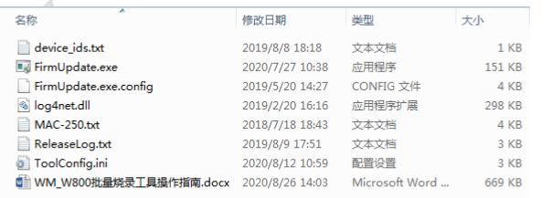

device_ids.txt：有用户需要向产品中写入 device id，在烧录固件时，可将该文件内的device id 依次写入产品；

FirmUpdate.exe：烧录工具的运行程序；

FirmUpdate.exe.config：主要是配置 log 文件夹内文件的组成和输出格式；

log4net.dll：日志记录组件；

MAC-250.txt：产品若要烧录 MAC，在烧录固件时，可将该文件内的 MAC 依次写入产品；

ReleaseLog.txt：烧录工具发布记录；

ToolConfig.ini：烧录工具初始化配置；

WM_W800 批量烧录工具操作指南.docx：烧录工具操作指南说明文档。

### 3.2 初始化设置

使用批量烧录工具之前，需要根据用户定制需要进行一些初始化配置，才可以执行烧录。

打开 ToolConfig.ini 文件如下，每行都有相应的说明，可按需进行设置并保存。

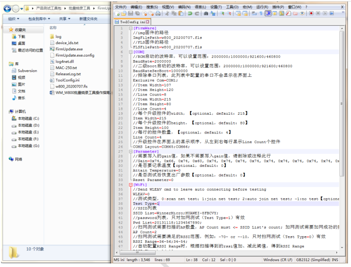

这里重点介绍以下几点：
1> 待烧录固件的路径：请将目标固件路径正确设置于上述文件“ImgFilePath=”和“FLSFilePath=”后。上图将 w800_20200707.fls 直接拷贝至烧录工具目录里，所以可将固件名直接写在等号之后；

2> BaudRate：波特率的设置无需更改，烧录工具连接产品后会自动进入 ROM 并以最大波特率烧录固件，提升烧录效率；

3> COMS_Layout 设置：即烧录工具所连接测试夹具占用的 PC 上 COM 编号，注意编号顺序要与升级界面显示顺序一致；

4> Gain：此项需要慎重，除非有用户特殊需求，我们不建议客户在此写入 Gain 值。我们在产线测试，以及标准固件里，都可对产品写入合适的 Gain 值；

5> Test Type：如果在产品烧录固件后，想测试下产品的 WiFi 加网，可以将此处设置为 1，并将目标 AP 的 SSID 配置在 SSID List 之后，AP 的 Key 配置在 Pwd List 之后；如果想尝试加入几个 AP，请分别将 AP 的 SSID 和 Key 依次对应分别配置在 SSID List 和 PwdList 之后，并以分号分开，如上图。

6> 对 ToolConfig.ini 修改之后，请注意保存，并重新打开烧录工具。

注意：

建议使用 Notepad++或 UltraEdit 工具编辑 ToolConfig.ini，以免由于配置格式问题，影响工具执行。

### 3.3 烧录工具界面

批量烧录工具无需安装，在完成初始化设置之后打开即可方便使用。鼠标放置在FirmUpdate.exe 处，右键点击“以管理员身份运行”，即可根据此前 ToolConfig.ini 的设置，打开烧录工具主控界面如下：

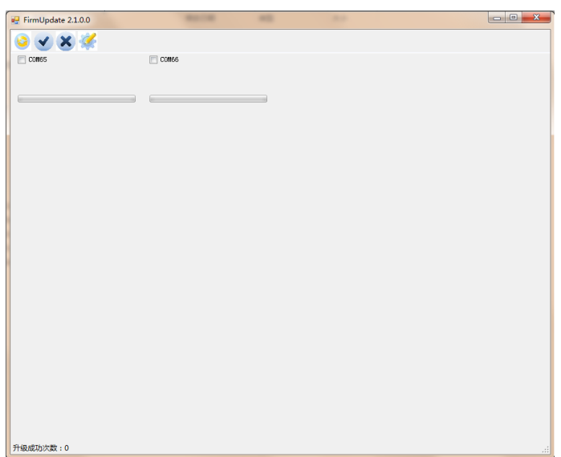

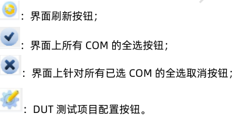

### 3.4 测试配置框

点击烧录工具主控界面上 之后，弹出如下配置项：

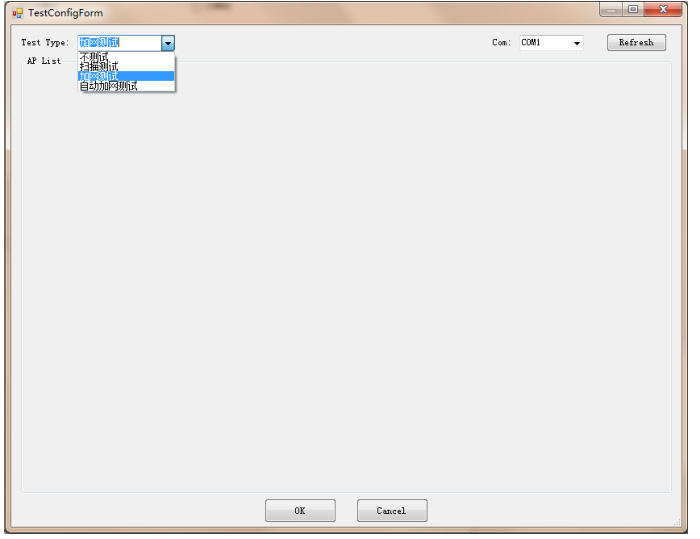

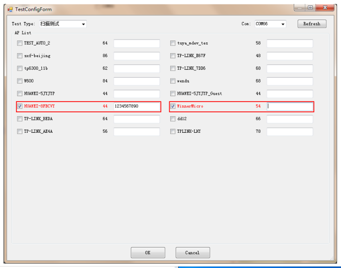

说明：
此页面只是以可视化方式设置测试项而已，此处的修改保存可直接修改 ToolConfig.ini 文件。若此处发生修改和保存，必须重新打开烧录工具。

建议在正式使用烧录工具前，用 Notepad++直接修改 ToolConfig.ini 并保存后，再打开烧录工具，以避免多次关闭和打开烧录工具。

## 4 操作执行

### 4.1 烧录&测试执行

烧录工具的主要操作步骤如下：
1> 打开烧录工具；

2> DUT 放入夹具后，点击烧录工具界面 将所有 COM 呈现在界面内；

3> 随后点击 即可将界面内所有 COM 全部选中，当然也可以直接鼠标勾选相应 COM；

4> 勾选相应 COM 后工具连接 DUT 进入 ROM 即可自动升级，如下界面：

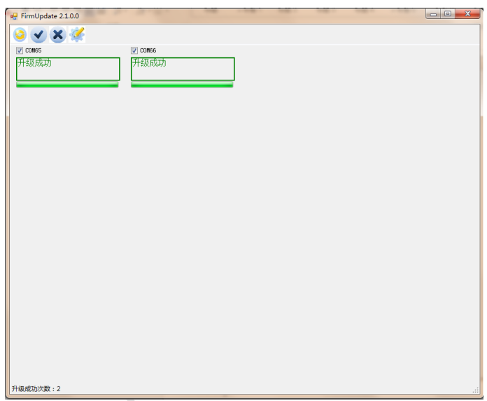

如果在初始化配置中设置了测试 WiFi 加网，在 DUT 升级成功后，即可开始执行测试，截图如下：

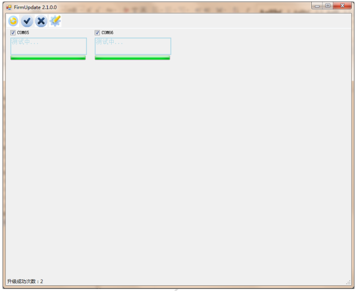

显示测试结果如下：

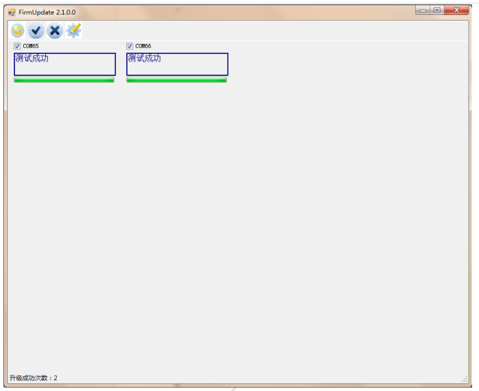

5> 测试执行成功之后，点击 取消全选，更换 DUT，重新压入夹具，随后点击 ，即可再次烧录测试一批 DUT。

### 4.2 Log 查看

首次打开烧录工具，即可创建 log 的根文件夹，其内再以执行日期分别创建 log 文件夹如下：

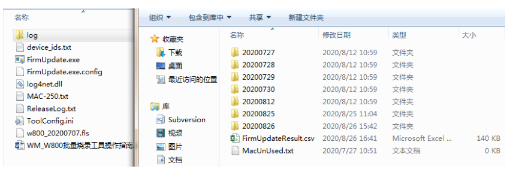

## 5 FAQ

I COM 全选的时候，遇到“后台线程忙”，请按照提示框操作即可恢复。

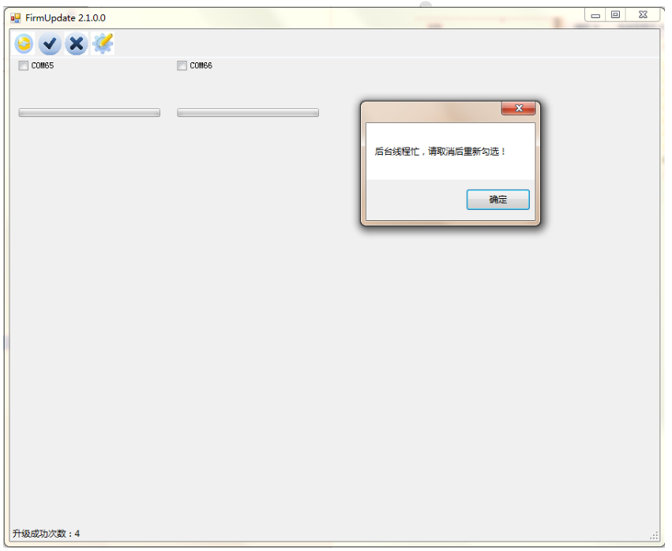

II 遇到打开串口错误，请确认 PC 与 DUT 夹具间 USB 延长线是否可靠连接，重新连接即可恢复。

## 支持与服务

| 四博智联资源                                        |                                                              |
| --------------------------------------------------- | ------------------------------------------------------------ |
| 官网                                                | [www.doit.am](http://www.doit.am/)                           |
| 教材                                                | [ESPDuino智慧物联开发宝典](https://item.taobao.com/item.htm?spm=a1z10.3-c.w4002-7420449993.9.Bgp1Ll&id=520583000610) |
| 购买                                                | [官方淘宝店](https://szdoit.taobao.com/)(szdoit.am)          |
| 讨论                                                | [技术论坛](http://bbs.doit.am/forum.php)(bbs.doit.am)        |
| 应用案例集锦                                        |                                                              |
| [Doit玩家云](http://wechat.doit.am)(wechat.doit.am) | [免费TCP公网调试服务](http://tcp.doit.am)(tcp.doit.am)       |
| 官方技术支持QQ群1/2/3群已满                         |                                                              |
| 技术支持群4                                         | 278888904                                                    |
| 技术支持群5                                         | 278888905                                                    |
| 术支持群6                                           | 278888906                                                    |
| 技术支持群7                                         | 278888907                                                    |
| 技术支持群8                                         | 278888908                                                    |
| 技术支持群9                                         | 278888909                                                    |
| 技术支持群10                                        | 278888900                                                    |