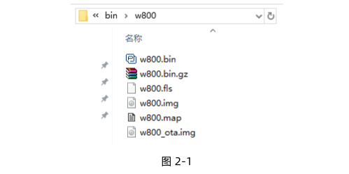
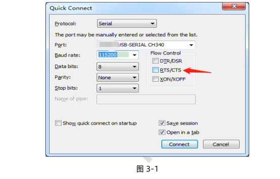
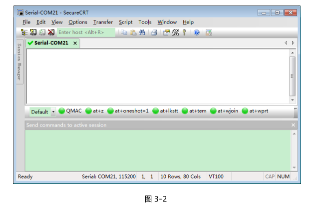
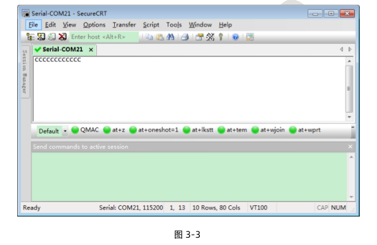
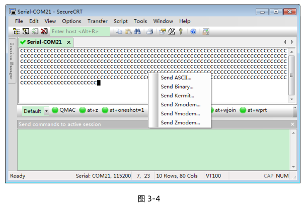
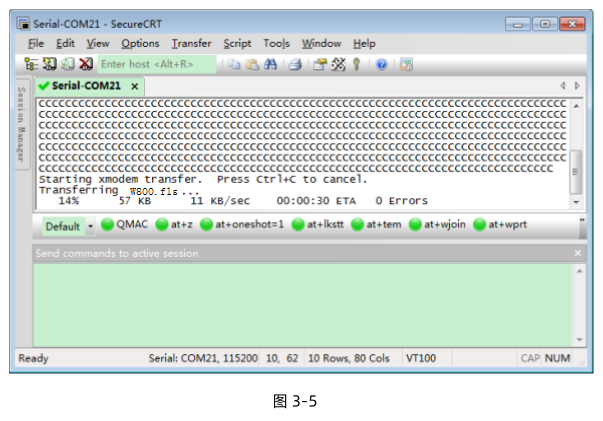
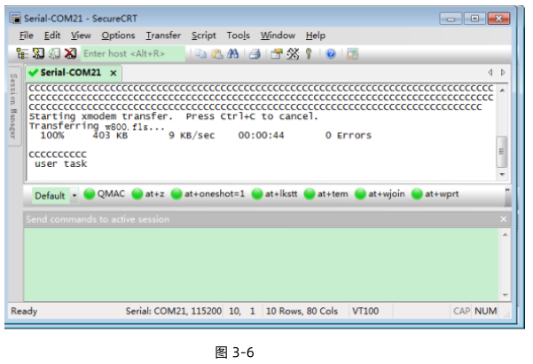

 W800_固件升级指导 

 From SZDOIT

## 1 引言

### 1.1 编写目的

指导用户如何通过串口升级的不同固件到 w800 芯片或者模块。

### 1.2 预期读者

w800 芯片的开发使用人员

## 2 W800 的固件用途简介

W800 的 SDK 编译完成后，会生成可供升级的固件：

1) w800.img：用户固件，用于非首次升级使用；

2) w800.fls： secboot 和 w800.img 集于一体的固件，用于首次升级（研发调试，生产烧录）使用；

3) w800_ota.img：用户 OTA 固件，只能用于 OTA 升级使用。

下图显示了编译结束后生成的固件。

固件的具体说明，详见：《wm_w800_固件生成说明》，接下来以使用串口工具SecureCRT 为例，介绍如何给 W800 模块进行固件升级。

## 3 固件升级操作

说明：
1）理论上任何支持 XMODEM 协议的串口工具都支持 w800 升级。
2）w800.fls 固件升级在 ROM 里实现。
3）w800.img 固件升级在 ROM 里实现。

### 3.1 进入升级

1）给设备上电，使电脑串口与 w800 的 UART0 连通；
2）打开 SecureCRT，连接与 W800 UART0 对应的 COM 口；
注意：串口设置时 RTS/CTS 一定不要勾选（如图 3-1）

3）拉低 W800 模块的 BOOTMODE（PA0）脚（w800.fls 需要此步骤）；
4）PC 端按住 ESC 键；
5）复位 W800 模块；
经过上述步骤，串口工具会持续打印字符’C’，标志 W800 已经进入串口升级流程（如果 2）中拉低了 BOOTMODE 脚，此时可以释放）。

### 3.2 升级固件

1) 将 w800.fls 文件拖拽到对话框里，拖拽完成后，如下图所示。

2) 选择 Send Xmodem…选项。

3) 单击选择该项后，设备的程序就开始了升级固件的操作，升级过程中会显示进度。

4) 升级成功后，会话框会继续打印 CCC，需要手动复位设备，设备就会运行新的固件了。

# 支持与服务

| 四博智联资源                                        |                                                              |
| --------------------------------------------------- | ------------------------------------------------------------ |
| 官网                                                | [www.doit.am](http://www.doit.am/)                           |
| 教材                                                | [ESPDuino智慧物联开发宝典](https://item.taobao.com/item.htm?spm=a1z10.3-c.w4002-7420449993.9.Bgp1Ll&id=520583000610) |
| 购买                                                | [官方淘宝店](https://szdoit.taobao.com/)(szdoit.am)          |
| 讨论                                                | [技术论坛](http://bbs.doit.am/forum.php)(bbs.doit.am)        |
| 应用案例集锦                                        |                                                              |
| [Doit玩家云](http://wechat.doit.am)(wechat.doit.am) | [免费TCP公网调试服务](http://tcp.doit.am)(tcp.doit.am)       |
| 官方技术支持QQ群1/2/3群已满                         |                                                              |
| 技术支持群4                                         | 278888904                                                    |
| 技术支持群5                                         | 278888905                                                    |
| 术支持群6                                           | 278888906                                                    |
| 技术支持群7                                         | 278888907                                                    |
| 技术支持群8                                         | 278888908                                                    |
| 技术支持群9                                         | 278888909                                                    |
| 技术支持群10                                        | 278888900                                                    |