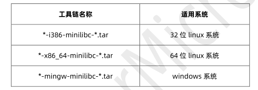
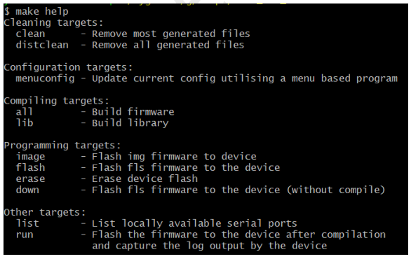
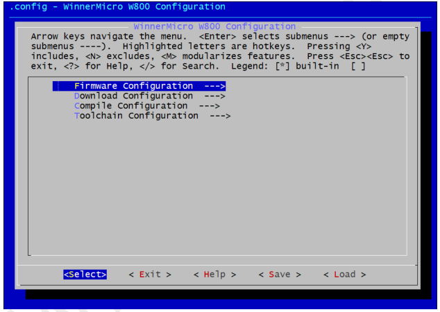

 W800_SDK命令行编译指南  

 From SZDOIT

## 1 引言

### 1.1 编写目的

本文档主要用于阐述 W800 SDK 在命令行下的编译方法。

### 1.2 预期读者

该文档适用的读者包括 W800 SDK 研发人员，W800 SDK 工程开发人员等。

## 2 编译环境

目前编译工具链仅支持 Windows 和 Linux 系统，所以编译只能选择 Windows 系统或者 Linux 系统。
提示：如果用户使用 MacOS 系统，可以选择安装一个 Windows 或者 Linux 虚拟机，然后在虚拟机里按照本文操作。

### 2.1 Windows 系统

因 Windows 系统默认本身并不支持基于 GNU 的 Makefile 的编译，所以需要搭建支持 GNU 编译工具链的环境。
为了简化编译环境制作，我们基于 Cygwin 搭建了一套完整的编译环境安装包，用户只需下载安装即可。

链接：https://pan.baidu.com/s/1sBW5Fnhh6OgqRxl3hmNdoQ
提取码：q6zb

上面链接是 w800 产品包提取路径，用户获取工具的路径为：W800_ProductPackage->开发套件->编译工具
文件名称：cygwin4wm_setup_vx.x.x.exe

### 2.2 Linux 系统

Linux 系统下可直接在 shell 中执行编译，需要在 Linux 上安装好常用的开发库和工具。

注意：因 Linux 系统版本众多，各种包安装方式也不尽相同，所以需要使用者拥有一定的基础，如果用户无 Linux 使用经验，建议直接在 Windows 系统下使用我们提供的 Cygwin 集成包进行编译。

## 3 获取 SDK

从 W800_ProductPackage->SDK 处获取下载最新的软件包解压即可。

## 4 获取编译工具链

从官网 https://occ.t-head.cn 平头哥芯片开放社区->技术部落->资源下载->工具，根据自己本地系统环境选择下载适用的“800 Series Toolchain”。

下载后，将编译工具链解压到磁盘，设置编译工具链路径至环境变量即可，举例如下：
export PATH=$PATH:/opt/csky-abiv2-tools/bin
可以将配置写至.profile 等配置文件中达到自动配置的目的，当然也可以在 sdk 中直接指定工具链路径。
注意：我们提供的 Cygwin 集成包中已经安装了编译工具链并设置好了环境变量，可跳过这步直接使用
（请参阅 2.1 章节）。

## 5 编译固件

在 shell 中切换到 SDK 的根目录，执行：
make
编译完成之后，产生的固件在 bin 目录下。

提示：在 windows 系统下使用我们提供的 Cygwin 集成包的用户，可以直接在 SDK 文件夹右键选择使
用 Cygwin 打开此目录，就会在新打开的的 shell 中自动切换到 SDK 目录（不支持中文路径）。

## 6 编译进阶

注意：本章的内容仅供有一定基础的开发人员使用，普通用户不需要阅读本章内容。

### 6.1 查看指令

在 shell 中切换到 SDK 的根目录，执行：
make help
此时会显示出当前 SDK 所支持的编译指令，如：

### 6.2 配置参数

根据“ Configuration targets ”提示，用户可使用：
make menuconfig
进行参数配置。menuconfig 一个基于 ncurses 库的传统菜单界面的配置方式，执行后根据界面上的提示操作即可。

### 6.3 烧录固件

先配置编译参数中的“Download Configuration”选项，输入正确的串口号和所能支持的波特率。
Windows 系统下串口号为 COMn（如 COM0、COM3、COM7 等），Linux 系统下串口号一般为 ttyUSBn（如 ttyUSB0、ttyUSB3、ttyUSB7 等）。如果不确定当前串口号是什么，可敲“make list”查看当前机器上的串口再进行区分和选择。

根据“ Programming targets ”提示的，共有两种方式进行配置，任选其一即可。

#### 6.3.1 make image

编译完成之后，只烧录用户代码，即*.img 格式的固件
注意：如果此操作执行了，而且需要二级启动文件的支持才可以，则还需要烧录二级引导固件才可以。

#### 6.3.2 make flash

编译完成之后，烧录 second boot 和用户代码，即*.fls 格式的固件。

#### 6.3.3 make down

不进行编译，直接进行烧录*.fls 格式的固件。
注意：无论选择哪种方式，在烧录时可能需要用户进行一些配合，请根据屏幕提示操作即可。w800 串口最高支持 2M 波特率，SDK 默认的串口下载波特率是 115200，所以当使用者的下载设备支持 2M 波特率时，就可以在“Download Configuration”中设置波特率为 2000000 以体验更快的下载速度。

### 6.4 擦除 Flash

先配置编译参数中的“Download Configuration”选项，输入正确的串口号。
在 shell 中切换到 SDK 的根目录，执行：
make erase
等待操作完成即可。
注意：不需要每次都擦除 Flash，请根据需要选择是否擦除。

### 6.5 运行固件

先配置编译参数中的“Download Configuration”选项，输入正确的串口号和所能支持的波特率。
在 shell 中切换到 SDK 的根目录，执行：
make run
该命令先进行编译，编译出固件之后烧写至设备，然后捕获设备正常工作时产生的日志并将日志输出到屏幕上。

### 6.6 清除临时文件

在 shell 中切换到 SDK 的根目录，执行：
make clean
执行完成之后会将编译过程中产生的临时文件全部删除。

## 7 FAQ

### 7.1 为什么编译这么慢

因目前命令行编译不支持并行（make –j 选项），而 Make+GCC 方式编译在 Windows 系统 Cygwin 下效率要比在 Linux 系统上低很多，所以在 Windows 系统上编译 SDK 比较慢，用户想要提升编译速度，可以采取下面的方式进行优化。

#### 7.1.1 使用 Linux 系统编译

Linux 系统下编译快，追求编译速度的用户可首选在 Linux 下编译。

#### 7.1.2 使用 lib 方式编译

如果将 SDK 原生代码提前编译成库，这样编译时只有用户代码参与编译，编译速度将会大大提高，这种使用方式就是使用 lib 编译。

在配置编译参数中的 “Compile Configuration”选择“enable use lib”即可使用 lib 方式编译，取消选择“enable use lib”即为全部使用源码编译。

SDK 默认选择“enable use lib”，不使用全部源码参与编译。

在使用 lib 方式编译，当用户修改了 SDK 原生代码时，先使用“make lib”更新 lib，然后重新执行“make”编译即可。

### 7.2 为什么编译时遇到“ No such file or directory ”错误

有些时候明明之前能正常编译的现在却出现这个错误，可能是因为一些编译生成的中间文件被破坏了，这时先执行“make clean”清除临时文件，再重新执行“make”编译一遍即可。

