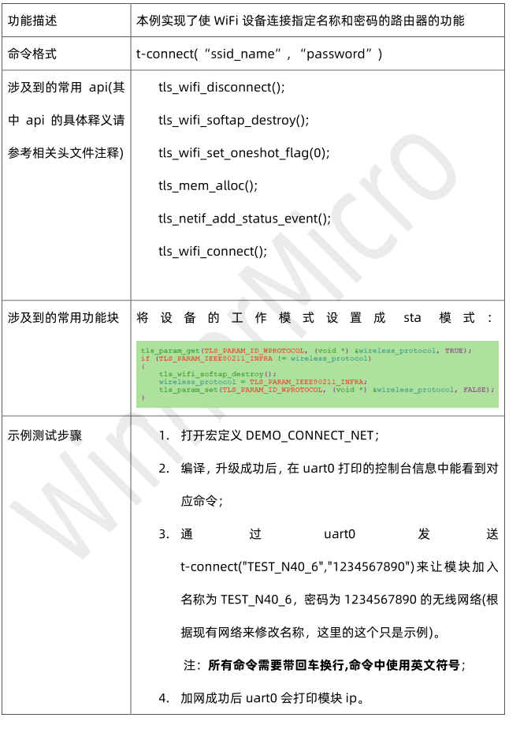
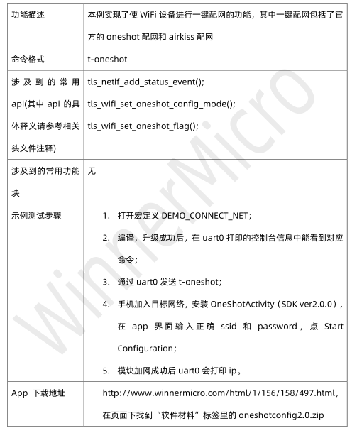
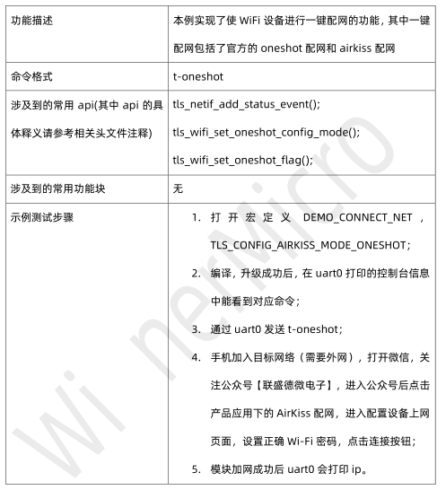
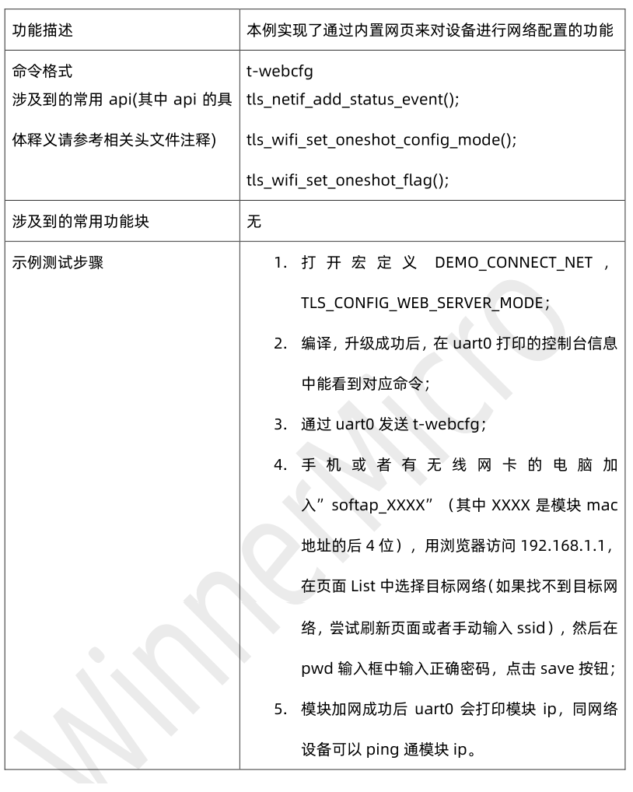
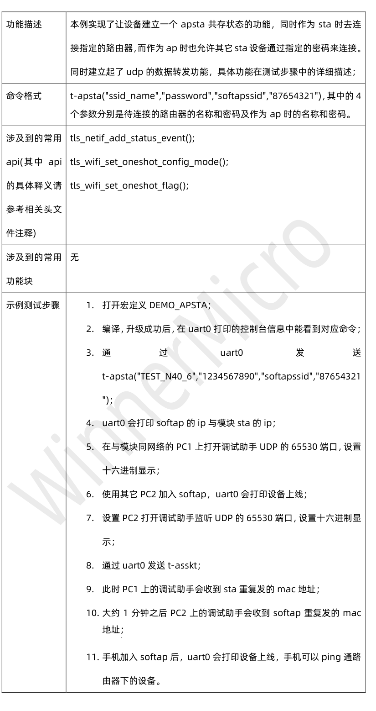
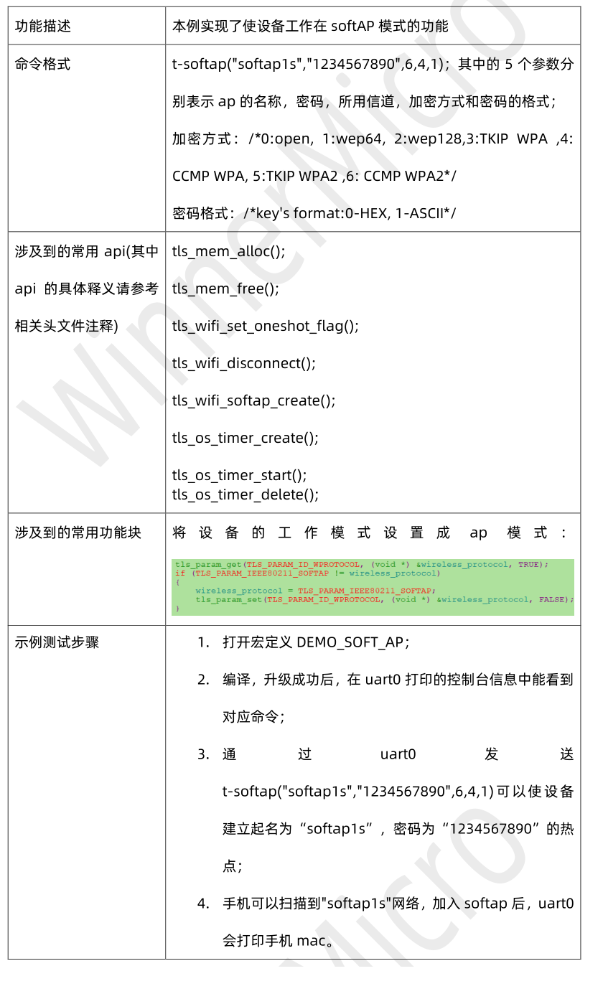
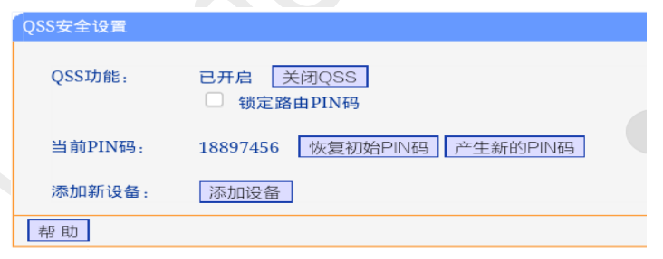
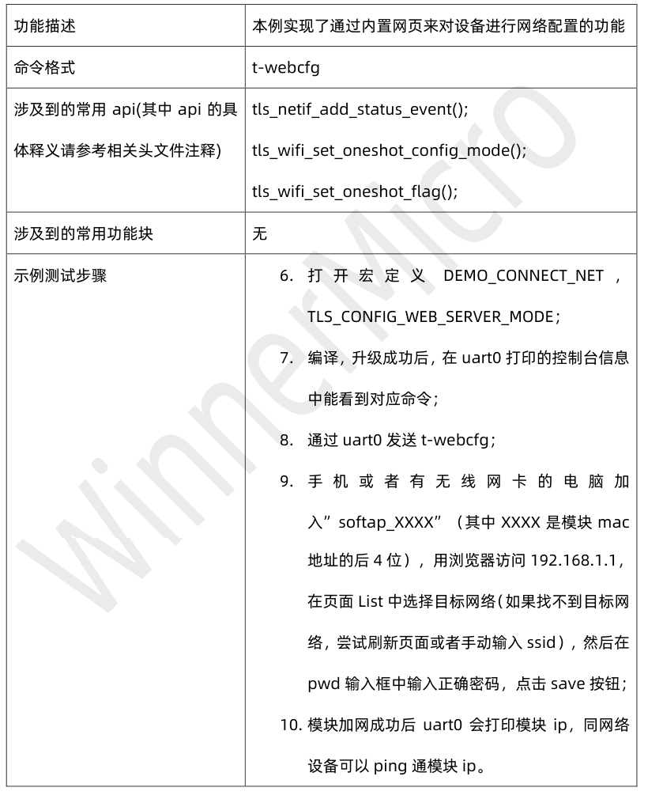
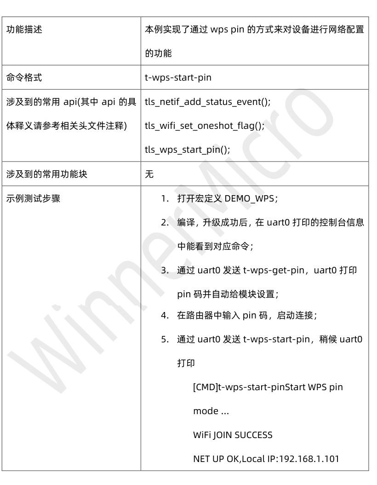
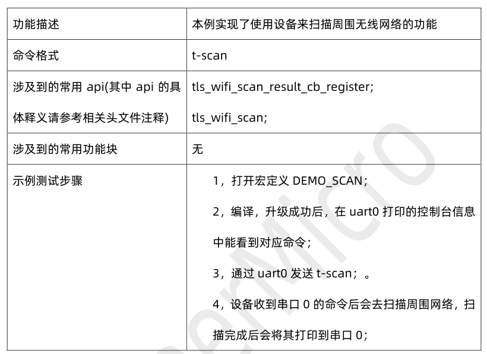

 W800_SDK DEMO运行指南 

 From SZDOIT

## 1 引言

### 1.1 编写目的

为基于 W80X 芯片 SDK 进行二次开发的软件开发工程师提供相关功能的代码示例。

### 1.2 预期读者

FAE，客户方软件开发工程师。

## 2 DEMO 概要

该文档中用到的所有 DEMO 相关的宏定义都在 wm_demo.h 中。

运行 DEMO 时必须打开该 DEMO 对应的宏定义，建议关闭不相关宏定义。DEMO 演示需要在控制台下进行，打开 DEMO_CONSOLE 编译选项，即打开了控制台。

DEMO_CONSOLE 同时还控制了 AT 指令的启用，如果使能此宏，则 AT 指令失效；关闭此宏，AT 指令生效。
以下三节将分别以配网联网类示例，硬件驱动类示例以及应用类示例来分别介绍其测试使用方法。

## 3 配网联网类 DEMO 功能描述

### 3.1 DEMO_CONNECT_NET 操作步骤

注：此 DEMO 下有四个演示 DEMO。

#### 3.1.2 t-oneshot(oneshot 配网)

#### 3.1.3 t-oneshot（airkiss 配网）

#### 3.1.4 t-webcfg(网页配网)

### 3.2 DEMO_APSTA 操作步骤

### 3.3 DEMO_SOFT_AP 操作步骤

### 3.4 DEMO_WPS 操作步骤

注：此 DEMO 下有两个演示 DEMO，需要路由器支持 wps

#### 3.4.1 t-wps-start-pbc

1. 打开宏定义 DEMO_WPS；

2. 编译，升级成功后，在 uart0 打印的控制台信息中能看到对应命令；

3. 通过 uart0 发送 t-wps-start-pbc，并在路由器上按 wps 按钮，稍候 uart0 打印

   [CMD]t-wps-start-pbcStart WPS pbc mode ...
   WiFi JOIN SUCCESS
   NET UP OK,Local IP:192.168.1.101

#### 3.4.2 t-wps-start-pin

### 3.5 DEMO_SCAN 操作步骤

更多信息查看官方手册：[《W800_SDK DEMO运行指南 V1.0》](https://pan.baidu.com/s/1tFu_JmflZBWa5k-hKUP6JA) 提取码：doit 

