
 WM_W800_CDS使用手册 

 From SZDOIT

## 1 引言

### 1.1 编写目的

指导 W800 相关的开发和测试人员使用 CDS 集成开发环境；

### 1.2 预期读者

所有 W800 相关的开发人员和测试人员；

### 1.3 术语定义

SWD: Serial Wire Debug，串行线调试

## 2 CDS 简介

CDS 为杭州中天微系统有限公司研发的嵌入式集成开发环境，全称为 C-SKY Development Suite，使用CDS 进行基于 XT804 嵌入式 C/C++工程的开发，能使软件的开发、调试等工作更高效的进行。

### 2.1 安装 CDS

在官网 https://occ.t-head.cn 平头哥芯片开放社区-技术部落-资源下载中可以找到 CDS 集成开发环境下载链接，下载 CDS 安装包之后，双击压缩包中的 setup.exe 即可启动安装。

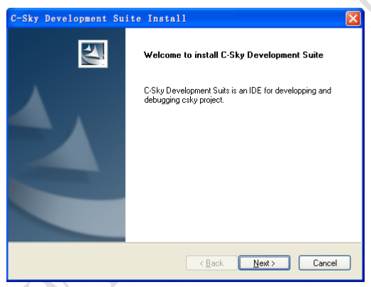

安装中需要用户输入一些信息，根据界面提示输入即可：

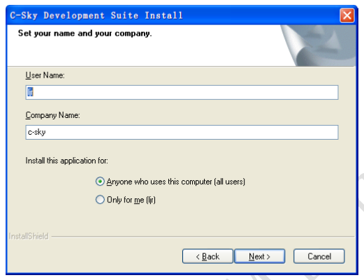

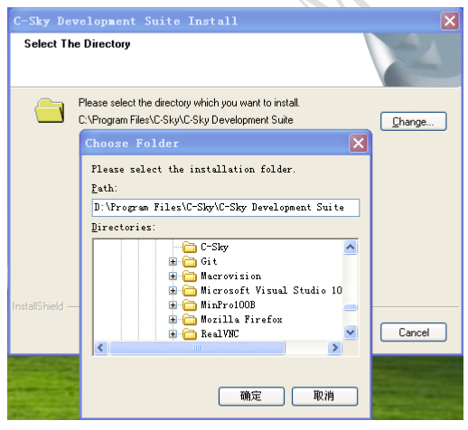

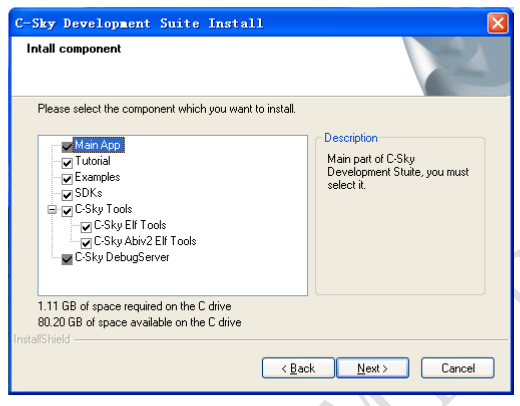

最后，点击 next 启动安装：

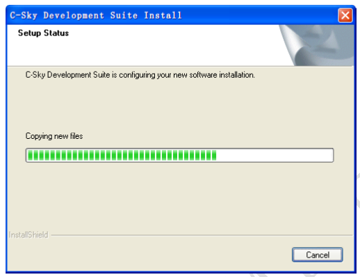

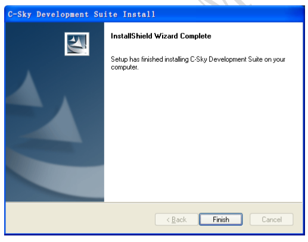

### 2.2 启动 CDS

启动 CDS 有如下两种方法：

可以通过双击桌面图标 CDS Workbench 启动；

可以在开始菜单中找到图标 CDS Workbench 启动；

### 2.3 卸载 CDS

和常规 Windows 程序卸载方法一样，可以在 Windows 系统的控制面板(或在设置的应用和功能)中找到CDS(也可以在开始菜单 C-Sky 中找到 Uninstall CDS)，执行卸载操作。

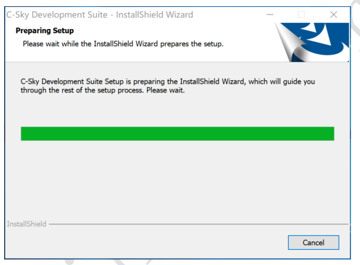

卸载完成之后，可能有部分文件夹卸载程序不会自动删除，用户自行手动删除掉即可。

注意：在卸载之前请先关闭 CDS 相关的文件。

## 3 CDS 使用介绍

### 3.1 导入工程

按照如下操作导入到 CDS 中：

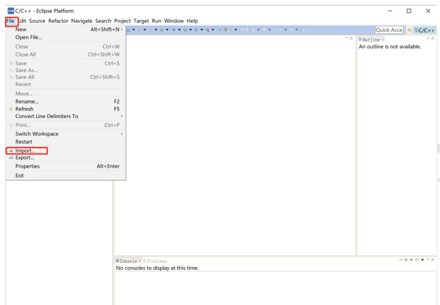

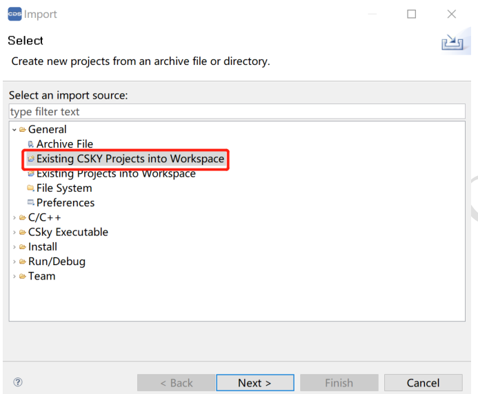

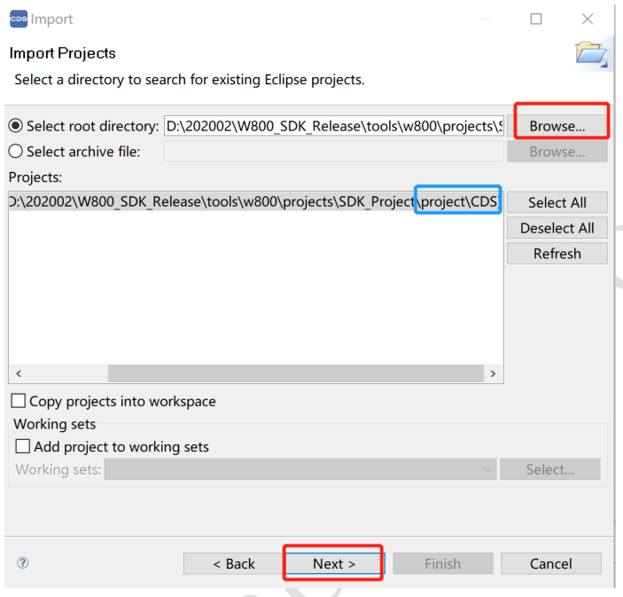

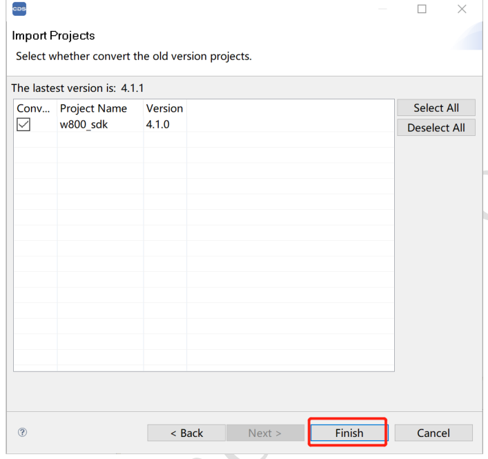

完成之后，导入的工程出现在工程管理视图中，如下图所示。

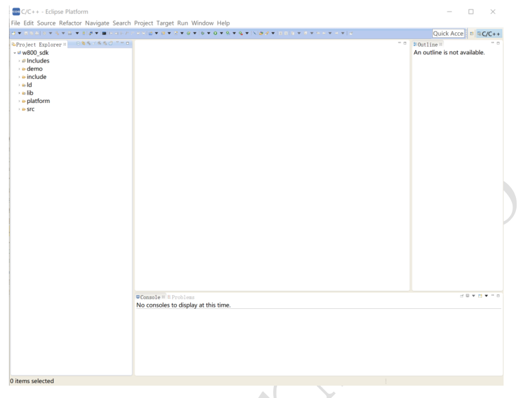

### 3.2 编译 SDK

导入 SDK 工程之后，在左侧工程管理视图中右键单击工程，选择 Build Project 开始编译：

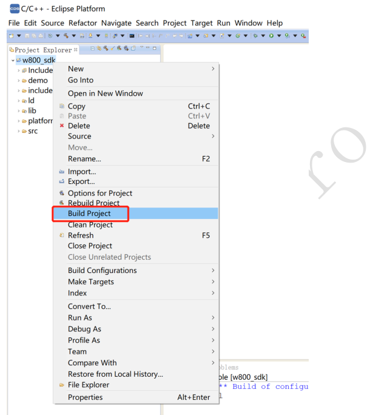

在 CDS 的 Console 窗口会输出编译信息，如果有错误也会在 Problems 中显示，可以根据提示自行修改。

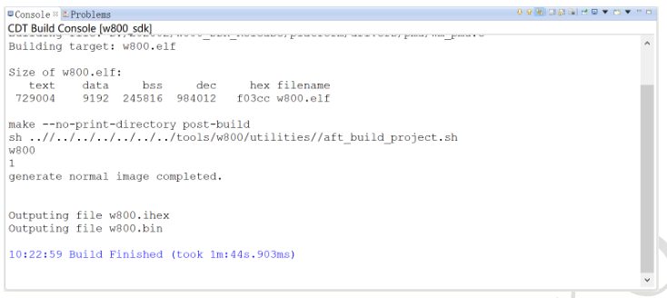

### 3.3 下载固件

W800 可以使用多种方式下载固件，这里仅以集成 wm_tool 工具下载举例。

首先右键工程依次选择“Make Targets”→ “Create…”：

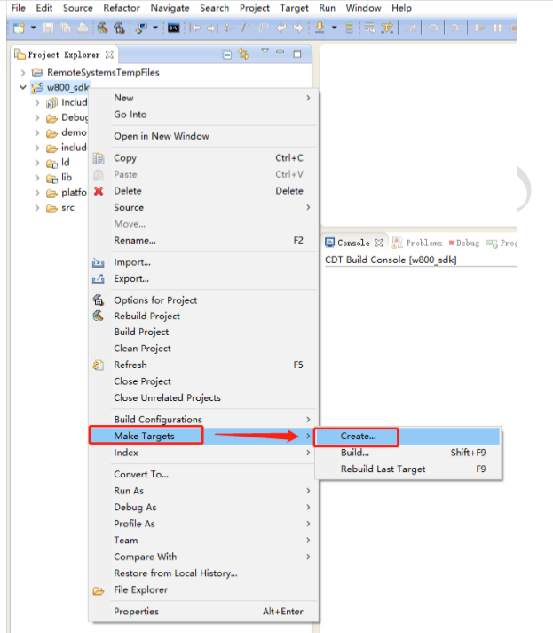

在弹出的对话框中按照下图进行设置：

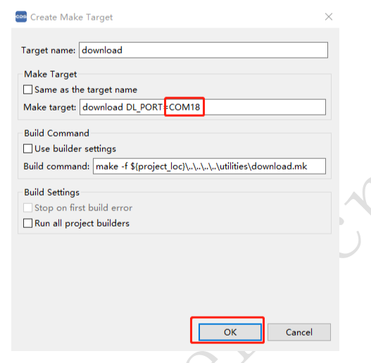

“Target name”输入“download”；

“Make Target”输入“download DL_PORT=串口号”，如 COM18；

“Build Command”输入“make -f ${project_loc}\..\..\..\..\utilities\download.mk”；

这几条配置，除了串口号用户按需修改之外，其余建议用户直接复制粘贴，填完点击 OK 按钮。

然后右键工程依次选择“Make Targets”→ “Build…”：

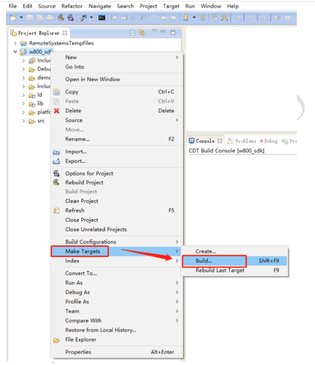

在弹出的对话框中选中刚才配好的“download”项目，点击“Edit…”按钮：

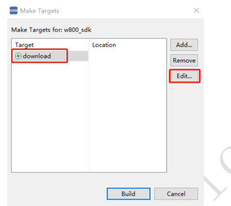

这时弹出对话框如下图：

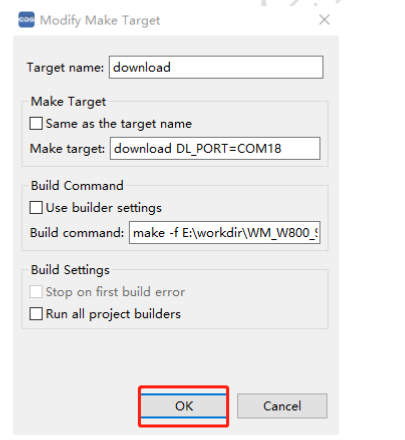

直接点击 OK 按钮返回即可。

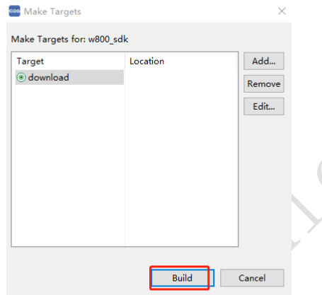

此时，选中刚才配好的“download”项目，点击“Build”按钮即可开始下载固件：

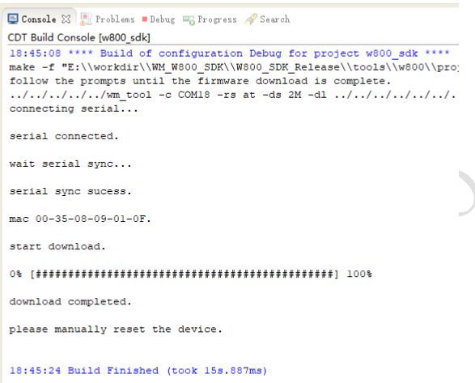

下载过程中，有可能需要用户手动复位开发板，请按照 Console 窗口中的提示信息操作即可。

### 3.4 在线调试

使用 CK-LINK 和设备进行 SWD 连接之后，右键工程选择如下：

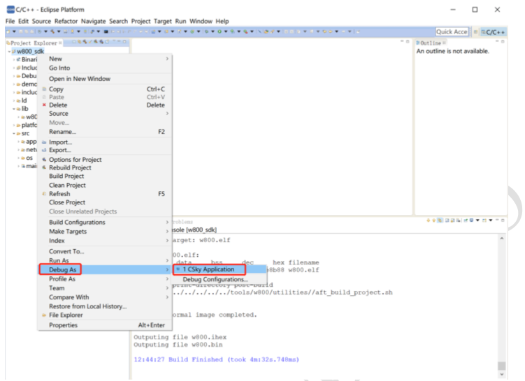

之后根据界面提示即可进入调试。
关于调试更详细的介绍请参阅《WM_W800_SWD 调试配置指南》。

## 4 更多参考文档

安装中天微 CDS 时，也会安装很多相关的官方参考文档，请在开始菜单 C-Sky 中查看，如：

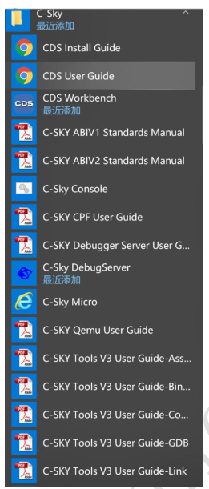

## 支持与服务

| 四博智联资源                                        |                                                              |
| --------------------------------------------------- | ------------------------------------------------------------ |
| 官网                                                | [www.doit.am](http://www.doit.am/)                           |
| 教材                                                | [ESPDuino智慧物联开发宝典](https://item.taobao.com/item.htm?spm=a1z10.3-c.w4002-7420449993.9.Bgp1Ll&id=520583000610) |
| 购买                                                | [官方淘宝店](https://szdoit.taobao.com/)(szdoit.am)          |
| 讨论                                                | [技术论坛](http://bbs.doit.am/forum.php)(bbs.doit.am)        |
| 应用案例集锦                                        |                                                              |
| [Doit玩家云](http://wechat.doit.am)(wechat.doit.am) | [免费TCP公网调试服务](http://tcp.doit.am)(tcp.doit.am)       |
| 官方技术支持QQ群1/2/3群已满                         |                                                              |
| 技术支持群4                                         | 278888904                                                    |
| 技术支持群5                                         | 278888905                                                    |
| 术支持群6                                           | 278888906                                                    |
| 技术支持群7                                         | 278888907                                                    |
| 技术支持群8                                         | 278888908                                                    |
| 技术支持群9                                         | 278888909                                                    |
| 技术支持群10                                        | 278888900                                                    |