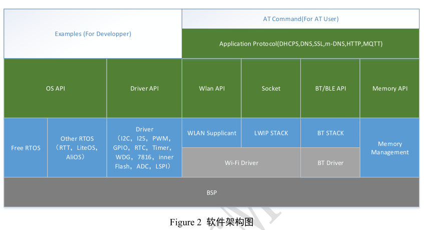
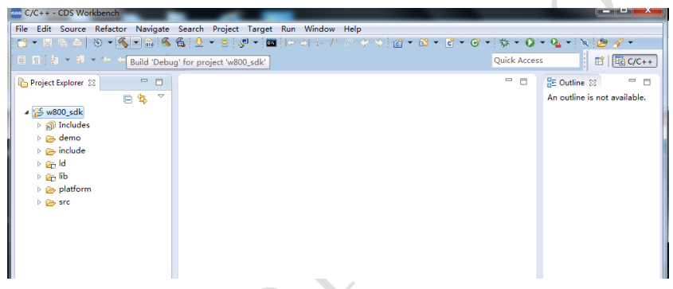
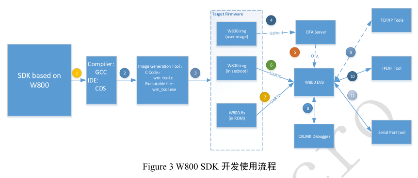
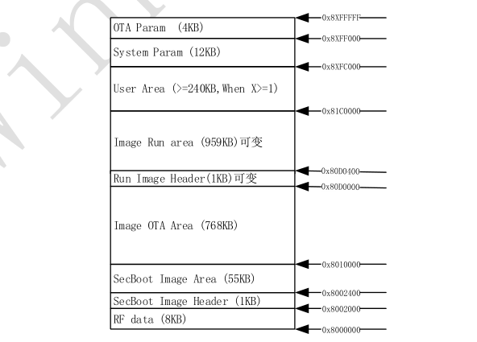

<center><font size=10> WM_W800_SDK用户手册 </center></font>
<center> From SZDOIT</center>

## 1 引言

### 1.1 概述

本文主要描述 W800 软件开发包（SDK）的功能和使用方法，该 SDK 集成了 W800 硬件驱动（BSP）、实时操作系统、TCP/IP 协议栈、WiFi 协议栈，BT 协议栈以及其它公共模块，能够满足大部分应用软件的需求。

### 1.2 芯片简介


⚫ 芯片外观

✓ QFN32 封装，4mm x 4mm

⚫ MCU 特性

✓ 集成 32 位 XT804 处理器，工作频率 240MHz，内置 DSP、浮点运算单元与安全引擎

✓ 内置 2MB Flash，288KB RAM

✓ 集成 5 路 UART 高速接口

✓ 集成 2 路 16 比特 SD-ADC，最高采样率 1KHz

✓ 集成 1 个 I2C 控制器

✓ 集成 GPIO 控制器，最多支持 18 个 GPIO

✓ 集成 5 路 PWM 接口

✓ 集成 1 路 Duplex I2S 控制器

⚫ 安全特性

✓ MCU 内置 Tee 安全引擎，代码可区分安全世界/非安全世界

✓ 集成 SASC/TIPC，内存及内部模块/接口可配置安全属性，防止非安全代码访问

✓ 启用固件签名机制，实现安全 Boot/升级

✓ 具备固件加密功能，增强代码安全

✓ 固件加密密钥使用非对称算法分发，增强密钥安全性

✓ 硬件加密模块：RC4256、AES128、DES/3DES、SHA1/MD5、CRC32、2048 RSA,真随机数发生器

⚫ Wi-Fi 特性

✓ 支持 GB15629.11-2006，IEEE802.11 b/g/n

✓ 支持 Wi-Fi WMM/WMM-PS/WPA/WPA2/WPS

✓ 支持 EDCA 信道接入方式

✓ 支持 20/40M 带宽工作模式

✓ 支持 STBC、GreenField、Short-GI、支持反向传输

✓ 支持 AMPDU、AMSDU

✓ 支持 IEEE802.11n MCS 0~7、MCS32 物理层传输速率档位，传输速率最高到 150Mbps

✓ 2/5.5/11Mbps 速率发送时支持 Short Preamble

✓ 支持 HT-immediate Compressed Block Ack、Normal Ack、No Ack 应答方式

✓ 支持 CTS to self

✓ 支持 Station、Soft-AP、Soft-AP/Station 功能

⚫ 蓝牙特性

✓ 集成蓝牙基带处理器/协议处理器，支持 BT/BLE 双模工作模式，支持 BT/BLE4.2 协议

⚫ 电源管理

✓ 3.3V 单电源供电

✓ 支持 Wi-Fi 节能模式功耗管理

✓ 支持工作、睡眠、待机、关机工作模式

✓ 待机功耗小于 15uA

### 1.3 SDK 基本特征

W800 SDK 是集 RTOS 内核，硬件驱动，Wi-Fi 协议栈，蓝牙协议栈，TCP/IP 协议栈，网络应用协议，AT指令集，多种应用层协议以及相应的示例代码于一体的嵌入式 Wi-Fi、蓝牙应用开发平台。

它提供的功能有：

无线

⚫ 支持 IEEE802.11b/g/n 无线标准

⚫ 支持 BT/BLE4.2

⚫ 支持频率范围：2.412~2.484 GHz

⚫ 支持基础网（Infra）

➢ 支持多种加密和认证机制：OPEN/WEP64/WEP128/TKIP/CCMP/WPA-PSK/WPA2-PSK

➢ 支持快速联网模式（指定信道与 BSSID）

➢ 支持无线漫游

➢ 支持 PS-POLL 节能模式

➢ 支持 WPS 功能

⚫ 支持软 AP

➢ 支持 OPEN、WEP、TKIP、AES 加密认证

➢ 最多支持 8 个 station 连接

➢ 支持 STA 的 PS-POLL 节能

⚫ 支持软 APSTA

➢ 支持 2 级级联

➢ 最多支持 8 个 station 连接

驱动

⚫ 支持 UART 接口通信

➢ 支持 UART 数据接口，接口最大速率 2Mbps

⚫ 支持用户可编程的 GPIO 控制

⚫ 支持 I2S 接口

⚫ 支持 I2C 接口，最大速率 400Kbps

⚫ 支持 7816 接口

⚫ 支持硬件加解密

⚫ 支持外挂 SPI-FLASH

⚫ 支持内置 FLASH

⚫ 支持 ADC 接口

⚫ 支持 PWM 接口

联网

⚫ 支持不同配网方式

➢ ONESHOT

➢ WPS

➢ WEB 页面

➢ AIRKISS

➢ 蓝牙

⚫ 支持 API 方式联网（针对二次开发者）

⚫ 支持 AT 指令方式联网（针对 AT 指令开发者）

TCP/IP 协议

⚫ 支持多种网络协议：TCP/UDP/ICMP/DHCP/DNS

⚫ 支持 DHCP Server、DNS Server

⚫ 支持 HTTP Client、HTTP Server 功能

⚫ 支持 IPERF

其它

⚫ 支持 AT 指令集

⚫ 支持标准 socket 接口

⚫ 支持 m-DNS

⚫ 支持 web socket

⚫ 支持 SSL Server、SSL Client

⚫ 支持 OS 替换

⚫ 支持云移植

⚫ 支持基于串口方式的模块生产测试

⚫ 提供各种使用文档

## 2 K SDK 使用说明

### 2.1 软件架构



### 2.2 目录结构

WM_SDK

├─app 用户程序开发入口

├─bin 可执行文件

├─demo 基本 DEMO 功能

├─doc Release Note/API 文档

├─include API 头文件

├─ld 链接脚本文件

├─lib Wi-Fi，BT，application 库

├─Makefile make 脚本文件

├─platform 芯片及平台相关的公共源代码

├─src 应用程序，网络协议栈、OS 及第三方开源代码集

└─tools 编译脚本、CDS IDE 工程以及 IMAGE 生成工具

### 2.3 编译连接

#### 2.3.1 CDS 工程编译

打开 CDS 集成编译环境，导入工程文件。

导入工程文件时，设置要导入的 sdk 根路径，然后，会显示出要导入的工程文件，按照操作进行即可。

编译时，选中 sdk 工程后，点击工具栏的 build 或者 rebuild 即开始编译。编译生成的文件放置在 bin目录下。



#### 2.3.2 命令行编译

安装指定的编译工具，按照编译工具要求设置，解压 SDK 后，打开工具跳转到 SDK 的根目录下，执行make 即可。

参考文档： 《WM_W800_SDK 脚本编译指南》

#### 2.3.3 编译结果

w800.bin 原始 bin 文件

w800.img XMODEM/OTA 下载镜像文件

w800_ota.img 仅支持 OTA 下载的压缩固件（节省 OTA 空间）

w800.fls 工厂烧录镜像文件

w800.map MAP 文件

参考文档： 《WM_W800_固件生成说明》

### 2.4 烧录固件

#### 2.4.1 通过 ROM 烧录

如果出厂的 W800 开发模组没有烧录过固件，则上电的时候，模块会进入 ROM（UART0）打印信息如下：


如果 W800 的开发模组引出了 BOOTMODE 脚，且上电的时候，BOOTMODE 脚被拉低 30ms 以上，则模块也会
进入 ROM（仅 UART0）打印信息如下：


ROM 依据 XMODEM 下载的不同阶段，命令的执行的结果和启动的不同阶段所遇到的异常状况会通过 UART0输出不同的字符，来表示错误码。

参见文档：《WM_W800_ROM 功能简述》 ，《WM_W800_固件升级指导》

#### 2.4.2 通过 SECBOOT 烧录

W800 SECBOOT 是一段功能程序，它实现了用户固件搬移、固件启动校验、启动跳转、以及跳转到 ROM XMODEM 的升级等功能。

基于 W800 的开发模组在上电/复位时，如果 UART0 接收到了 ESC 键，则模块会在 SECBOOT 启动时检测ESC 键并跳转到 ROM，然后进入串口 XMODEM 下载模式，（UART0）打印信息如下：


不同的 XMODEM 升级阶段，如果遇到异常，则会通过 UART0 输出不同的字符，来表示错误码。
参见文档： 《WM_W800_ROM 功能简述》 ，《WM_W800_SECBOOT 功能简述》

### 2.5 程序调试

#### 2.5.1 固件调试信息

SDK 支持标准 C 的 printf 打印调试的功能，输出到物理串口 UART0，用户可以依据自身需求在调试阶段增加自己的调试打印信息。

SDK 现有的 LOG 信息输出，可以通过 wm_debug.h 文件里的如下宏定义来设置：

/** Define the debugging level: info */

#define TLS_DBG_LEVEL_INFO TLS_DBG_OFF

/** Define the debugging level: warning */

#define TLS_DBG_LEVEL_WARNING TLS_DBG_OFF

/** Define the debugging level: error */

#define TLS_DBG_LEVEL_ERR TLS_DBG_OFF

/** Define the debugging level: dump */

#define TLS_DBG_LEVEL_DUMP TLS_DBG_OFF

/** general debug info switch, default: off */

#define TLS_GENERAL_DBG TLS_DBG_OFF

Wi-Fi 的调试信息，需要单独的 Wi-Fi Lib 来支持，且需要用户实现 wm_printf 和 wm_vprintf 两个接口。

#### 2.5.2 CK-LINK 调试

W800 支持 CK-LINK 调试方式。

参考文档：《WM_W800 调试配置指南》

#### 2.5.3 AT 指令调试

W800 支持 AT 指令操作。

参考文档：《WM_W800_AT 指令用户手册》

### 2.6 开发工具



### 2.7 编译工具

#### 2.7.1 IDE 开发环境—CDS

W800 的 SDK 支持 CDS 集成开发编译环境。

#### 2.7.2 命令行的 GCC

W800 的 SDK 支持命令行的 GCC 开发编译环境，安装 Linux 虚拟机（已集成编译环境）。

参考文档： 《WM_W800_SDK 脚本编译指南》

### 2.8 固件生成工具

W800 的 SDK 目标文件在编译后，需要打包生成目标的升级文件，SDK 自带源码的工具。

参考文档： 《WM_W800_固件生成说明》_

### 2.9 下载工具

W800 支持串口的 XMODEM 协议升级，推荐使用 SecureCRT。

参考文档： 《WM_W800_固件升级指导》

### 2.10 调试工具

TCP/IP 工具：TCP 调试助手，用来测试 socket 通信

Iperf: 用于测试网络性能

## 3 开发指南

### 3.1 WM_SDK 启动方式

WM_SDK 的运行方式是基于 W800 芯片内部集成的 32KB Cache 实现的 XIP 方式，运行于 QFLASH。

W800 的启动过程经过 ROM 跳转到 SECBOOT，再经由 SECBOOT 跳转到用户代码空间。

ROM 负责芯片的基本功能初始化，固化于芯片。

SECBOOT 负责用户空间代码的校验，升级，放置于 QFLASH 的一段空间里。

W800 的 CACHE 空间大小为 32KB，当运行代码大小小于 32K 时，CPU 将无需从 QFLASH 读取指令。

### 3.2 用户程序入口


800 模块启动后通过 ROM 和 SECBOOT 程序运行后，最终会运行到 startup.S 开始执行，然后，跳转wm_main.c 文件进行一些初始化功能，最后，进入 main.c 打印 user task。

K WM_SDK 的用户程序（ main.c ）开始入口为： UserMain(void) ，用户可在此文件，基于 CreateDemoTask函数中创建自己的 Task ，完成定制化功能。目前 DEMO CODE 提供了一个 CreateDemoTask 用于测试 SDK提供的 API，客户可以根据实际需要修改。

```
void UserMain(void)
{
    printf("\n user task\n");
    #if WM_DEMO
    CreateDemoTask();
    #endif
}
```

### 3.3 内存使用

W800 共有 160K Byte SRAM+128K Byte（可配置空间），地址空间为【0x20000000 – 0x2048000】，用于系统运行时堆栈和 Wi-Fi 收发 BD。

系统堆大小设置，位于 d gcc_csky.ld 文件中，如下定义：

min_heap_size = 0x10000;

PROVIDE (__ram_end = 0x2003c000);__

PROVIDE (__heap_end = __ram_end);

来配置系统堆的大小，其中__heap_end 决定了链接后实际的堆大小，可在 image 启动后，实际确认一下堆的大小。

目前，默认最小堆配置为 64KBytes。

### 3.4 FLASH 布局

W800 默认采用内置 2M Byte QFlash 空间，具体分配如下（图中 X=1）：



用户可用参数区 240Kbyte，可以依据运行区与升级区的 IMAGE 大小进行调整。

参考文档：《W800 参数区使用说明》，《WM_W800_QFLASH 布局说明》

### 3.5 用户参数管理

W800 使用者期望存储自定义的参数或者运行日志。当前的 SDK 的 QFLASH 布局用户可用的空间为 240KB，地址范围为：0x81C0000-0x81FBFFF。

如果用户的代码空间有冗余，则用户可按照自己的需要重新调整 QFLASH 的代码区和用户参数区的空间，增加用户参数区空间。

参考文档：《WM_W800_参数区使用说明》_

### 3.6 系统参数管理

系统参数是指 W800 模块运行时所需要的联网，接口配置，模式配置等的参数，具体如下：

1）Wi-Fi 相关（SSID，BSSID，KEY，信道列表，节电标志，速率设置，区域码，工作模式）

2）IP 信息（静态 IP，DHCP 使能信息，NTP 服务器，DNS 服务器）

3）接口配置（UART 模式配置）

4）其他参数（WEB）

系统参数区位于：0x81FC000-0x81FEFFF。 该参数区用户不可用作其它用途。

参考文档：《WM_W800_参数区使用说明》


## 支持与服务

| 四博智联资源                                        |                                                              |
| --------------------------------------------------- | ------------------------------------------------------------ |
| 官网                                                | [www.doit.am](http://www.doit.am/)                           |
| 教材                                                | [ESPDuino智慧物联开发宝典](https://item.taobao.com/item.htm?spm=a1z10.3-c.w4002-7420449993.9.Bgp1Ll&id=520583000610) |
| 购买                                                | [官方淘宝店](https://szdoit.taobao.com/)(szdoit.am)          |
| 讨论                                                | [技术论坛](http://bbs.doit.am/forum.php)(bbs.doit.am)        |
| 应用案例集锦                                        |                                                              |
| [Doit玩家云](http://wechat.doit.am)(wechat.doit.am) | [免费TCP公网调试服务](http://tcp.doit.am)(tcp.doit.am)       |
| 官方技术支持QQ群1/2/3群已满                         |                                                              |
| 技术支持群4                                         | 278888904                                                    |
| 技术支持群5                                         | 278888905                                                    |
| 术支持群6                                           | 278888906                                                    |
| 技术支持群7                                         | 278888907                                                    |
| 技术支持群8                                         | 278888908                                                    |
| 技术支持群9                                         | 278888909                                                    |
| 技术支持群10                                        | 278888900                                                    |