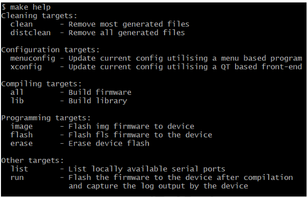
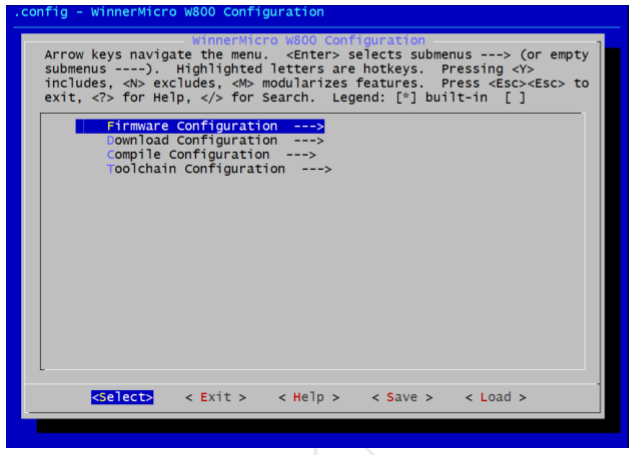
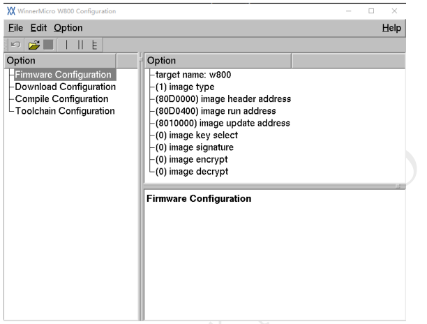

 WM_W800_SDK脚本编译指南 

 From SZDOIT

## 1 引言

### 1.1 编写目的

本文档主要用于阐述 W800 SDK 的编译方法。

### 1.2 预期读者

该文档适用的读者包括 W800 SDK 研发人员，W800 SDK 工程开发人员等。

## 2 编译环境

目前编译工具链仅支持 Windows 和 Linux 系统，所以编译只能选择 Windows 系统或者 Linux 系统。

提示：如果用户使用 MacOS 系统，可以选择安装一个 Windows 或者 Linux 虚拟机，然后在虚拟机里按照本文操作。

### 2.1 Windows 系统

因 Windows 系统默认不支持 Makefile 编译，所以我们选择使用 Cygwin 进行编译，推荐直接下载使用我们提供的 Cygwin 集成包（官网提供 cygwin4wm_setup 安装包下载链接，内含编译工具链）。

### 2.2 Linux 系统

Linux 系统下可直接在 shell 中执行编译，需要在 Linux 上安装好常用的开发库和工具。

注意：因 Linux 系统版本众多，各种包安装方式也不尽相同，所以需要使用者拥有一定的基础，如果用户无 Linux 使用经验，建议直接在 Windows 系统下使用我们提供的 Cygwin 集成包进行编译。

## 3 获取 SDK

从官网 http://www.winnermicro.com 下载 SDK 包即可。

## 4 获取编译工具链

从官网 https://occ.t-head.cn 平头哥芯片开放社区-技术部落-资源下载中根据自己本地环境下载“800 Series Toolchain”，下载后将编译工具链解压到磁盘，设置编译工具链路径至环境变量即可，举例如下：

export PATH=$PATH:/opt/csky-abiv2-tools/bin

可以将配置写至.profile 等配置文件中达到自动配置的目的，当然也可以在 sdk 中直接指定工具链路径。注意：我们提供的 Cygwin 集成包中已经安装了编译工具链并设置好了环境变量，可跳过这步直接使用（请参阅 2.1 章节）。

## 5 编译固件

在 shell 中切换到 SDK 的根目录，执行：

make

编译完成之后，产生的固件在 bin 目录下。

## 6 编译进阶

注意：本章的内容仅供有一定基础的开发人员使用，普通用户不需要阅读本章内容。

### 6.1 查看指令

在 shell 中切换到 SDK 的根目录，执行：

make help

此时会显示出当前 SDK 所支持的编译指令，如：

### 6.2 配置参数

根据“ Configuration targets ”提示的，共有两种方式进行配置，用户可根据自己环境任选其一即可。

#### 6.2.1 make menuconfig

这是一个传统菜单界面的配置方式，其基于 ncurses 库，执行后根据界面上的提示操作即可。

#### 6.2.2 make xconfig

这是一个窗口化的配置方式，其界面比较友好，更加适合新手使用。

这种配置方式需要编译环境安装 QT 才可以使用，推荐使用 QT3，其显示效果最好。

我们提供的 Cygwin 集成包已经安装了 QT3 库，其它编译环境需要用户自行安装。

### 6.3 擦除 Flash

先配置编译参数中的“Download Configuration”选项，输入正确的串口号。

在 shell 中切换到 SDK 的根目录，执行：

make erase

等待操作完成即可。

注意：不需要每次都擦除 Flash，请根据需要选择是否擦除。

### 6.4 烧录固件

先配置编译参数中的“Download Configuration”选项，输入正确的串口号和所能支持的波特率。

Windows 系统下串口号为 COMn（如 COM0、COM3、COM7 等），Linux 系统下串口号一般为 ttyUSBn（如 ttyUSB0、ttyUSB3、ttyUSB7 等）。

根据“ Programming targets ”提示的，共有两种方式进行配置，任选其一即可。

#### 6.4.1 make image

只烧录用户代码，即.img 格式的固件

#### 6.4.2 make flash

烧录 second boot 和用户代码，即*.fls 格式的固件。

注意：无论选择哪种方式，在烧录时可能需要用户进行一些配合，请根据屏幕提示操作即可。

### 6.5 运行固件

先配置编译参数中的“Download Configuration”选项，输入正确的串口号和所能支持的波特率。

在 shell 中切换到 SDK 的根目录，执行：

make run

此时先进行编译，编译出固件之后烧写至设备，然后捕获设备正常工作时产生的日志并将日志输出到屏幕上。

### 6.6 清除临时文件

在 shell 中切换到 SDK 的根目录，执行：

make clean

执行完成之后会将编译过程中产生的临时文件全部删除。

## 7 FAQ

### 7.1 为什么编译这么慢

因目前脚本不支持并行编译（make –j 选项），而 Make+GCC 方式编译在 Windows 系统 Cygwin 下效率要比在 Linux 系统上低很多，所以在 Windows 系统上编译 SDK 比较慢，用户想要提升编译速度，可以采取下面的方式进行优化。

#### 7.1.1 使用 Linux 系统编译

Linux 系统下编译效率高，速度比 Windows 系统下要快很多，追求编译速度的用户可首选在 Linux 下编译。

#### 7.1.2 使用 lib 方式编译

默认采用编译全部源码比较耗时，当用户进行二次开发时只改自己的代码而不修改 SDK 原生代码时，可直接将 SDK 原生代码做成 lib，这样每次编译的时候只需要编译用户自己的代码即可，能大大加快编译速度。

在配置编译参数中的 “Compile Configuration”选择“enable use lib”即可。

当后续修改了 SDK 原生代码时，先去掉“enable use lib”，再使用“make lib”更新 lib，最后重新启用“enable use lib”即可。

### 7.2 为什么编译时显示“internal compiler error: Segmentation fault”错误

这是编译工具链的问题，可多次重复执行编译予以解决，也可以重启系统之后再尝试编译。

后续编译工具链更新可能会解决这个问题。

### 7.3 为什么编译时遇到“ No such file or directory ”错误

有些时候明明之前能正常编译的现在却出现这个错误，这是因为一些中间文件被破坏了，这时只需要先执行“make clean”清除临时文件，再重新执行“make”启动编译即可。

# 支持与服务

| 四博智联资源                                        |                                                              |
| --------------------------------------------------- | ------------------------------------------------------------ |
| 官网                                                | [www.doit.am](http://www.doit.am/)                           |
| 教材                                                | [ESPDuino智慧物联开发宝典](https://item.taobao.com/item.htm?spm=a1z10.3-c.w4002-7420449993.9.Bgp1Ll&id=520583000610) |
| 购买                                                | [官方淘宝店](https://szdoit.taobao.com/)(szdoit.am)          |
| 讨论                                                | [技术论坛](http://bbs.doit.am/forum.php)(bbs.doit.am)        |
| 应用案例集锦                                        |                                                              |
| [Doit玩家云](http://wechat.doit.am)(wechat.doit.am) | [免费TCP公网调试服务](http://tcp.doit.am)(tcp.doit.am)       |
| 官方技术支持QQ群1/2/3群已满                         |                                                              |
| 技术支持群4                                         | 278888904                                                    |
| 技术支持群5                                         | 278888905                                                    |
| 术支持群6                                           | 278888906                                                    |
| 技术支持群7                                         | 278888907                                                    |
| 技术支持群8                                         | 278888908                                                    |
| 技术支持群9                                         | 278888909                                                    |
| 技术支持群10                                        | 278888900                                                    |