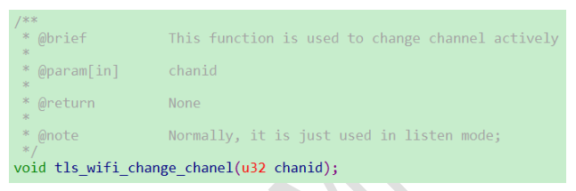
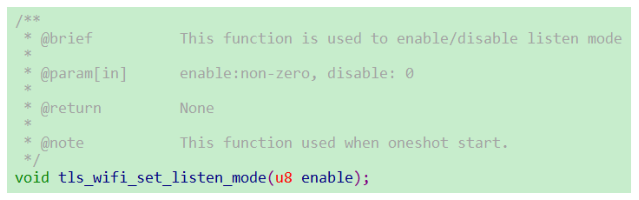
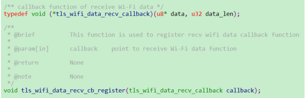
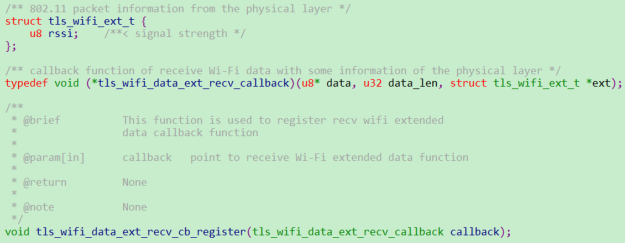
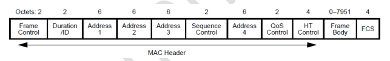
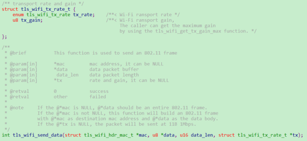
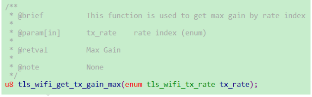

 WiFi_自由通信接口使用指导 

 From SZDOIT

## 1 引言

### 1.1 编写目的

指导 W60X/W800 相关的开发人员使用 WiFi 自由通信接口

## 1.2 预期读者

所有 W60X/W800 相关的开发人员

## 2 设置信道

W60X/W800 在通信时，只有处于同一信道的模块才能互相通信。

chanid 取范围为 0-13 代表 1-14 信道。W60X 使用 2.4G 频段，所以理论上支持 1-14 个信道，但是不同的国家规定了具体所能使用的信道，如中国只能使用 1-13 信道。

## 3 设置监听模式

默认情况下，W60X/W800 只能接收到目的地址是自己、广播地址的包，所以只有设置 W60X/W800 处于监听模式，才能接收到空中所有的包。

编程时，通过调用 tls_wifi_set_listen_mode(1)启动监听模式，调用 tls_wifi_set_listen_mode(0)停止监听模式。

## 4 设置接收回调函数

W60X/W800 将所能接收到的报文，都可以上报给用户进行处理。

这两个接口的区别为 tls_wifi_data_ext_recv_cb_register 除了上报报文内容还附加了报文的信号强度，在编程时根据需要选择一个适合自己的接口即可。
根据 802.11 协议，一个 MAC 头的格式为：

接口中u8* data指针指向一个从MAC帧头开始的完整帧（不包含FCS内容），u32 data_len指整个帧的长度（不包含 FCS 长度），FCS 错误的帧会被系统丢弃不会上报给用户，编程时需要用户根据协议去解析帧内容。

## 5 发送帧

当用户需要发送自组帧时，可以使用下面这个接口：

在编程时，struct tls_wifi_hdr_mac_t *mac 填 NULL，u8 *data 指向一个完整的 802.11帧（不包含 FCS 内容），u16 data_len 为这个完整 802.11 帧的长度（不包含 FCS 长度），FCS 由硬件自动计算并附加在帧尾。

struct tls_wifi_tx_rate_t *tx 指定了发包的速率大小和发送增益，速率值根据枚举值填写即可

增益值取值范围是 0x60-0x78，推荐用户直接使用 tls_wifi_get_tx_gain_max 获取对应速率的增益值填入。

## 支持与服务

| 四博智联资源                                        |                                                              |
| --------------------------------------------------- | ------------------------------------------------------------ |
| 官网                                                | [www.doit.am](http://www.doit.am/)                           |
| 教材                                                | [ESPDuino智慧物联开发宝典](https://item.taobao.com/item.htm?spm=a1z10.3-c.w4002-7420449993.9.Bgp1Ll&id=520583000610) |
| 购买                                                | [官方淘宝店](https://szdoit.taobao.com/)(szdoit.am)          |
| 讨论                                                | [技术论坛](http://bbs.doit.am/forum.php)(bbs.doit.am)        |
| 应用案例集锦                                        |                                                              |
| [Doit玩家云](http://wechat.doit.am)(wechat.doit.am) | [免费TCP公网调试服务](http://tcp.doit.am)(tcp.doit.am)       |
| 官方技术支持QQ群1/2/3群已满                         |                                                              |
| 技术支持群4                                         | 278888904                                                    |
| 技术支持群5                                         | 278888905                                                    |
| 术支持群6                                           | 278888906                                                    |
| 技术支持群7                                         | 278888907                                                    |
| 技术支持群8                                         | 278888908                                                    |
| 技术支持群9                                         | 278888909                                                    |
| 技术支持群10                                        | 278888900                                                    |