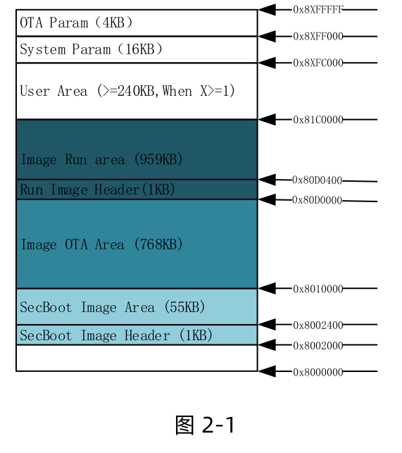

 W800_固件生成说明 

 From SZDOIT

## 1 引言

### 1.1 编写目的

本文档主要用于阐述 W800 中的固件格式，存储位置及文件生成。

### 1.2 预期读者

该文档适用的读者包括 W800 SDK 研发人员，W800 SDK 工程开发人员等。

### 1.3 术语定义

## 2 IMAGE 在 QFLASH 的位置

### 2.1 SECBOOT 参数区域

地址空间：0x8002000-0x80023FF，共 1KB

参数布局：详见《WM_W800_QFLASH 布局说明》

### 2.2 SECBOOT 存放区

地址空间：0x8002400-0x800FFFF，共 55KB

### 2.3 运行 IMG 参数区

地址空间：0x80D0000-0x80D03FF，共 1KB

参数布局：详见《WM_W800_QFLASH 布局说明》

### 2.4 运行 IMG 存放区

地址空间：0x80D0400-0x801DFFFF，共 1087KB

### 2.5 升级 IMG 存放区

地址空间：0x8010000-0x80CFFFF，共 768KB

### 2.6 升级 IMG 参数区

地址空间：0x8XFF000-0x8XFFFFF，共 4KB

## 3 W800 的 Image 组成说明

Image 由 Header, Body 和数字签名三部分组成（如图）。

### 3.1 Image Header

W800 Image Header 包含信息：魔术字，Image 属性，Image 启动地址，Image 长度，Image Header 头位置，Image 升级地址，Image CRC 校验，Image 解密信息，数字签名，压缩信息。

#### 3.1.1 Image Header 各字段描述

#### 3.1.2 Image Attribute

### 3.2 Image Body

### 3.3 数字签名

如果 Image Header 的属性里的 signature 被置位了，则说明固件带有数字签名。

数字签名是针对 Image Header 和 Image Body 组成的文件。

## 4 IMAGE 类型

依据 Img_Attr_Type 可以区分出来不同的 Image，常用的有如下两种

### 4.1 SECBOOT（非压缩格式）

W800 的二级引导程序

### 4.2 User image

用户运行区的固件，可以为压缩的或者非压缩的，压缩的采用 G-ZIP 实现。
非压缩格式：

压缩格式：

## 5 生产烧录 Image（组合 Image）

W800 生产烧录固件是把 SECBOOT 和 User.img 用工具拼接起来通过 xmodem 升级，如下。

W800 的 ROM 会依据 Header 来区分当前烧录的位置。

## 6 不同阶段 IMAGE 文件升级

## 7 IMAGE 文件生成

设定：

原始 Image 文件：w800_original.img

加密文件为：w800_original_enc.img

Image 加密 Key：X，存为文件为 keyfile

keyfile 的公钥加密文件为： keyencfile

公钥证书文件：capub.pem

公钥文件的 N 记为：capbu_N.dat

签名前的 Image 文件：Image_nosig.img

签名后的 Image 文件：Image_sig.img

签名文件：sign.dat

### 7.1 IMAGE 的加密及签名过程（可选）

通过 openssl enc -aes-128-ecb 对 w800_original.img 进行加密（KEY 由用户自定义），生成原始 IMAGE 的加密文件 w800_original_enc.img。

通过 openssl rsautl –encrypt，用公钥证书 capub.pem 对 keyfile 进行加密生成keyencfile

把 keyencfile 追加到文件 w800_original_enc.img 的后面，生成临时文件 Temp，再把 capbu_N.dat 文件追加到 Temp 后面，生成 Image 的 Body。

### 7.2 IMAGE 压缩（可选）

对目标 Image(已包含了完整的 Image header+Image 内容+可选的签名+可选的加密信息） 进行压缩，仅支持 GZIP 压缩算法。

### 7.3 IMAGE 生成

Image Body 生成后，接下来需要增加 Image Header。

使用 wm_tool 工具生成最终签名前的 Image 文件 Image_nosig.img。

### 7.4 IMAGE 签名（可选）

对 Image_nosig.img 做数字签名得到签名文件 sign.dat ，把 sign.dat 追加到Image_nosig.img 后，生成最终的签名文件 Image_sig.img。
上述的整个 IMAGE 生成过程，可以参考 W800 SDK 中的SDK/tools/w800/utilities/aft_build_project.sh
或者rules.mk

## 8 FAQ

### 8.1 W800 的 IMAGE 固件空间可以调整吗？

可以调整，依照 QFLASH 的布局图，按照自己的需求调整即可。

### 8.2 首次使用 W800 模块，用户应该烧录哪个文件？

分几种情况：
1） W800 模块仅有 ROM 固件
烧录一个 SECBOOT 和 User Image 打包在一起的固件，通过 ROM 的串口 0 烧录。
2） W800 仅有 SECBOOT 固件
烧录 User Image
3） W800 模块有可用的用户固件
可以根据需要使用自己指定的固件

### 8.3 W800 模块没有任何响应怎么办？

如果 W800 模块连接上 UART0 后，既没有进入 ROM，也没有进入 SECBOOT 和用户固件，则需要对其进行恢复操作。

1） 如果模块的 BOOTMODE 脚拉低，复位模块可以进入 ROM，则按照 7.2 的方法 1）操作即可。

2） 如果 BOOTMODE 脚拉低也没用，则可以考虑硬件问题了。

3） 可以考虑是否串口接反了

### 8.4 如何烧录 W800 的工厂烧录文件？

W800 的工厂烧录文件是一个 SECBOOT 和 User Image 文件链接在一起的文件。

工厂烧录的步骤：

1） BOOTMODE 脚拉低

2） 复位芯片

3） 通过 UART0 2M 方式升级

8.5 W800 的用户运行区固件大小有限制吗？

有限制的，取决于 QFLASH 的大小，用户的参数区大小。

8.6 W800 的 IMAGE 区域调整，需要做哪些工作？

详见：《WM_W800_参数区使用说明》的用户参数区调整规则。

