
 W800_QFLASH布局说明 

 From SZDOIT

## 1 引言

### 1.1 编写目的

本文档主要用于阐述 W800 中的 QFLASH 布局，使读者了解当前 W800 的 QFLASH 的
使用情况。

### 1.2 预期读者

该文档适用的读者包括研发人员、测试人员、W800 的工程使用人员等。

### 1.3 术语定义

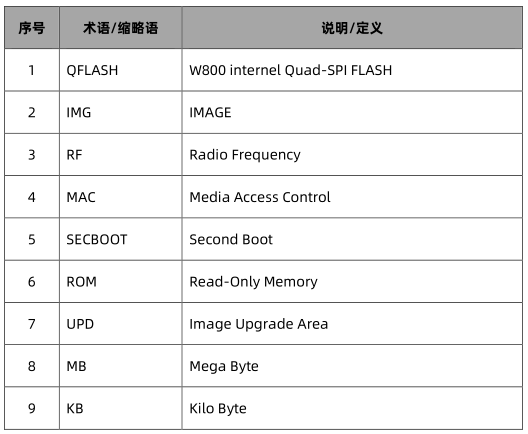

## 2 W800 QFLASH 的布局

地址空间：0x8000000-0x8XFFFFF，共(X+1)MB，X >= 1，针对 2M 及以上的 QFLASH。

### 2.1 QFLASH 大于 2M 的布局

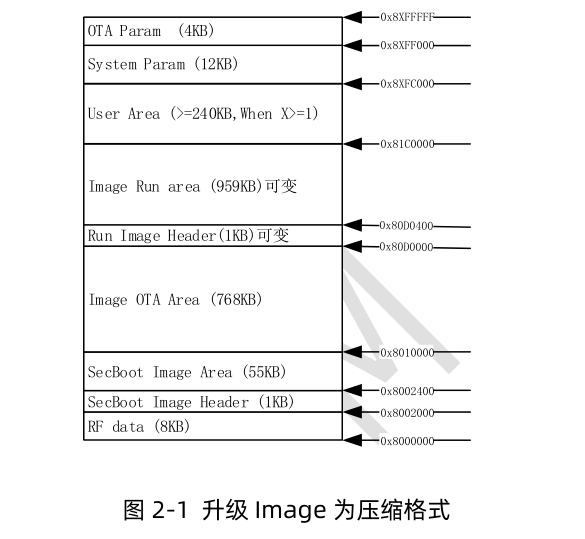

#### 2.1.1 物理层参数区

地址空间：0x8000000-0x8001FFF，共 8KB
参数内容：
系统 RF 及 MAC 相关参数。
参数布局：

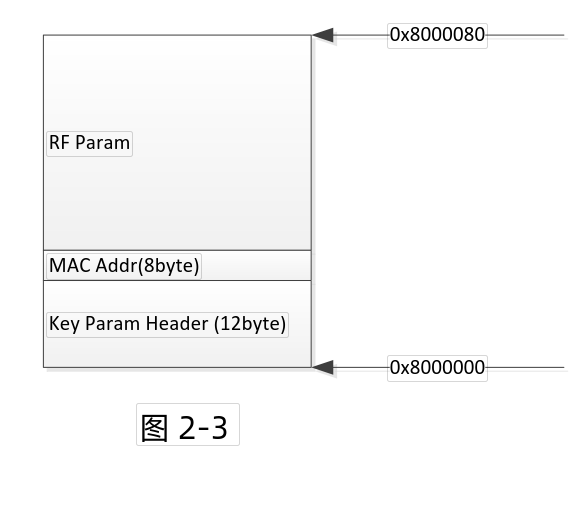

#### 2.1.2 SECBOOT 参数区

地址空间：0x8002000-0x80023FF，共 1KB
参数内容：
SECBOOT 启动校验相关信息及启动地址
参数布局：

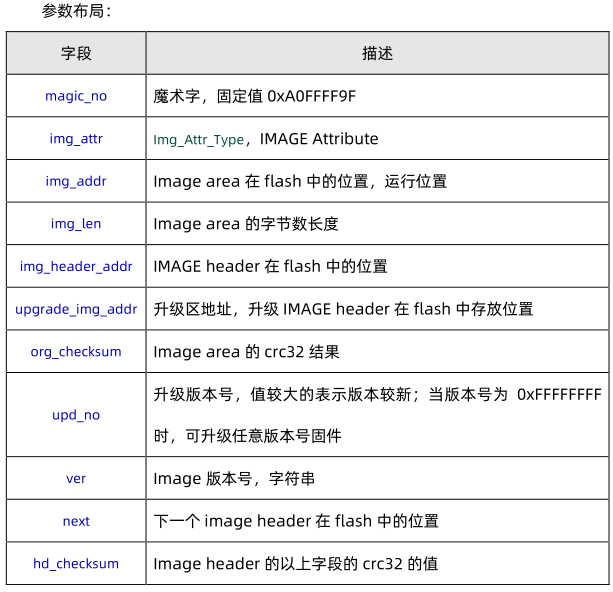

W800 的 IMAGE Attribute 字段描述：

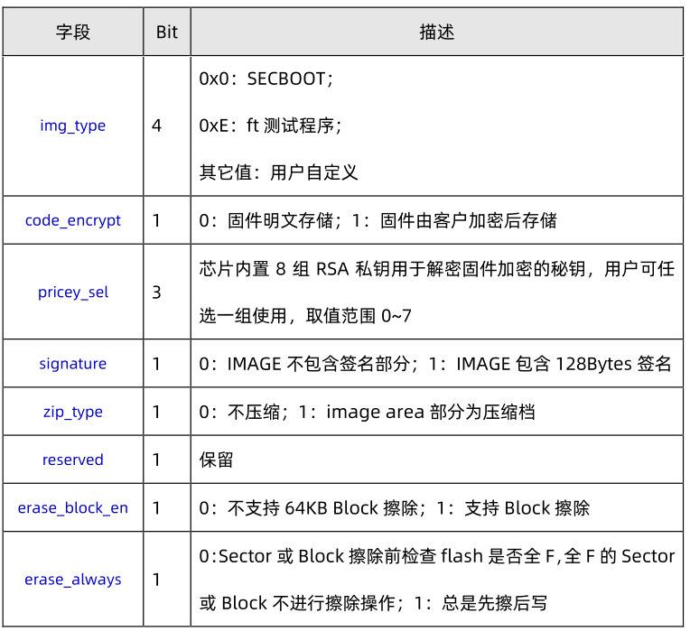

#### 2.1.3 SECBOOT 存放区

地址空间：0x8002400-0x800FFFF，共 55KB
参数内容：
SECBOOT IMAGE 内容
参数布局：
平铺的 SECBOOT IMAGE，可为加密文件

#### 2.1.4 升级 IMG 存放区

地址空间：

0x8010000-0x80CFFFF，共 768KB
参数内容：
OTA 升级 IMAGE 文件（可为 secboot，User Image）
参数布局：

#### 2.1.5 运行 IMG 参数区

地址空间：0x80D0000-0x80D03FF，共 1KB
参数内容：
运行区 IMAGE 启动校验相关信息及启动地址
参数布局：

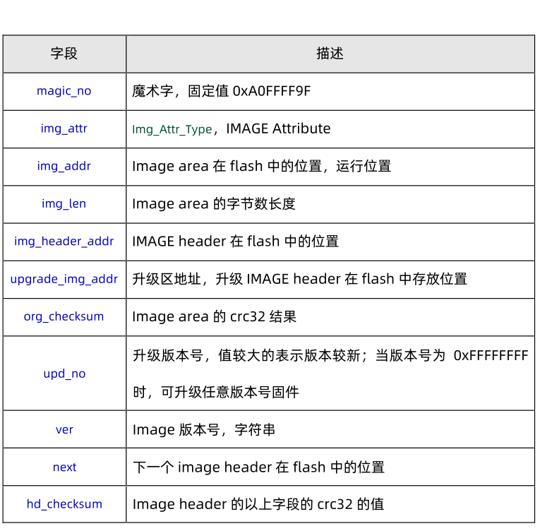

#### 2.1.6 运行 IMG 存放区

地址空间：
0x80D0400-0x81BFFFF，共 959KB
参数内容：
平铺的运行时 IMAGE
参数布局：

#### 2.1.7 用户参数区

地址空间： 0x81C0000-0x8XFBFFF，共（X+1）MB – 1808KB， X >=1。
参数内容：
用于用户存放自定义参数时使用。
用户可用参数区大小与用户 Image 空间大小相关
参数布局：
用户自定义

#### 2.1.8 系统参数区

地址空间： 0x8XFC000-0x8XFEFFF，共 12KB
参数内容：
系统运行时所需的相关参数
参数布局：

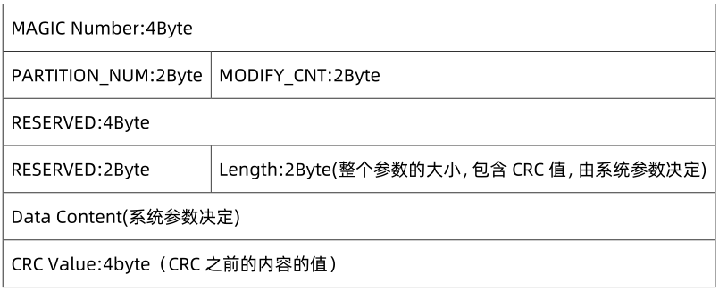

1）系统参数 1 区（0x8XFC000-0x8XFCFFF）
2）系统参数 2 区（0x8XFD000-0x8XFDFFF）
3）系统参数 3 区（0x8XFE000-0x8XFEFFF）

#### 2.1.9 升级 IMG 参数区

地址空间：0x8XFF000-0x8XFFFFF，共 4KB
参数内容：
OTA 升级 IMAGE 校验信息，用于区分是否 OTA。
SECBOOT 搬移 OTA 固件后改写。
参数布局：

### 2.2 QFLASH 小于 2M 的布局

针对上述的不同 Size，QFlash 的布局会不同，以 1MB 举例如下。
1）<2MB，不考虑 OTA 升级的场景

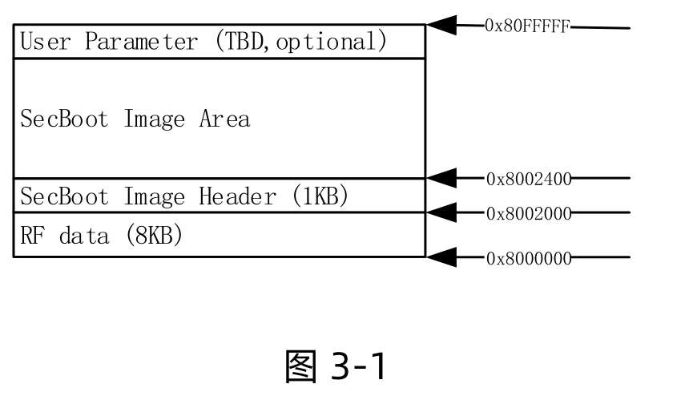

2）<2MB，考虑 OTA 升级的场景
（1）QFlash 空间够，则布局如下：

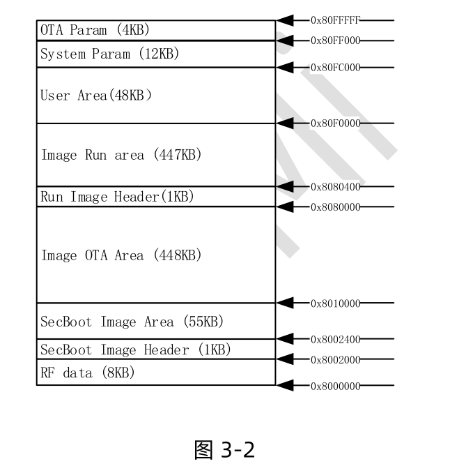

（2）QFlash 空间不足够，则布局如下，部分 OTA 区域要放置到内部 QFlash，部分
OTA 和全部用户区都放到外部存储设备：

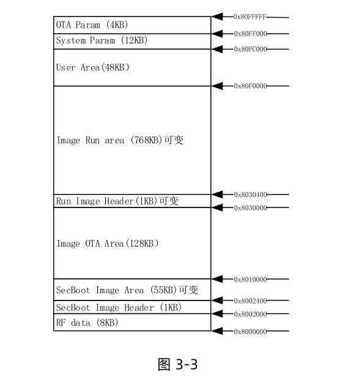

如下是针对不同 Flash Size 和基本功能支持情况做的划分

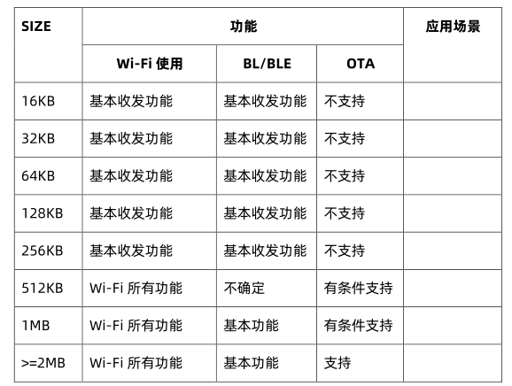

注：
有条件支持：内部 Flash 基本都划分为代码空间，要通过外挂存储设备才可实现
OTA 固件的存储。
支持： 内部存储空间已经满足运行区和 OTA 区域
不支持：内部存储空间不足以支撑 OTA 相关代码(Wi-Fi+OTA 应用，蓝牙+OTA
应用)的运行。

## 3 FAQ

### 3.1 为什么布局划分总是以 64KB 为倍数划分？

考虑到 QFlash 的实现方式不同，针对掉电过程中，如果有 QFlash 的写动作，可能会破坏整个扇区的操作。

### 3.2 为什么总是留一部分升级区在内部 Flash 里？

因为 ROM 里总是认定 SECBOOT 的升级区域在内部 QFlash 里。
为了预防 SECBOOT 升级，必须把 OTA 区域预留在内部 QFlash 里。

# 支持与服务

| 四博智联资源                                        |                                                              |
| --------------------------------------------------- | ------------------------------------------------------------ |
| 官网                                                | [www.doit.am](http://www.doit.am/)                           |
| 教材                                                | [ESPDuino智慧物联开发宝典](https://item.taobao.com/item.htm?spm=a1z10.3-c.w4002-7420449993.9.Bgp1Ll&id=520583000610) |
| 购买                                                | [官方淘宝店](https://szdoit.taobao.com/)(szdoit.am)          |
| 讨论                                                | [技术论坛](http://bbs.doit.am/forum.php)(bbs.doit.am)        |
| 应用案例集锦                                        |                                                              |
| [Doit玩家云](http://wechat.doit.am)(wechat.doit.am) | [免费TCP公网调试服务](http://tcp.doit.am)(tcp.doit.am)       |
| 官方技术支持QQ群1/2/3群已满                         |                                                              |
| 技术支持群4                                         | 278888904                                                    |
| 技术支持群5                                         | 278888905                                                    |
| 术支持群6                                           | 278888906                                                    |
| 技术支持群7                                         | 278888907                                                    |
| 技术支持群8                                         | 278888908                                                    |
| 技术支持群9                                         | 278888909                                                    |
| 技术支持群10                                        | 278888900                                                    |