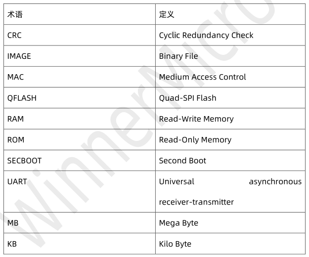
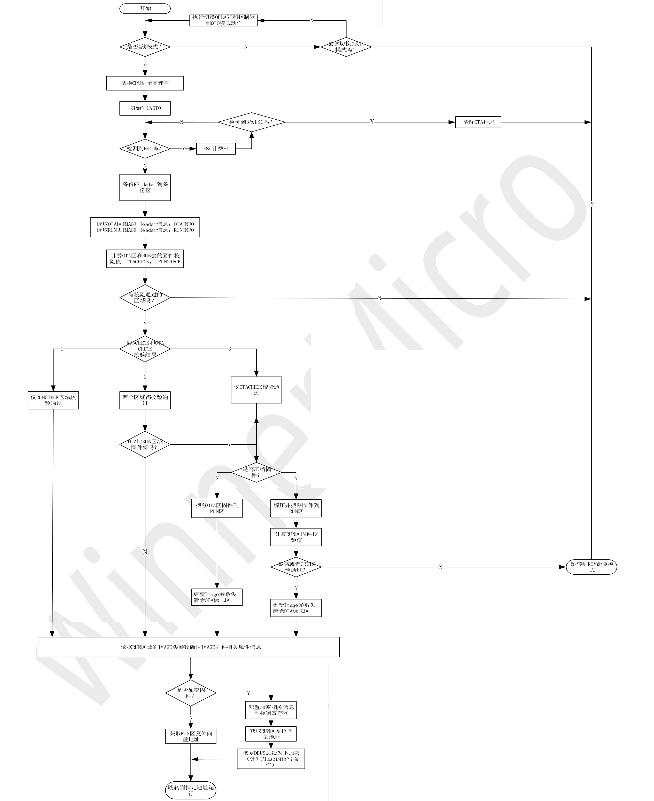

 W800_SECBOOT功能简述 

 From SZDOIT

## 1 引言

### 1.1 概述

本文档是对 W800 的 SECBOOT 功能及使用说明进行简单描述，供开发者和设计者理解W800 的 SCEBOOT 功能。

### 1.2 术语定义

### 1.3 文献索引

1.《WM_W800_固件生成说明》
2.《WM_W800_QFLASH 布局说明》

## 2 SECBOOT 流程图

## 3 SECBOOT 功能

### 3.1 Secboot 的功能说明

#### 3.1.1 IMAGE 启动部分

##### 3.1.1.1 QFlash 工作模式切换

针对未知的 Flash 厂商，当从 ROM 跳转到 QFlash 时，需要切换 QFlash 的工作模式：从 1 线切换到 4 线模式。

##### 3.1.1.2 IMAGE 完整性校验(CRC32)

1）IMAGE 头进行 CRC 校验；
IMAGE 的内容进行 CRC 校验。
在此校验之后，对启动代码进行后续的动作。
2）IMAGE 整体的签名校验

##### 3.1.1.3 代码解压

针对客户为了节省空间对代码进行压缩的情况，依据使用的压缩算法对代码进行解压。
需要考虑使用那些压缩解压缩算法，及压缩率。
仅支持 GZIP 算法。

##### 3.1.1.4 代码搬移

解压后的代码是需要放置到指定的运行位置，依据 IMAGE 的 header 信息去确定。OTA

##### 3.1.1.5 代码解密设置

针对代码是加密的情况，需要配置代码的解密信息。

##### 3.1.1.6 代码跳转运行

代码搬移后，确定代码的复位向量地址，从 secboot 跳转到用户的 image 去运行。

#### 3.1.2 升级功能

##### 3.1.2.1 升级方式

同 ROM 升级方式，xmodem。

##### 3.1.3 特殊指令

同 ROM 支持的指令。

