
 W800_SWD调试配置指南 

 From SZDOIT

## 1 引言

### 1.1 编写目的

指导 W800 相关的开发和测试人员使用 SWD 在线调试程序；

### 1.2 预期读者

所有 W800 相关的开发人员和测试人员；

### 1.3 术语定义

JTAG：Joint Test Action Group，联合测试工作组

SWD: Serial Wire Debug，串行线调试

## 2 SWD 简介

最早 JTAG 是一种国际标准测试协议（IEEE 1149.1 兼容），主要用于芯片内部测试。JTAG 协议在定义时，由于当时的计算机（PC 机）普遍带有并口，因而在连接计算机端是定义使用的并口。而计算机到了今天，不要说笔记本电脑，现在台式计算机上面有并口的都很少了，取而代之的是越来越多的 USB 接口。所以SWD 接口就出现了，与 JTAG 的 20 个引脚相比，SWD 只需要 4 个（或者 5 个）引脚，结构简单更加稳定。

SWD 接口的信号引脚如下：

Vref：目标表参考电压信号，用于检测目标板是否供电，直接与目标板 VDD 相连，并不向外提供输出电压；

GND:公共地信号；

SWDIO:串行数据输入信号，作为仿真信号的双向数据信号线，建议上拉；

SWCLK：串行时钟输入，作为仿真信号的时钟信号线，建议下拉；

SWO：串行数据输出，CPU 调试接口可通过 SWO 输出一些调试信息，该引脚可选；

RESET:仿真器输出至目标 CPU 的系统复位信号，该引脚可选。

## 3 安装 Debug Server

在官网 https://occ.t-head.cn 平头哥芯片开放社区-技术部落-资源下载中可以找到 Debug Server 下载链接，下载 Debug Server 安装包之后，Windows 系统下双击压缩包中的 setup.exe即可启动安装，Linux 系统下执行压缩包中的安装脚本即可启动安装。

注意：Windows 系统下安装 CDS 集成开发环境的话是可选安装 Debug Server 的。

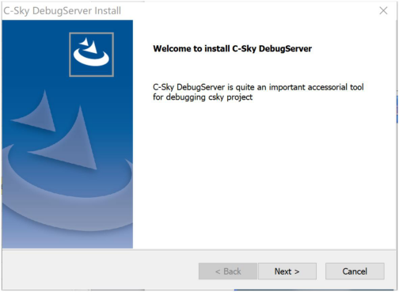

安装中需要用户输入一些信息，根据界面提示输入即可：

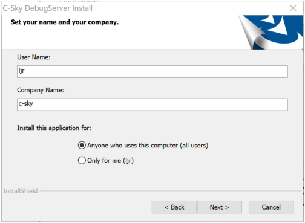

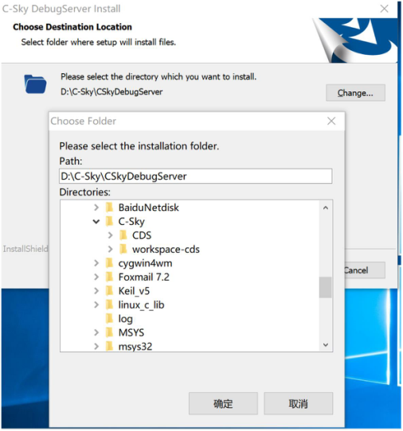

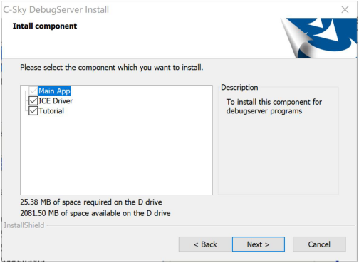

最后，点击 next 启动安装：

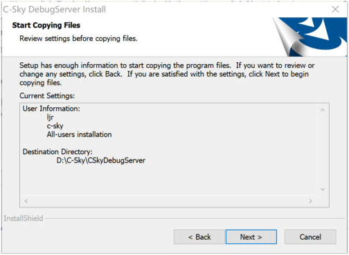

然后请耐心等待安装完成。

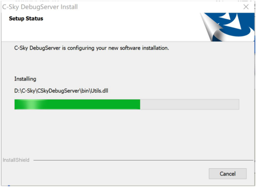

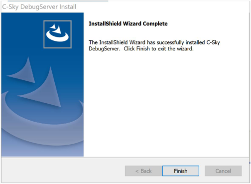

## 4 连接 CK-LINK

先使用杜邦线连接CK-LINK和W800模块，其连接方式如下图：

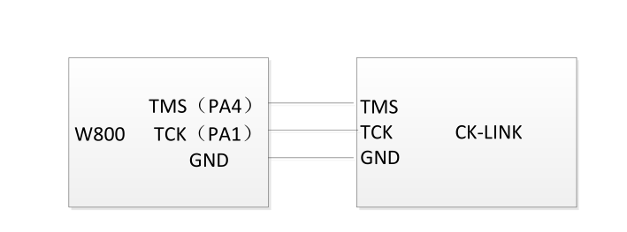

然后模块供电，并将 CK-LINK 和电脑连接，驱动安装正确的话，CK-LINK 的指示灯将会由红色变为黄色。

***注意：***

要使用调试功能，需要配置 PA1 和 PA4 的 IO 的复用为调试功能，SDK 里把宏 WM_SWD_ENABLE

置为 1 后编译版本，烧录到板子后即可使用调试器。

## 5 启动 Debug Server

启动 Debug Server 有如下两种方法：

可以通过双击桌面 Debug Server 图标启动；

可以在开始菜单中找到 Debug Server 图标启动；

启动之后，界面会如下显示：

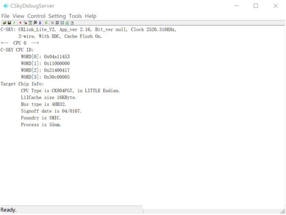

第一行会显示 CK-LINK 的版本等信息，如果驱动未安装成功这行信息不会出现；

后面几行显示了 CPU 等芯片信息，如果接线不正确这些信息也不会显示。

当显示无误之后，说明环境已经就绪，此时可以关闭此程序，请阅读下文使用 CDS 集成环境进行调试。

## 6 使用 CDS 集成环境在线调试程序

### 6.1 配置工程

导入 SDK 工程之后，在左侧工程管理视图中右键单击工程，如下图选择设置：

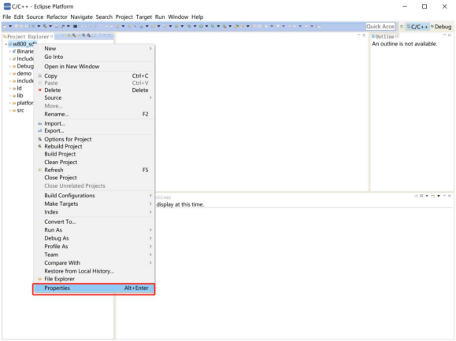

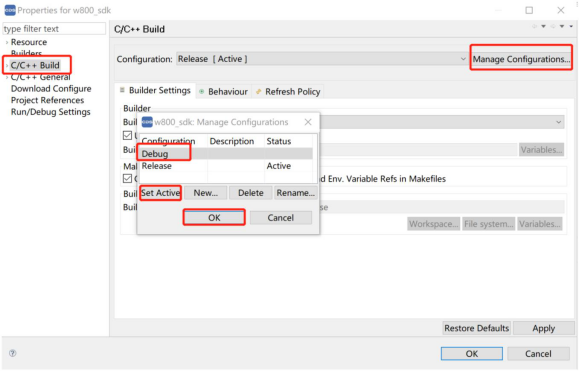

6.2 启动调试

右键工程选择如下：

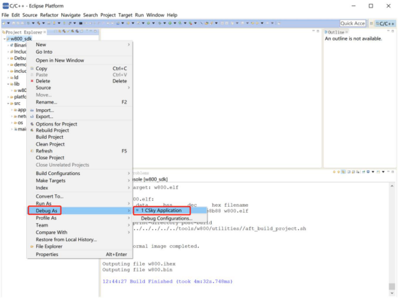

之后根据界面提示操作即可。

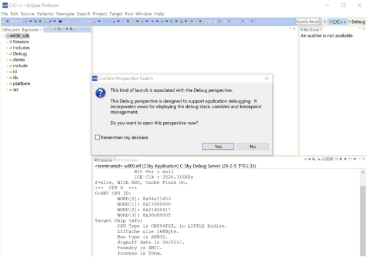

## 7 更多参考文档

在 Debug Server 的安装目录中（就是第 3 章安装 Debug Server 中选择的安装目录），中天微也提供了

一些参考文档，用户可自行去参考，如：

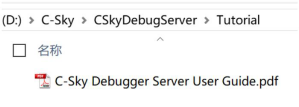

