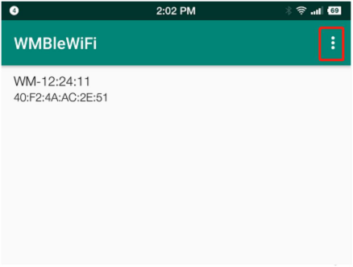
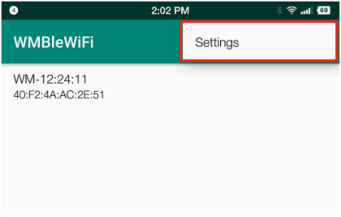
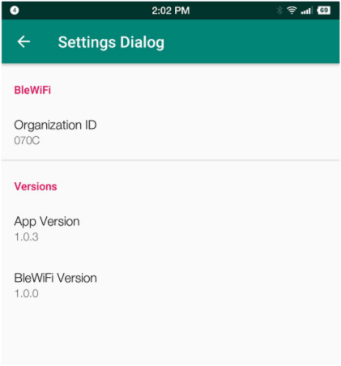
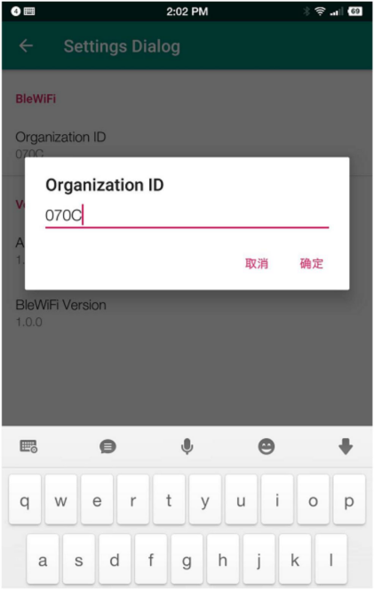
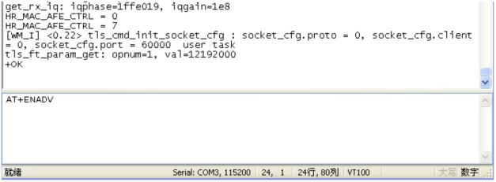
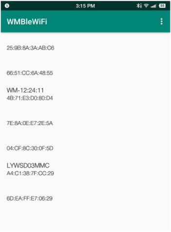
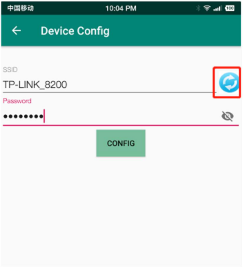
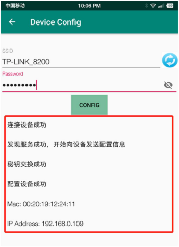

 W800 Android_BleWiFi蓝牙配网

 From SZDOIT

## 1 引言

### 1.1 概述

W800 作为集成 2.4 GHz Wi-Fi 和蓝牙双模的单芯片方案，支持 OneShotConfig 一键配网和蓝牙 BLE 配网两种模式，用户可以通过蓝牙 BLE 对使用了 W800 芯片的物联网设备进行安全配网。

联盛德提供蓝牙配网 Android SDK 和示例 APP，供用户为设备进行配网。本文档将介绍 Android 版本示例 APP 的使用方法，供用户快速理解配网过程，为开发自己的 APP 提供指导。

## 2 蓝牙配网示例

### 2.1 硬件和软件环境

• W800 模组一个；

• PC 一台，安装串口工具，通过串口与 W800 模组相连；

• Android 手机一台，安装 WMBleWiFi APP;

### 2.2 APP 设置界面

1.打开 APP，显示下面界面，点击右上角 ；

2.页面将显示 Settings 菜单，点击 Settings 进入设置界面；

3.进入设置界面，可以设置 BLE 扫描过滤 Organization ID，查看 APP 版本和 BleWiFi版本；

4.点 击 Organization ID 行 ， 弹 出 设 置 Organization ID 窗 口 ， 可 以 设 置Organization ID 继续扫描过滤，也可以清空它，不过滤扫描结果；

### 2.3 配置 Station 模式示例

1.PC 连接 W800 模组，串口工具发送 AT+ENADV 开启蓝牙配网过程；

2.手机打开 WMBleWiFi APP，在 APP 界面下拉刷新，可以发现周边的蓝牙设备，显示在界面列表中，每项分上下两行，上面是设备名称，下方是蓝牙 Mac 地址，有的设备不广播名称，名称部分为空；

3.在扫描设备列表中，选择点击 W800 模组，进入到配置界面。点击 按钮，弹出WiFi 扫描列表，选择要配置的 AP SSID，输入密码，点击 Config 按钮，开始配网过程；

4.配置界面下方是日志信息，显示配网进度。分别是连接设备、发现服务和特征、密以及 IP 地址信息；

