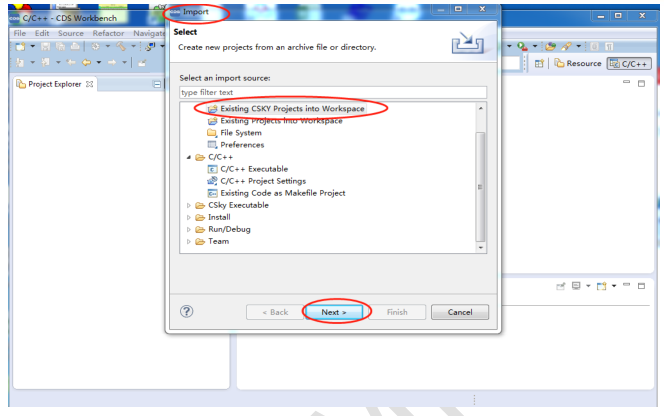
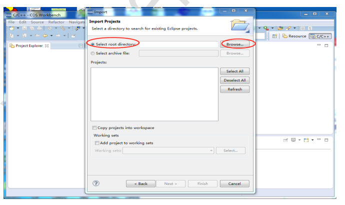
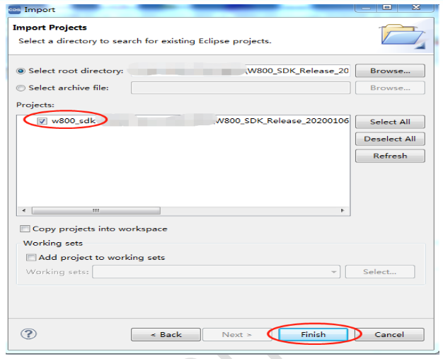
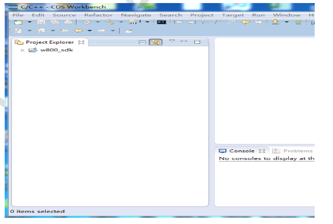
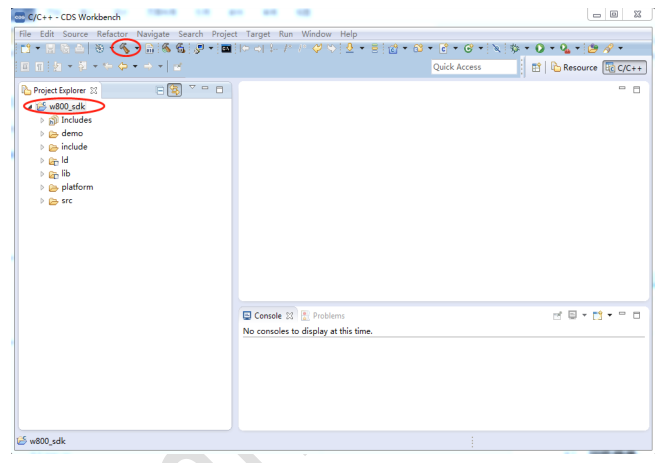

<center> <font size=10> W800_入门手册 </font></center>

<center> from SZDOIT </center>

# 

## 1 概述

指导如何用户搭建 w800 硬件开发的软件环境，通过示例工程展示如何编译、下载固件到w800开发板等操作步骤。
该手册基于W800的ARDUINO开发板进行介绍及示例的升级运行。

w 800 是一款基于XT 804 内核SoC，支持功能：

- 2.4G Wi-Fi
- 蓝牙
- 内置多种接口（QFlash，UART，GPIO，I²C，PWM，I²S， 7816 ）
- 支持多种硬件加解密算法（RC 4 ，DES， 3 DES，AES，RSA，MD5，SHA1）
- 内置安全功能


## 2 准备工作

##### 硬件：

```
⚫ w800开发板
⚫ USB数据线（Micro USB）
⚫ PC（Windows、linux或Mac OS）
```

**软件：**
   ⚫  工具链，用于编译w800代码
   ⚫ 编译工具
   ⚫ w800 sdk
   ⚫ 串口工具（支持xmodem协议）
   ⚫ 代码编辑器

## 3 w800开发板简介

W800 Arduino开发板，提供了如下接口：
⚫ I2C&I2S接口
⚫ Uart 0 &SWD调试接口
⚫ SPI&Uart 1 通信接口
⚫ PWM接口
⚫ SIM 接口
⚫ GPIO
⚫ Micro USB 接口
用户通过Micro USB口与上位机相连，通过UART0口进行固件烧录。

## 4 w800编译环境搭建

### 4.1 w800工具链


**linux平台** ： （获取最新工具链）
csky-elfabiv2-tools-x86_64-*.tar.gz
csky-elfabiv2-tools-i386-*.tar.gz
**windows平台** ：
csky-elfabiv2-tools-mingw-*.tar.gz
**获取路径：**
https://occ.t-head.cn/community/download?id=

### 4.2 开发环境安装

w 800 基于gcc编译环境开发，正式使用工程前，需要先完成编译工具的安装，具体步
骤如下：

#### 4.2.1 Windows

##### 4.2.1.1 基于linux虚拟机的编译环境

获取路径：
链接：https://pan.baidu.com/s/1GFgly3mIyX_jb70ULWLbDw
提取码：n1ca
使用VirtualBox环境，安装VirtualBox-5.2.38- 136252 - Win.exe

Ubuntu虚拟机为：WinnerMicro_Ubuntu.7z
**注意事项：
1 ）** 尽量关闭杀毒软件
**2 ）** 建议采用官方提供的虚拟机环境

##### 4.2.1.2 基于Cygwin的编译环境

获取路径：
链接：https://pan.baidu.com/s/1sBW5Fnhh6OgqRxl3hmNdoQ
提取码：q6zb
上面链接是w800产品包提取路径，用户获取工具的路径为：W800_ProductPackage->
开发套件->编译工具
工具安装后会添加到右键菜单里，用户只需在SDK的根目录右键打开命令行工具，按照
所需执行make相关操作即可。
文件名称：cygwin4wm_setup_vx.x.x.exe
参看文档： **《WM_W800_SDK命令行编译指南》**

##### 4.2.1.3 基于CDK的编译环境

获取路径：
链接：https://occ.t-head.cn/community/download?id=
上面是平头哥的 CDK下载链接位置，用户可根据需要去下载安装，这是一个可视化的
开发编译环境。
注意：
1 ） CDK的编译环境路径深度不要超过 80 字符，否则编译报错

##### 2 ） 建议把SDK解压到磁盘根目录下，然后打开CDK工程编译。

##### 3 ） CDK工程仅在V1.00.00及之后版本才提供

##### 4.2.1.4 基于CDS的编译环境


需要windows下的cds ide开发编译环境，参见 附录 1


#### 4.2.2 Linux

从官网https://occ.t-head.cn平头哥芯片开放社区-> **技术部落** - > **资源下载** - > **工具** ，根
据自己本地系统环境选择下载适用的“ **800 Series Toolchain** ”。


下载后将编译工具链解压到的某个路径下（如opt目录），设置编译工具链路径至环境
变量，举例如下：

export PATH=$PATH:/opt/ csky-elfabiv2-tools
/bin
上述设置完成，编译工具链即可用，可以进行接下来的编译工作。

用户也可将工具链的路径配置写至.profile等配置文件中达到自动配置的目的
用户还可以在sdk中直接指定工具链路径。

#### 4.2.3 Mac OS

##### 安装虚拟机环境，获取路径：

链接：https://pan.baidu.com/s/1GFgly3mIyX_jb70ULWLbDw
提取码：n1ca
使用VirtualBox环境，安装VirtualBox-5.2.38- 136252 - OSX.dmg
Ubuntu虚拟机为：WinnerMicro_Ubuntu.7z


## 5 SDK工程获取

w800 sdk获取方式：联盛德官网（www.winnermicro.com）获取，详细位置：

如果您已获取到w800 sdk，直接解压到 **非中文路径** 即可。

## 6 SDK工程编译

如果您已按照章节 4 完成了编译环境的安装，并且通过章节 5 的指引获取到w800 sdk包，那么接下来就可以进行编译生成固件。

### 6.1 Windows

#### 6.1.1 Ubuntu虚拟机

把sdk拷贝或者从网站下载到虚拟机环境下，打开设备终端（Terminal），解压sdk工
程，修改sdk工程权限(shell命令：chmod)，进入工程根目录，终端上执行make即可开
始编译。
w800固件会生成，固件位于w800 sdk工程bin\w800目录下，生成文件有：
w800.fls： 串口烧录
w800_ota.img：OTA升级

w800.map：map文件

### 6.2 Linux

把sdk拷贝或者从网站下载到虚拟机环境下，打开设备终端（Terminal），解压sdk工
程，修改sdk工程权限(shell命令：chmod)，进入工程根目录，终端上执行make即可开
始编译。

### 6.3 mac os

## 7 固件烧录

完成前面步骤 6 就已经生成了可烧录的w800固件。
接下来介绍如何把固件烧录到w800开发板，以Windows环境的烧录为例，其他环境（linux或mac os）下串口显示不同，操作步骤基本一致。

### 7.1 Window下的操作步骤

1. 通过USB转接线连接PC和w800开发板（默认连接w800 UART0， **波特率 115200 bps** ，
   **8 位数据位** ， **无奇偶校验位** ， **1 位停止位** ）
   
2. 在PC的设备管理器中确认与w800连接所用的COM口（Windows环境）

3. 打开串口工具（以SecureCRT为例），选定COM口（ **波特率 115200 bps** ， **8 位数据位** ，
   **无奇偶校验位** ， **1 位停止位** ）
   1 ） SecureCRT下，选择新建会话（如下图），协议选择Serial（可在下拉菜单里选择）
   
   
   
    2 ） 点击下一步，进入串口选择配置页面（注意：不要勾选RTS/CTS），点击下一步设置会话名称（也可默认，只要不重复即可），点击完成
   
   

​	    3 ） 如下图，点击连接弹出连接选项，选择指定COM，然后点击完成，串口连接完成。


4. 按下开发板的bootmode脚，复位启动后，模块启动后会进入升级模式，串口不断打印字符’C’（ 如下图），此时， **松开bootmode脚** 。


5. 串口工具下，选择菜单传输，下拉选择发送Xmodem，弹出对话框后，选择固件w800.fls


6. 点击打开，开始升级，升级完成后，串口继续打印CCC

7. 复位模块，串口打印user task，即说明w800开发板已正常启动


### 7.2 Linux下升级步骤

### 7.3 Mac os下升级步骤

## 8 串口调试

完成步骤 7 后，如果使用w800 sdk下载解压后bin目录的固件，那么，w800开发板
上运行的就是支持at指令的固件，用户可参考w800 at指令手册进行相关操作。

## 9 w800 sdk如何开始编写用户程序

### 9.1 用户入口

w800的sdk的入口函数UserMain，位于sdkdir\app\main.c文件里（如下示例代码）。

void UserMain(void)
{
    printf("\n user task \n");-------w800的启动完成打印
    #if DEMO_CONSOLE ------w800的参考示例代码（结合wm_demo.h宏开关使用）
    CreateDemoTask();
    #endif
    //user task-----------------用户任务创建从此开始
}


### 9.2 demo如何使用

w800的参考示例代码位于sdkdir\demo目录，需要结合wm_demo.h里的相关宏开关才能使用。
详细的demo使用指导，请参考文档：WM_W800_SDK_DEMO使用指导

### 9.3 at指令如何使用

w800 的 at 指令相关代码位于 sdkdir\src\app\wm_atcmd 目录下，需要结合wm_config.h里的宏开关（如下）使用。
/**Host Interface&Command**/
\#define TLS_CONFIG_HOSTIF CFG_ON
\#define TLS_CONFIG_AT_CMD (CFG_ON && TLS_CONFIG_HOSTIF)
\#define TLS_CONFIG_RI_CMD (CFG_ON && TLS_CONFIG_HOSTIF)
详细的at指令使用指导，请参考文档：WM_W800_SDK_AT指令用户手册
**注意：** at指令和demo示例因为都使用的是串口 0 ，因此不能同时使用。

## 附录1 CDS开发环境使用

##### CDS是一个集成开发编译环境，如果需要使用，可以按照如下步骤操作。

### 1. CDS安装软件获取

https://occ.t-head.cn/community/download_detail?id=
安装工具可能会有不同的版本，选择最新的即可。

### 2. CDS软件的安装

##### 这是一个可视化的安装程序，按照安装步骤顺序执行即可。

### 3. CDS工程（Import）导入

a) 打开CDS Workbench（如下图）

![image-20201028171743652https://github.com/SmartArduino/zhdocs/raw/master/zhW_Series/W800/Start/image-20201028171743652.png)b) Project Explorer区域，右键Import选择Existing CSKY Projects into Workspace，然后点击Next



c) 如下图，点击右侧Browse...指定w800 sdk的工程路径



d) 路径选择后，sdk工程会出现在Projects区域，默认是勾选w800_sdk，点击Finish



e) 工程导入完成，在Project Explorer出现w800的sdk工程，如下图。



### 4. CDS工程编译（Build）

Project Explorer选中w800 sdk工程，点击工具栏Build（或右键菜单选择Build Project或Rebuild Project）开始编译




Buil

### 5. 固件生成

完成编译链接后，w800固件会生成，固件位于w800 sdk工程bin\w800目录下，生成文件有：
w800.fls： 串口烧录
w800_ota.img：OTA升级
w800.map：map文件

```

```