
 WM_W800 AutoTest 产测工具操作指南 

 From SZDOIT

## 1 引言

WM_W800 AutoTest 工具是我司自主开发的，基于连接 Litepoint 并调用其相关接口，完成对 WM_W800 相关产品物理层发射功率、频偏和接收灵敏度的测试，以筛选出产线上的不良品。

### 1.1 编写目的

指导操作员快速正确使用 AutoTest 产测工具验证基于 WM_W800 外置天线模块涉及产品。

### 1.2 预期读者

工具开发人员、工具测试人员、产品经理、操作员等。

### 1.3 术语定义

DUT Device Under Test 被测器件

### 1.4 参考资料

无

## 2 搭建测试环境

### 2.1 所需软硬件

1> Litepoint 测试仪器；

2> 屏蔽箱；

3> DUT 即 WM_W800 外置天线模块产品；

4> PC；

5> 射频线，网线，USB 延长线；

6> AutoTest 软件；

7> 标准 SDK 固件。

### 2.2 环境组建

1> DUT 烧录标准 SDK 固件；

2> PC 配置与 Litepoint 同网段 IP 地址，并通过网线连接 Litepoint；

3> PC 安装 AutoTest 软件；

4> 屏蔽箱通过射频线连接 Litepoint 射频端口，通过 USB 延长线连接 DUT 和 PC。

## 3 AutoTest 工具安装目录

解压 AutoTest 产测工具压缩包后并打开目录如下：

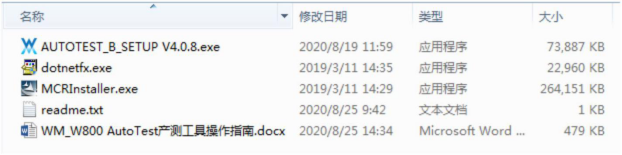4

打开 readme.txt 查看 PC 安装 AutoTest 的软硬件要求。

|      |                  |
| ---- | ---------------- |
|      | 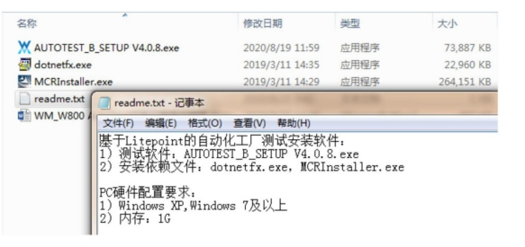 |

### 3.1 安装 AutoTest

鼠标移至 AUOTEST_B_SETUP V4.0.8.exe 并点击右键，选择“以管理员身份运行”即可安装 AutoTest 产测工具，一路“下一步”即可，如无特殊安装放置要求，该工具会默认创建并安装到“C:Program Files (x86)WinnerMicroAUTOTEST_B V4.0.8”路径下。

### 3.2 初始化设置 AutoTest

安装完毕 AutoTest 之后，需要初始化配置 AutoTest.ini，才可以使用 AutoTest 执行测试。

1> 打开 AutoTest.ini 之后，将下图中蓝色字体处修改为 Litepoint 设备地址；

2> 根据 Litepoint 的设备类型 IQnxn 和 IQxel，在 LitepointAPI 处相应设置为 0 和 1；

3> 连接 Litepoint 和 DUT 的射频线线损测定：射频线将 Litepoint 的 RF1 和 RF2 连接，运行 Litepoint signal 软件配置 RF1 发送指定信号强度，查看在 RF2 接收到的信号强度，从而确定所用射频线的线损。最后将该线损配置在 AutoTest.ini 文件中的“Cable Loss”处。

4> 完成上述三处修改之后保存 AutoTest.ini 并关闭。

  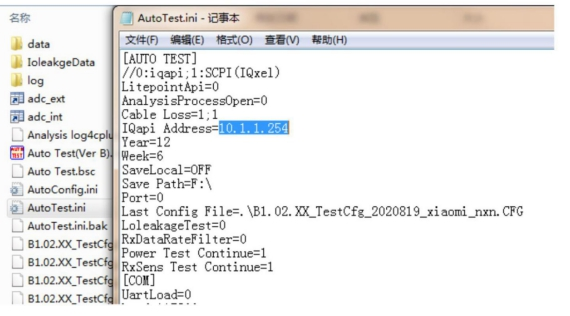

## 4 AutoTest 操作步骤

### 4.1 打开 AutoTest

1> 双击 AutoTest 工具快捷方式标识；

2> 选择被测模块连接 PC 串口编号。

### 4.2 确认配置

点击“配置”弹框查看 Litepoint 的 IP 地址和射频线线损设置是否与测试环境一致，若不一致也可在此处修改并点击 OK；

  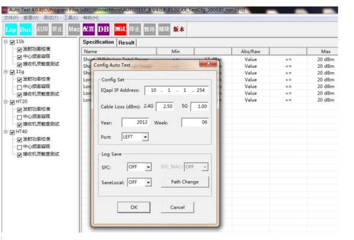 

### 4.3 选取配置文件

进入 AutoTest 工具操作界面，如下图点击“文件”、“载入配置文件”选择指定的测试配置文件后，点击“打开”即可。

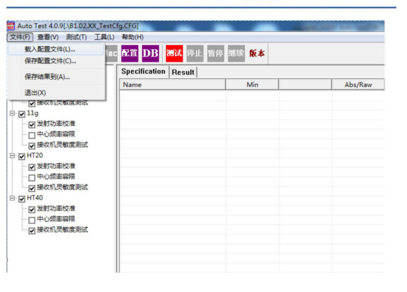

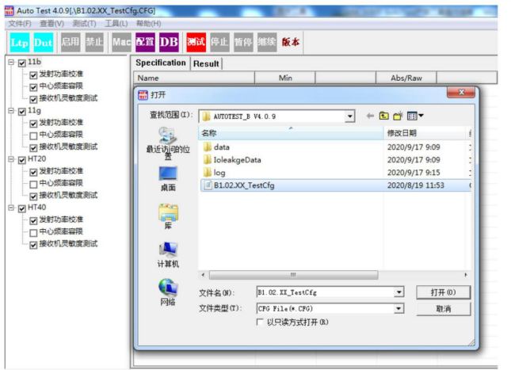

上述配置文件已默认勾选了测试项，如果想改变测试项内容，请双击对应测试项，在弹出的设置框里修改。比如双击 11b 下“发射功率校准”即弹出下面的设置框，根据自己意图进行相应勾选，最后点击“OK”。

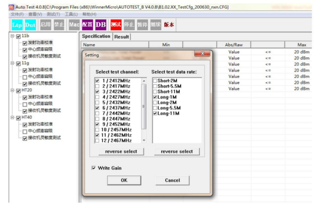

4.4 测试执行

点击 AutoTest 工具菜单栏 即可开始执行测试，执行完毕后工具会以 PASS 或 Fail 的图片显示测试结果，截取测试过程如下：

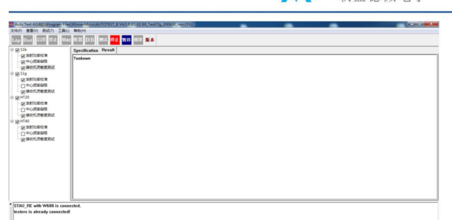

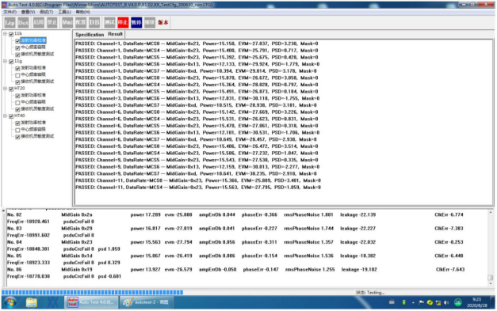

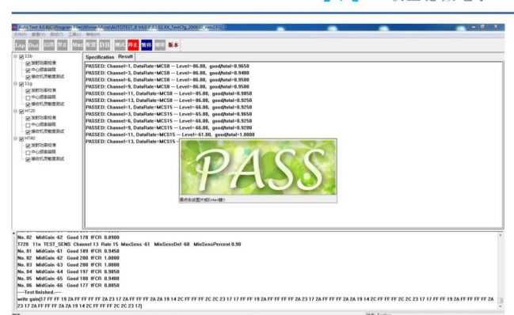

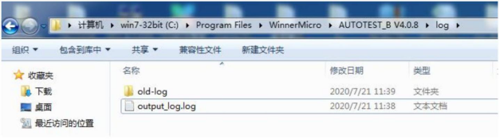

待测试完毕，请更换其它模块后可直接点击“测试”继续执行，并自动生成相应的 log。

### 4.5 测试 log

log 文件是以追加的方式累积记录的，直至 log 文件达到 50MB，随后自动以日期来命名保存该 log 文件，然后重新以 output_log.log 记录新产生的 log 信息。

## 5 FAQ

I 首次双击 AutoTest 快捷方式，打开 AutoTest 失败，是怎么回事？

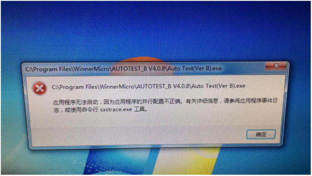

如果遇到如下提示，是由于 PC 系统未安装 Microsoft visual C++所致，安装后，即可打开AutoTest。

II 点击“测试”后提示“Failed to connect to testers on:10.1.1.254”，是怎么回事？

请首先确认 PC 与 Litepoint 的网线连接，随后确认 PC 和 Litepoint 的 IP 地址是否在同一网段，若不在相同网段，请修改 PC 上的 IP 地址。

III 点击 AutoTest “测试”后提示“Failed to connect to DUT Errpr=200”，请确认 DUT

与 PC 连接的 USB 延长线，并重新连接 DUT（下压治具，或将模块重新置入卡槽板）。

 