# 1 概述

 W 800 芯片是一款安全 IoT Wi-Fi/蓝牙 双模 SoC芯片。支持2.4G IEEE802.11b/g/n Wi-Fi 通讯协议；支持 BT/BLE 双模工作模式，支持 BT/BLE4.2 协议。芯片集成 32 位 CPU 处理器，内置QFlash、SPI、 UART、GPIO、I^2 C、I^2 S、 7816 等丰富的数字接口；支持多种硬件加解密算法，内置DSP、浮点运算单元与安全引擎，支持代码安全权限设置，内置2MBFlash存储器，支持固件加密存储、固件签名、安全调试、安
全升级等多项安全措施，保证产品安全特性。适用于用于智能家电、智能家居、智能玩具、无线音视频、工业控制、医疗监护等广泛的物联网领域。

# 2 管脚定义

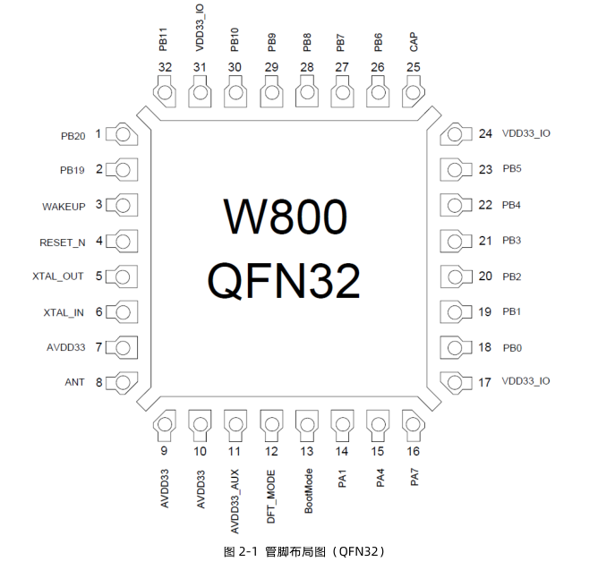

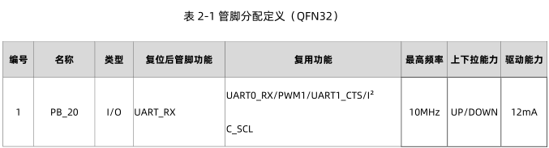
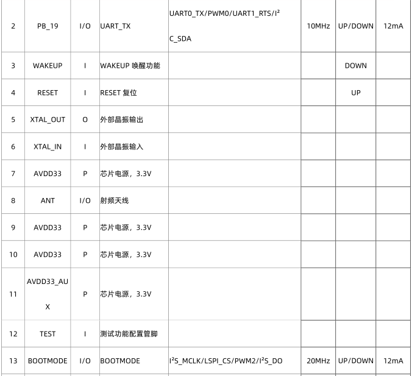
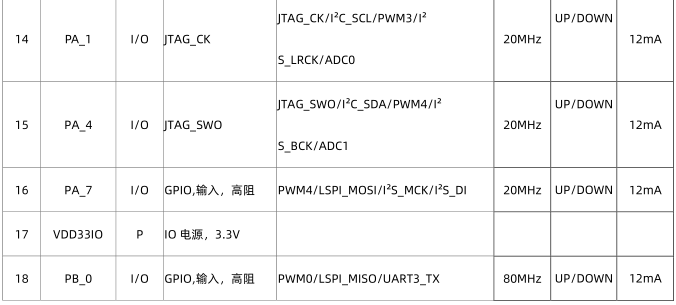
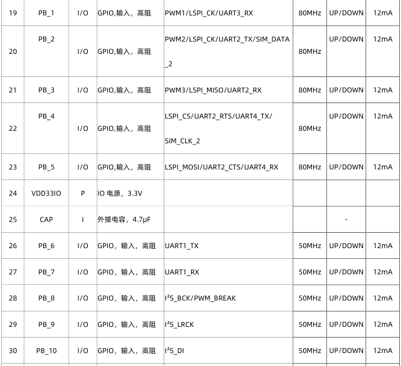
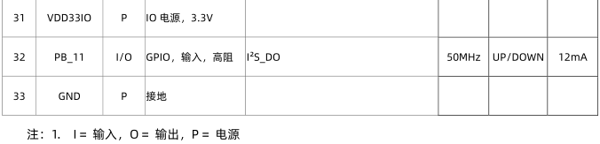

# 3 芯片外围电路设计

# 3.1 RESET复位电路设计

复位电路建议设计为RC电路，上电自动复位，W 800 低电平复位。如果使用外部控制RESET管 脚，当电平值低于 2 .0v时，芯片处于复位状态。复位时低电平需持续 1 00us以上，见图 3 - 1。

# 3.2 参考时钟电路设计

 芯片参考时钟选用 4 0MHz频率，客户根据实际产品需求选用不同温度等级要求的晶体，频率稳定度± 1 0ppm，晶体负载电容 10 pF。晶体两端所接负载电容根据不同厂家晶体及频偏情况需要调整。参

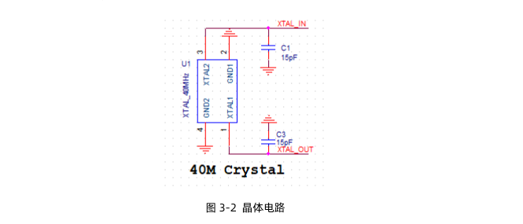

#时钟走线尽量靠近芯片，尽量短，并且远离干扰源，时钟周围多地孔隔离。时钟下面各层禁止其它走 线穿过，防止干扰时钟源。

# 3.3 射频电路设计

芯片采用单天线设计，内部集成了功放及收发切换开关，芯片射频端口阻抗 50 欧。根据实际产品设计 性能匹配要求，需预留π型匹配网络，根据实际天线阻抗值，优化外部设计匹配元件，匹配元件需要按照低通的形式设计，对二次谐波的抑制能力要10dB。

# 3.4 GPIO设计

芯片上电后 1 ， 2 脚默认为UART0端口，该端口提供下载及AT指令端口以及log输出端口。客户在使用时候注意不要随意使用该端口作为GPIO使用，防止被占用无法下载及调试。在系统起来后，该端口可以复用为其它端口使用。

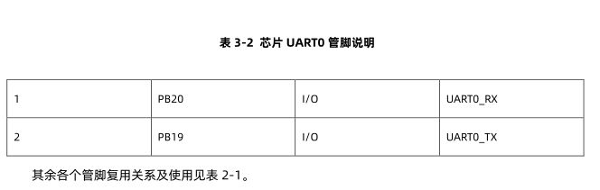

# 3.5 电源设计
芯片电源输入脚放置相应滤波电容，且外部对整个芯片供电总电流建议500mA及以上。总电源走线线宽要求不低于 3 0mil。供电范围 3 .0V-3.6V。请勿超过该范围，超过 3 .6v可能会对芯片造成永久性损坏。低于 3 .0v可能整体性能会下降。不同管脚放置电容见下表要求。

芯片 7 和 9 脚附近需分别放置 2 个电容， 分别为 1 uf和 1 nf滤波器电容。见表 3 - 3 。

表 3-3 芯片电源管脚说明

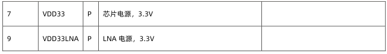

芯片 10 脚附近放置 4 7uf及1nF滤波电容。推荐有条件客户在模块电源入口处放置 3 30uf电解电容。见表 3-4。

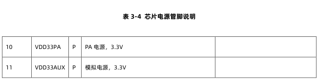

芯片 17 ,2 4 ,3 1 脚附近放置1uf滤波电容。见表 3 - 5 。

 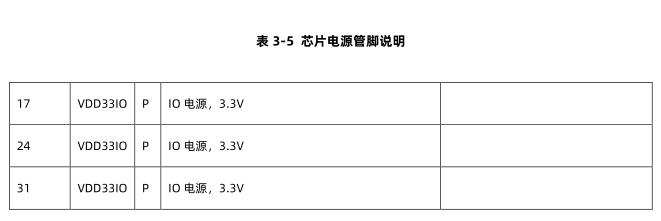

 芯片 25 脚必须外接4.7uf滤波电容。

# 4 Layout设计

W 800 芯片中间PAD是散热地焊盘，需要接地处理，同时需要打孔，跟地良好接触散热。图 4 -1 。

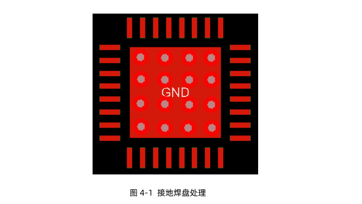

产品设计完成后PCB需要所有层做敷铜接地处理，第二层射频部分需要保证完整的地平面，保证射频阻抗连续性，同时射频走线根据板厚需要做 50 欧姆阻抗控制。

电源建议采用星型走线方式，见图 4 - 2 。特别注意 9 脚电源脚不要跟 10 ,1 1 脚直接接一起，9 脚采用星型走线，单走一根电源线到主电源上，避免芯片内部LNA供电受到其他电源干扰。所有芯片脚接电容均靠近芯片电源脚放置。

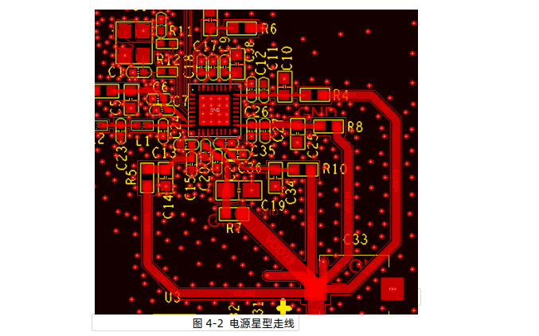

# 5 天线设计

根据客户需要可使用外置天线，也可以使用PCB板载天线。根据不同天线对产品有不同的要求。

# 5.1 外置天线

对连接外置天线的连接座尽可能远离底板电源等噪声源，防止干扰天线。

# 5.2 板载天线

当模块使用板载天线设计需严格按照本指导书设计，防止天线性能下降，影响产品使用。天线背面敷铜需全部挖空，天线参考地平面尽可能大，天线必须经过实际仿真，仿真后天线尺寸图导入PCB。紫色区域是天线部分，所有层均不能敷铜，全部净空。黄色区域是射频走线。具体见图 5 - 1 。

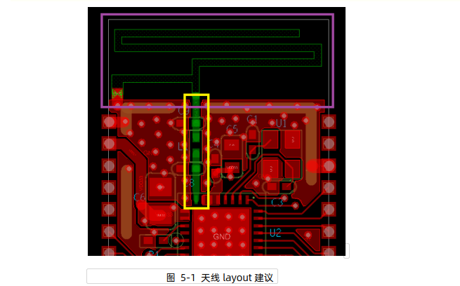

图 5 - 2 ， 5 - 3 为两种常用且对天线性能影响较小的天线摆放方式，建议尽量选择其中一种方式摆放模块；其中，第二种摆放方式要求PCB天线两边距离底板两边至少5.0mm以上。

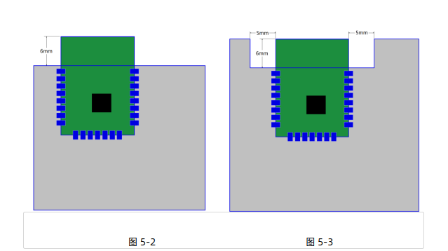